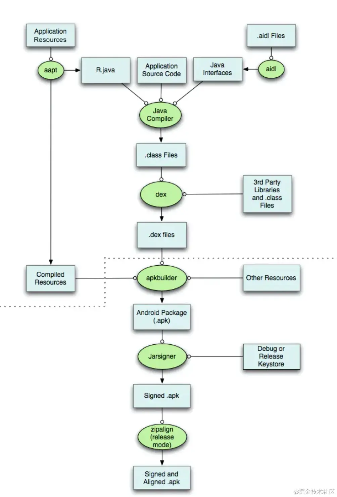
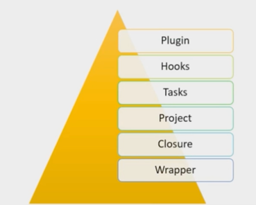

### gradle可以做的事情
- 使用的groovy语法，类似于shell脚本，可以完成数据处理，文件操作。groovy可以调用java，两者相辅相成
- gradle.wrapper.jar相当于执行脚本文件的jar包
1. 打apk包
2. 打插件包
3. hook插件
4. 自动化构建
5. 多渠道打包
6. 自动化签名
7. 后台java打包
8. 在项目中生成文件

### Gradle 配置分析
#### apk 打包的流程

- apk解压出来后： META-INF（依赖包的版本信息），res（资源，图片，layout，drawable，color等），AndroidManifest.xml，app-debug（），classes.dex（主包，热修复只能修复非主包的内容），classes2.dex（分包），resources.arsc（多语种）
- 打包时会把java，kotlin，ndk，资源文件等进行整合，最后打成一个apk包

#### gradle 是什么，特性有哪些

##### wrapper 脚本文件，Closure闭包，Project一个gradle的项目，tasks任务，hooks生成代码，plugin插件
- wrapper，一个gradle的封装体。有了gradle wrapper，即便机器上没有装gradle，也可以执行gradle的构建工作。

#### 根目录下的build.gradle
```groovy
buildscript{ //执行的脚本
    repositories{ //gradle插件的 依赖仓库
        //下载包的时候 是由上往下 去下载
        maven{ //国内的git仓库 写在最上面
            url ''
        }
        google() //国外的
        jcenter() //国外的 github
    }
    dependencies{ // 依赖的插件，包括gradle插件，自定义插件
        
    }
}
allprojects{
    //项目本身需要的依赖，配置所有的Modyle公共依赖，跟上面的地址写的一样
    repositories{
        
    }
    
}

//任务 ，清除所有build文件。
task clean(type: Delete){
    delete rootProject.buildDir
}
// 可以加一个生命周期的监听
gradle.beforeProject{project -> 
    println "beforeProject: $project.name"
    //在生命周期里面去触发自己的插件
}

gradle.afterProject{ project, projectState -> 
    println("afterProject:$project.name")
}
this.project.subprojects{sub -> 
    sub.beforeEvaluate{project
        println "#### Evaluate before of" + project.path
    }
}
afterEvaluate{
    println "afterEvalute start"
    // do somthing
    println "afterEvaluate end"
}
```
#### app的 build.gradle 文件
```groovy
android{
    
    buildTypes{
        debug{
            
        }
        release{
            
        }
    }
}
//依赖相关信息 
dependencies{
    
}
```


#### gradle 安装在哪里，各个文件和目录的作用是什么？


#### gradle 的 project 和 task 的概念
#### app打包慢的解决方案


### groovy语法介绍
1. grdle clean  :  clean 命令
2. gradle assembleDebug
3. gradle assembleRelease
- 这里我们学习 字符串拼接，list集合，map集合，闭包，方法，对象，task任务，文件操作。
 

### 什么是闭包与文件读取


### 自动配置签名


### 自定义配置gradle参数


### 代码混淆与反混淆


### 如何提高编译效率


### 多渠道打包以及自定义gradle插件


