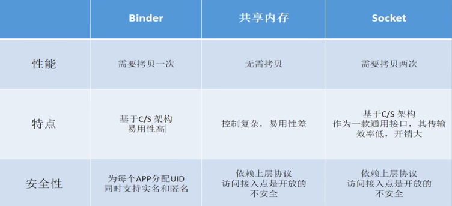
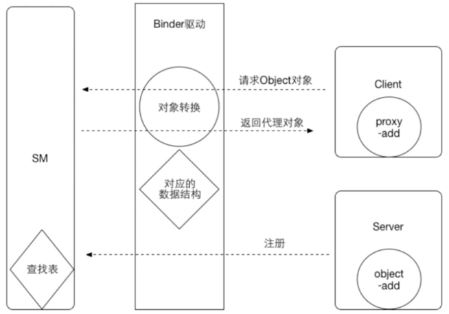
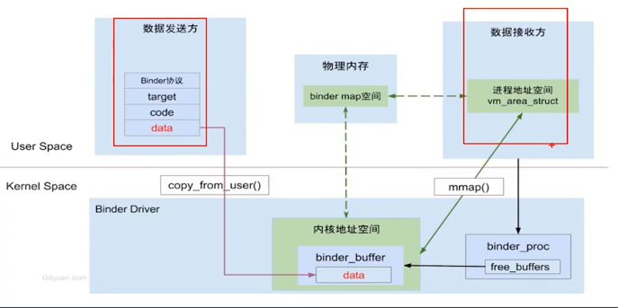

## Linux内核部分基础
### 进程隔离/虚拟地址空间
- 进程之间是不允许互相访问的，内存是不共享的；
- 每一个进程分为用户空间和内核空间，用户空间 和 内核空间也是隔离的。
- 用户空间和内核空间之间相互通信只能通过系统调用，例如通过native的API，copy_from_user，copy_to_user
- 我们说的内存空间 只是拟内存，只是一个地址，会映射到具体的物理地址。不同进程内核空间映射的都是同一块，内核空间是共享的；用户空间每个进程映射到不同的物理地址


### 系统调用
- 用户可以从应用层通过系统调用来访问内核的方法

### 多进程的情况
- 虚拟机给各个进程的运行内存是有限的，回收时优先回收对系统资源占用过多的进程
- 突破内存限制，如图库占用内存过多
- 功能稳定性，独立的通信进程需要保持长链接的稳定性，如推送
- 规避系统内存泄漏：独立的webview进程阻隔内泄漏导致的问题
- 隔离风险：不稳定功能放入独立进程，避免导致主进程崩溃
- 和系统服务，系统提供的功能通信

### binder驱动
- 相当于硬件接口

## Binder通信机制介绍
- Binder是跨进程的通信机制
- 对Server来说，Binder指的是Binder本地对象，对Client来说，Binder指的是Binder代理对象
- 对传输过程，Binder是可以进行跨进程传递的对象，会自动完成服务器和客户端对象转换

### 为什么使用binder

- Android使用Linux内核，它有很多快进程通信机制，IPC通信，如管道，消息队列，共享内存，信号量，socket，文件等
- 性能：广泛IPC会提出性能要求
- 安全：传统IPC没有对通信双方进行身份验证，Binder双方支持通信双方身份校验

### Binder通信模型
- 客户端持有一个服务代理，代理对象协助驱动，完成跨进程通信。

- 1.Server在ServiceManager，注册某方法add
- 2.Client从ServiceManager中查询是否有该方法，如果有，SM会返回Client一个代理空方法。
- 3.当Client调用该方法时，他会返回给内核驱动，内核驱动调用Server的add方法，把结果返回给驱动，驱动返回给Client

### Binder是如何做到一次拷贝的

- Binder机制中，接收方的用户空间 与 共享的内核空间 有一块共享区域的物理内存，这样用户空间就可以直接拿到 共享区域的数据了。
- 而共享内存机制无需拷贝，是因为 发送方和接收方都映射到同一块内存了，容易导致死锁

### mmap的原理
- Linux通过一个虚拟内存区域与一个磁盘上的对象关联起来，以初始化这个虚拟内存区域的内容，称作内存映射（Memory Mapping）
- 对文件进行mmap，会在进程的虚拟内存分配空间，建立映射关系。
- 之后就可以采用指针的方式读写这一段内存，系统会自动回写到对应的文件磁盘上

### Binder机制是如何跨进程的
- 普通方式：发送方与接收方之间，用户空间不共享，但内核空间是共享的
- binder中binder_mmap方法会开辟一块物理空间，让内核 和接收方 共同映射到这一块物理空间（也就是文件）。
- 发送方通过copy_from_user把数据拷贝到内核空间指定的虚拟内存后，这样 接收方也可以拿到。

#### AIDL实现进程通信
- 要实现两个进程间的通信，要通过操作系统，因此要约束一定的规则。
- AIDL 是一种接口自定义语言，用来实现设备上两个进程间的通信
- 进程间的通信信息会被妆画成AIDL协议消息，然后发送给对方，对方收到AIDL协议消息后在转化成相应的对象。


### 描述AIDL的java类细节（手写AIDL）
- 客户端ClientActivity，服务端RemoteService
```java
// 客户端 接收IBinder对象，之后才能用 iPersonManager 调用addPerson方法
private ServiceConnection connection = new ServiceConnection(){
    public void onServiceConnected(ComponentName name,IBinder service){
        iPersonManager = Stub.asInterface(service);
    }
    public void onServiceDisconnected(ComponentName name ){
        iPersonManager = null;
    }
}

```
```java
import java.util.ArrayList;
// 服务端
public class RemoteService extends Service {
    
   private ArrayList<Pserson> psersons;

    public IBinder onBinder(Intent intent) {
        persons =new ArrayList<>;
        return iBinder;
    }

    private IBinder iBinder = new Stub() {
        public void addPerson(Pserson person) {
            psersons.add(person)
        }
        
        public List<Person> getPsersonList(){
            return psersons;
        }
    }
}
```
- 三个类：
- 接口IPersonManager类，定义需要调用的功能方法类名。接口的实现在RemoteService，通过IBinder跨进程接口实现的对象返会给客户端。
- 代理类Proxy，需要实现IPersonManager接口。之后 客户端就可以拿到iPersonManager对象调用 addPerson方法了。这个iPersonManager对象就是由IBinder返回来的。由于是跨进程的，客户端拿到的实际上是代理的，需要进行转换：iPersonManager = Stub.asInterface(service)
- 代理类Proxy，实现的方法中，有两个包 客户端发送的数据data， 和 服务端返回的数据reply。然后调用 remote.transact()方法，客户端刮起，进入到驱动，驱动进行一系列处理，会进入服务端stub的onTransact方法。
- Stub类 继承Binder 表示这个服务端可以跨进程，是抽象类，具体的方法实现由服务端实现。服务端会把接口提供的方法设置id来区分，Stub的onTransact方法，里面会通过ID来确定客户端调用的是哪个方法，然后到真正实现的地方，如果有返回值，就会放到reply里面。
```java
// Proxy类 实现了 IPersonManager 接口
public void addPerson(Person person){
    Parcel data = Parcel.obtain();
    Parcel replay = Parcel.obtain();
    // ...
        
}
public List<Person> getPsersonList(){
        return psersons;
}
```

### 四大组件底层通信机制
- 以BindService为例，上述已经讲完了。

### 为什么Intent不能传递大数据
- 最大限制是一个具体的值 1M-8K 一兆减八k
- 服务端在注册的时候，会调用mmap方法去开辟一块共享空间，这块空间的大小就是限制。在底层源码中明确设置了 1*1024*1024 - 4096*2
- 实际上比这个数字还要小。类似于网络通信，数据会有包头，命令等，跟数据无关项。因此数据传递的时候要打包。
- 如果同步的话 要小于1M-8K，异步的话 要小于(1M-8K)/2
- java层 Binder.java代表binder
- natvie层 BBinder，javaBBinder代表binder
- 在驱动层binder_node结构体代表binder


