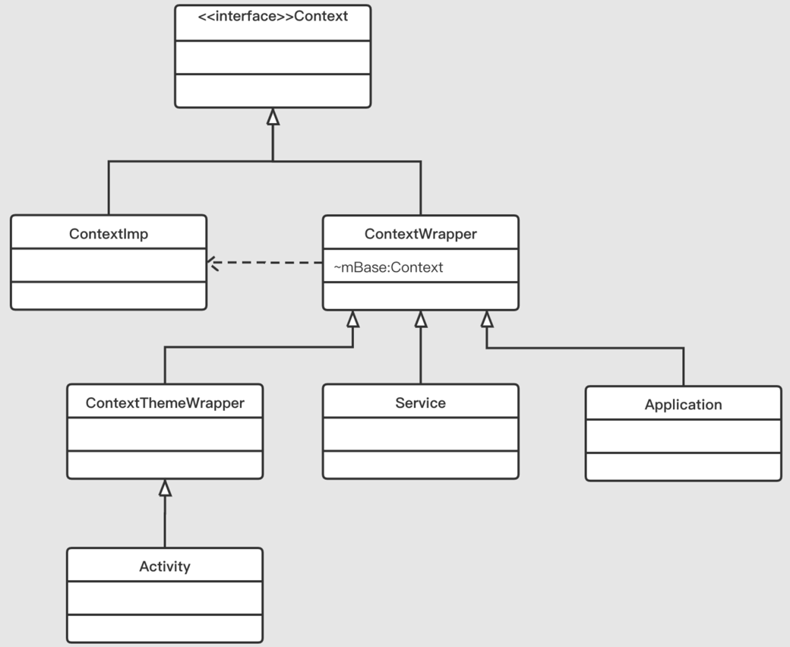

## Context继承关系
- Context是一个接口，ContextImp 和 ContextWrapper 都是其实现类。
- Activity，Service，Application都是直接或者间接继承自ContextWrapper

## 面试问题
### 1. 一个应用有几个Context
- Application，Activity，Service都继承自Context，而应用有几个进程就会有几个Application对象。
- Context个数 = Activity个数 + Service个数 + 进程个数
### 2. 为什么Activity、Service、Application都继承自Context，Context的作用是什么
- Context是一个接口，定义了一系列标准和规范，因为有了Context，各种应用组件才能访问系统服务，系统资源。
- 其源码如下：
```java
public abstract class Context {
    
    // 四大组件相关
    public abstract void startActivity(@RequiresPermission Intent intent);
    public abstract void sendBroadcast(@RequiresPermission Intent intent);
    public abstract Intent registerReceiver(@Nullable BroadcastReceiver receiver,
                                            IntentFilter filter);
    public abstract void unregisterReceiver(BroadcastReceiver receiver);
    public abstract ComponentName startService(Intent service);
    public abstract boolean stopService(Intent service);
    public abstract boolean bindService(@RequiresPermission Intent service,
            @NonNull ServiceConnection conn, @BindServiceFlags int flags);
    public abstract void unbindService(@NonNull ServiceConnection conn);
    public abstract ContentResolver getContentResolver();
    
    // 获取系统/应用资源
    public abstract AssetManager getAssets();
    public abstract Resources getResources();
    public abstract PackageManager getPackageManager();
    public abstract Context getApplicationContext();
    public abstract ClassLoader getClassLoader();
    public final @Nullable <T> T getSystemService(@NonNull Class<T> serviceClass) { ... }
    
    public final String getString(@StringRes int resId) { ... }
    public final int getColor(@ColorRes int id) { ... }
    public final Drawable getDrawable(@DrawableRes int id) { ... }
    public abstract Resources.Theme getTheme();
    public abstract void setTheme(@StyleRes int resid);
    public final TypedArray obtainStyledAttributes(@StyleableRes int[] attrs) { ... }
    
    // 获取应用相关信息
    public abstract ApplicationInfo getApplicationInfo();
    public abstract String getPackageName();
    public abstract Looper getMainLooper();
    public abstract int checkPermission(@NonNull String permission, int pid, int uid);
    
    // 文件相关
    public abstract File getSharedPreferencesPath(String name);
    public abstract File getDataDir();
    public abstract boolean deleteFile(String name);
    public abstract File getExternalFilesDir(@Nullable String type);
    public abstract File getCacheDir();
    // SharePreference
    public abstract SharedPreferences getSharedPreferences(String name, @PreferencesMode int mode);
    public abstract boolean deleteSharedPreferences(String name);
    
    // 数据库相关
    public abstract SQLiteDatabase openOrCreateDatabase(...);
    public abstract boolean deleteDatabase(String name);
    public abstract File getDatabasePath(String name);
    
    // 其它
    public void registerComponentCallbacks(ComponentCallbacks callback) { ... }
    public void unregisterComponentCallbacks(ComponentCallbacks callback) { ... }
    ...
}
public interface ComponentCallbacks {
  void onConfigurationChanged(Configuration newConfig);
  void onLowMemory();
}
```
- 通过分析源码，我们可以知道，Context作用包含以下几个方面：
1. 四大组件的交互，包括启动 Activity、Broadcast、Service，获取 ContentResolver 等
2. 获取系统/应用资源，包括 AssetManager、PackageManager、Resources、System Service 以及 color、string、drawable 等
3. 文件，包括获取缓存文件夹、删除文件、SharedPreference 相关等
4. 数据库（SQLite）相关，包括打开数据库、删除数据库、获取数据库路径等
5. 其它辅助功能，比如设置 ComponentCallbacks，即监听配置信息改变、内存不足等事件的发生

### 3. 为什么Activity需要继承自ContextThemeWrapper，而Service和Application直接继承自ContextWrapper?
```java
// ContextThemeWrapper的源码
public class ContextThemeWrapper extends ContextWrapper {
    private int mThemeResource;
    private Resources.Theme mTheme;
    private LayoutInflater mInflater;
    private Configuration mOverrideConfiguration;
    private Resources mResources;

    public ContextThemeWrapper() {
        super(null);
    }

    public ContextThemeWrapper(Context base, @StyleRes int themeResId) {
        super(base);
        mThemeResource = themeResId;
    }

    public ContextThemeWrapper(Context base, Resources.Theme theme) {
        super(base);
        mTheme = theme;
    }

    @Override
    protected void attachBaseContext(Context newBase) {
        super.attachBaseContext(newBase);
    }

    public void applyOverrideConfiguration(Configuration overrideConfiguration) {...}

    public Configuration getOverrideConfiguration() {...}

    @Override
    public AssetManager getAssets() {...}

    @Override
    public Resources getResources() {...}

    private Resources getResourcesInternal() {...}

    @Override
    public void setTheme(int resid) {...}

    @Override
    public int getThemeResId() {...}

    @Override
    public Resources.Theme getTheme() {...}

    @Override
    public Object getSystemService(String name) {...}

    protected void onApplyThemeResource(Resources.Theme theme, int resId, boolean first) {

    private void initializeTheme() {...}
}
```
- 其内部包含了与Theme相关的接口，当然，只有Activity才需要主题，Service和Application是不需要主题的，因为Service是没有界面的后台场景，所以Service和Application直接继承于ContextWrapper

### 4. 为什么ContextWrapper中存在一个ContextImp类型的变量mBase，同时它又实现了Context呢
```java
public class ContextWrapper extends Context {
    Context mBase;
    public ContextWrapper(Context base) {
        mBase = base;
    }
    protected void attachBaseContext(Context base) {
        if (mBase != null) {
            throw new IllegalStateException("Base context already set");
        }
        mBase = base;
    }
    public Context getBaseContext() {
        return mBase;
    }
    @Override
    public AssetManager getAssets() {
        return mBase.getAssets();
    }
    @Override
    public Resources getResources() {
        return mBase.getResources();
    }
    @Override
    public PackageManager getPackageManager() {
        return mBase.getPackageManager();
    }
    @Override
    public ContentResolver getContentResolver() {
        return mBase.getContentResolver();
    }
}
```
- ContextWrapper只是一个Context静态代理类，所有的操作都是通过内部成员 mBase 完成的，而mBase就是ContextImp对象。
- 一般情况下，使用代理而不直接使用某个对象，目的可能有两个：1.定制自己的行为，2.不影响原对象
- 其中 Servcie 和 Application 的父类 ContextWrapper 完全没有自定义的行为，而 Activity 的父类 ContextThemeWrapper 则自定义了 Resource 以及 Theme 的相关行为
- 对于 Service 和 Application 而言，不直接继承ContextImp，是担心用户修改了ContextImp而导致错误的发生
- 对于 Activity 而言，除了担心用户的修改之外，ContextImp和 Activity 本身对于 Reource 以及 Theme 的相关行为是不同的

## 使用Context注意点
### 1.单例模式中使用Context注意内存泄漏
- 单例模式的生命周期是和应用的生命周期保持一致的，所以在单例模式中使用Context，不能使用Activity Context，需要使用Application Context
### 2.创建dialog需要使用Activtiy Context
### 3.Activity的this和getBaseContext()有什么区别？
- Activity就是继承Context的，所以this是返回Activity自己 ，getBaseContext()返回的是ContextWrapper里面的mBase
### 4.getApplication()和getApplicationContext()有什么区别？
- 都是返回Applicatoin对象，但是他们的作用域不一样，getApplicatoin() 是Activity和Service里面特有的，其他地方不能用；BroadcastReceiver的onReceive()中的第一个参数，拿到的Context对象是不能调用getApplication()的只能调getApplicationContext()
### 5.Application构造方法中调用父类方法会发生闪退（如getResource()等）
#### Application的创建过程主要是下面三步
```java
//1.创建ContextImpl
ContextImpl appContext = ContextImpl.createAppContext(mActivityThread, this);
//2.创建Application
Application app = mActivityThread.mInstrumentation.newApplication(cl, appClass, appContext);
//3.调用Application#onCreate()
app.onCreate();
```
#### Instrumentation#newApplication()中
```java
public Application newApplication(ClassLoader cl, String className, Context context)
        throws InstantiationException, IllegalAccessException, 
        ClassNotFoundException {
    Application app = getFactory(context.getPackageName())
            .instantiateApplication(cl, className);
    app.attach(context);
    return app;
}
```
#### Application#attach()
```java
final void attach(Context context) {
        attachBaseContext(context);
        mLoadedApk = ContextImpl.getImpl(context).mPackageInfo;
    }
```
#### Application#attachBaseContext()
```java
protected void attachBaseContext(Context base) {
    if (mBase != null) {
        throw new IllegalStateException("Base context already set");
    }
    mBase = base;
}
```
- 在Application对象刚被创建的时候，其内部的mBase变量是空的，直到执行attachBaseContext()后，mBase才会有值，之后才会调用Application#onCreate()。所以在Application中使用Context接口中的相关方法，可以在onCreate()里面调用，而不能在构造方法中调用

## 总结
- 借用原作者的话就是：Context是一个抽象类，Activity就像是一个”皇帝“，Activity可以做很多很多的事情，但是Context就像是他手中的权利，如果没有Context，Activity其实只是一个”普通人“（普通java类）而已。
- 很多人往往把Activity理解成它继承了Context，是的没错，它确实继承自Context，但我认为，把Activity理解成它代理了Context，会更贴合实际意义一些

### 参考致谢 
- https://www.jianshu.com/p/492ec35ea552