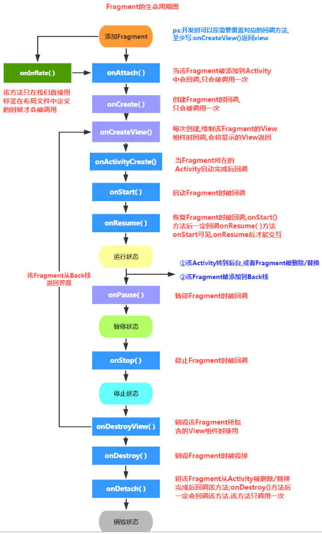
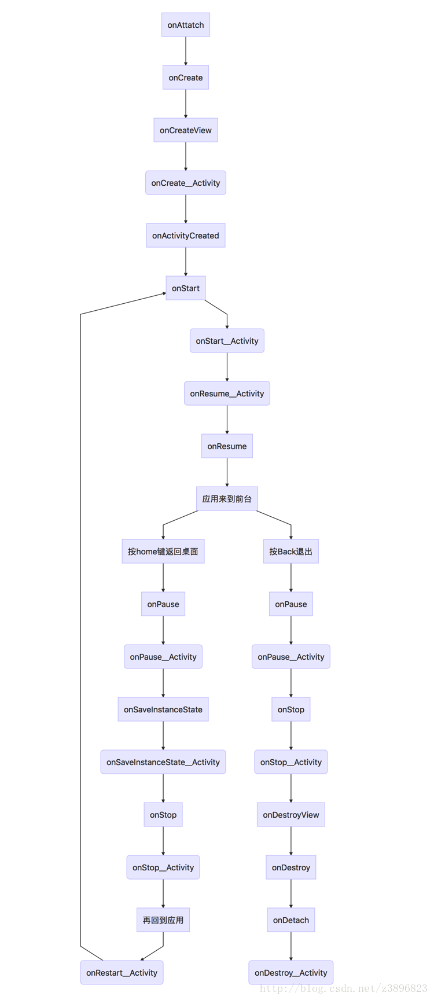

### Fragment为什么被称为第五大组件
#### 为什么被称为第五大组件
- 在使用频率上，不输四大组件，它不是独立的，必须加载在Activity中，可以灵活展现UI

#### Fragment加载到Activity两种方式
- 静态加载到activity布局中。
- 通过FragmentManager创建transaction，调用transaction的添加或者替换方法，最后调用commit方法完成fragment加载，利用容器资源作为标志位，设置所要显示的位置。

#### FragmentPagerAdapter和FragmentStatePagerAdaper区别
- FragmentPagerAdapter 页面较少，会保存内存，在destroyItem方法中，调用了detach方法，并不是真正的内存回收，把fragment的ui和activity的ui脱离开来。
- FragmentStatePagerAdaper 用于页面较多，每次切换都会回收内存，在destroyItem方法中，调用了remove方法，真正释放了内存，节省内存。

### Fragment生命周期

### Fragment之间的通信
- 在Fragment中调用Activity方法：getActivity方法会获得Activity对象
- 在Activity中调用Fragment方法：通过接口回调
- Fragment中调用Fragment方法：getActivity 获取到Activity，findFragmentById 获取Fragment
- Activity在创建的时候通过Bundle传输数据
- viewmodel

### FragmentManageer中方法
- repalce：销毁原有的Fragment，创建新的Fragemnt
- add：只是添加，不销毁
- remove：销毁
- 当Fragment不可见时，如果你要保留Fragment中的数据以及View的显示状态，那么可以使用add操作，后续中针对不同的状态隐藏和显示不同的Fragment。
- 当Fragment不可见时，你不需要保留Fragment中的数据以及View的显示状态，那么可以使用replace。

### 参考致谢
- https://www.bilibili.com/video/BV1CL4y1a7Uz?p=4