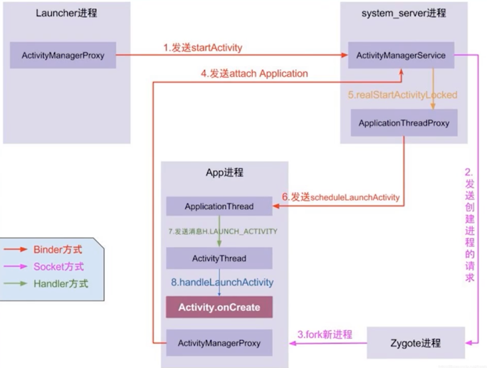
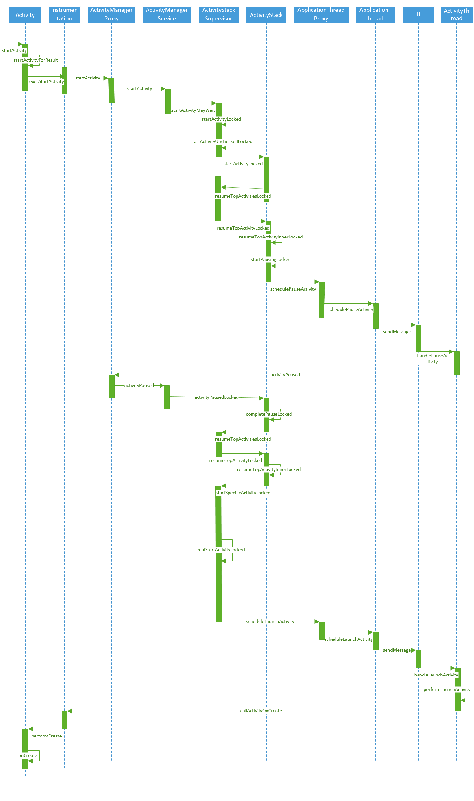
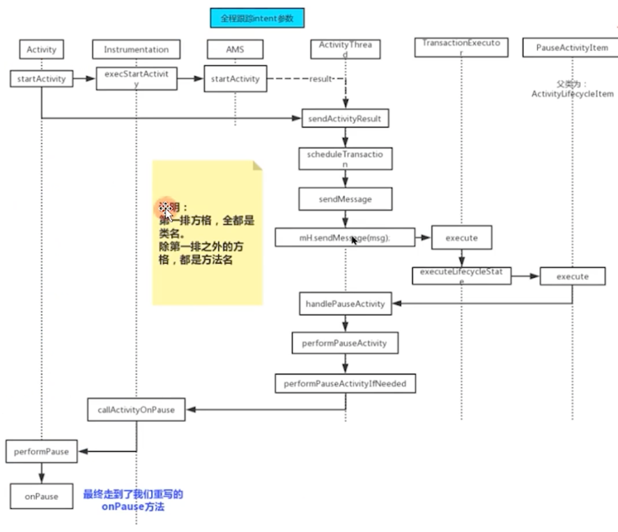
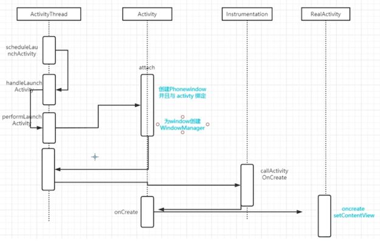

### AMS，PMS，以及WMS等都是运⾏在system_server这个进程中的线程
#### AMS
- ActivityManagerService 简称AMS，是Android内核的核心功能之一，在系统启动SystemServer时启动此服务。 AMS在Android系统中扮演很重要的角色，主要负责系统中四大组件的启动、切换、调度及应用进程的管理和调度等工作，其职责与操作系统中的进程管理和调度模块相类似。当发起进程启动或者组件启动时，都会通过Binder通信机制将请求传递给AMS，AMS再做统一处理。

#### WMS
- WindowManagerService 负责管理系统中所有的窗口，包括Activity的窗口、壁纸窗口、输入法窗口、弹窗子窗口等，即管理屏幕上展示上的一切窗口。在Android系统系统的过程中，在SystemServer进程中也把WMS服务启动起来，注册到ServiceManager中。

#### PMS
- PMS⽤来管理所有的package信息，包括安装、卸载、更新以及解析AndroidManifest.xml以组织相应的数据结构，这些数据结构将会被PMS、ActivityMangerService等等service和application使⽤到

### App启动流程

#### 四大进程
- Launcher进程：app启动流程的起点，负责接收用户点击屏幕事件
- app进程：你要启动的app所运行的进程。
- SystemServer进程：它是属于application Framework层的，Android中的所有服务，例如AMS, WindowsManager, PackageManagerService等等都是由这个SystemServer fork出来的
- Zygote进程：Zygote是Android系统中的进程，由用户空间的第一个进程Init进程启动的，是Android系统运行的第一个AndroidRuntime进程，同时也是打通Native和Java的桥梁。创建SystemServer进程；是用于管理整个Java framework层，包含ActivityManager，PowerManager等各种系统服务；孵化其他应用程序进程。

#### 六大类
- ActivityManagerService：(AMS)AMS是Android中最核心的服务之一，主要负责系统中四大组件的启动、切换、调度及应用进程的管理和调度等工作，它本身也是一个Binder的实现类
- Instrumentation：监控应用程序和系统的交互
- ActivityThread：应用的入口类，通过调用main方法，开启消息循环队列。ActivityThread所在的线程被称为主线程
- applicationThread：applicationThread提供Binder通讯接口，AMS则通过代理调用此app进程的本地方法
- ActivityManagerProxy：AMS服务在当前进程的代理类，负责与AMS通信
- applicationThreadProxy：applicationThread在AMS服务中的代理类，负责与applicationThread通信。

#### 启动流程总结
- ①点击桌面app图标，Launcher进程采用Binder向system_server进程发起startActivity请求
- ②system_server进程接收到请求后，通过socket向zygote进程发送创建进程的请求
- ③Zygote进程fork出新的子进程，即app进程
- ④app进程通过Binder向sytem_server进程发起attachapplication请求
- ⑤system_server进程在收到请求后，进行一系列准备工作后，再通过binder向app进程发送scheduleLaunchActivity请求
- ⑥app进程的applicationThread线程在收到请求后，通过handler向主线程发送LAUNCH_ACTIVITY消息
- ⑦主线程在收到Message后，通过反射机制创建目标Activity，并回调Activity.onCreate()等方法。
- ⑧到此，app便正式启动，开始进入Activity生命周期，执行完onCreate/onStart/onResume方法，UI渲染结束后便可以看到app的主界面。
- 参考致谢：https://baijiahao.baidu.com/s?id=1730780037727135079&wfr=spider&for=pc

### AMS对Activity启动管理，Activity的启动流程
- Activity启动最终会调用start()方法，而start()方法里面最终会跑到startActivity
- startActivity最终会跑到startActivityForResult()，startActivityForResult()里面执行的是 Instrumentation.execStartActivity()
- 通过Binder跨进程，执行的AMS中的ATM的startActivity，接下来以此分析。首先来看是怎么拿到ATM服务的
- 首先会调用AcitvityTaskManager.getService，而getService是通过ServiceManager通过代理模式拿到的ATM服务
- 执行ATM的startActivity方法，判断需要启动的Activity所在的App进程是否已经启动
- 如果进程存在，最终会执行到realStartActivityLocked方法，如果进程不存在，创建出进程后，最终也会执行到realStartActivityLocked方法
- 如果进程不存在，执行mService.startProcessAsync，AMS会创建socket连接zygote ，通过socket传递ActivityThread给zygote
- zygote通过反射去直接执行ActivityThread的main方法，在main方法中会执行thread.attach方法，内部拿到AMS，
- Activity通过跨进程调用AMS的attachApplication把ActivityThread对象传递给AMS
- AMS执行到realStartActivityLocked方法，去启动Activity，执行activity生命周期
- 参考致谢：https://www.jianshu.com/p/d6562ac93767
- 参考致谢：https://www.bilibili.com/video/BV1TF411u7m2?spm_id_from=333.337.search-card.all.click
  
- 

### Activity的onCreate之前执行的流程

- 在启动activity的时候，ActivityThread 会调用scheduleLaunchActivity -> handleLaunchActivity -> performLaunchActivity
- 在 performLaunchActivity 中会调用Activity的attach方法创建PhoneWindow并却与Activity绑定，同时创建windowManager
- 之后ActivityThread 会调用 Instrumentation的 callActivityOnCreat 方法，callActivityOnCreat 会调用 Activity 的onCreate方法
- Activity 的onCreate方法 会把生命周期分到我们真正的要启动的Activity中去，执行他们的onCreate方法并且setContentView解析xml布局