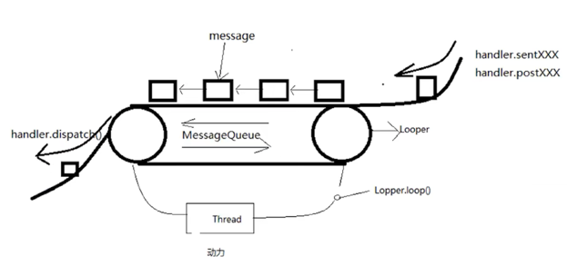
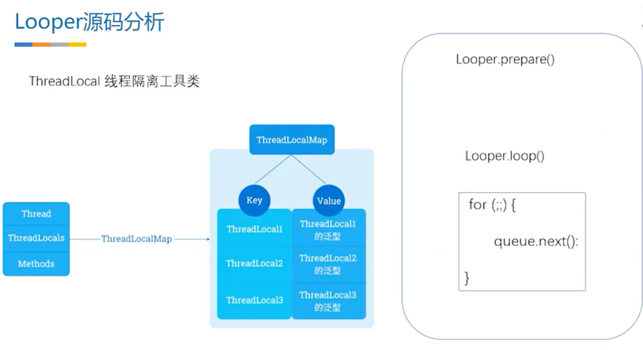
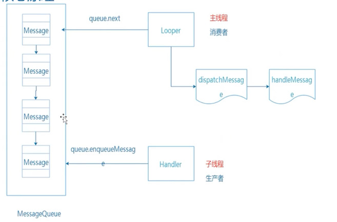

### Handler 安卓的心脏

- service管理，点击事件、生命周期、view刷新、按键、一切等都是一个Message
- handler中维护了一个消息队列
- Activity启动的时候有很多handleXXX方法，要处理的这些都是Message
- 所有类：Handler、Looper、Message、MessageQueue、Thread
```java
    public Handler(Callback callback, boolean async) {
        if (FIND_POTENTIAL_LEAKS) {
            final Class<? extends Handler> klass = getClass();
            if ((klass.isAnonymousClass() || klass.isMemberClass() || klass.isLocalClass()) &&
                    (klass.getModifiers() & Modifier.STATIC) == 0) {
                Log.w(TAG, "The following Handler class should be static or leaks might occur: " +
                    klass.getCanonicalName());
            }
        }

        mLooper = Looper.myLooper();
        if (mLooper == null) {
            throw new RuntimeException(
                "Can't create handler inside thread " + Thread.currentThread()
                        + " that has not called Looper.prepare()");
        }
        mQueue = mLooper.mQueue;
        mCallback = callback;
        mAsynchronous = async;
    }
```

### MessageQueue类
- MessageQueue是一个Message的单链表结构，用链表来做的队列，内部有 Message类型的 mMessage、Message 类型的 next；
- 队列里面的任务是按照事件顺序排列的

### Looper类从消息队列中取消息
- loop方法中，开启for死循环调用Message msg = queue.next()取消息。
```java
    private static void prepare(boolean quitAllowed) {
        if (sThreadLocal.get() != null) {
            throw new RuntimeException("Only one Looper may be created per thread");
        }
        sThreadLocal.set(new Looper(quitAllowed));
    }
```
```java
    public static void loop() {
        final Looper me = myLooper();
        if (me == null) {
            throw new RuntimeException("No Looper; Looper.prepare() wasn't called on this thread.");
        }
        final MessageQueue queue = me.mQueue;

        // Make sure the identity of this thread is that of the local process,
        // and keep track of what that identity token actually is.
        Binder.clearCallingIdentity();
        final long ident = Binder.clearCallingIdentity();

        // Allow overriding a threshold with a system prop. e.g.
        // adb shell 'setprop log.looper.1000.main.slow 1 && stop && start'
        final int thresholdOverride =
                SystemProperties.getInt("log.looper."
                        + Process.myUid() + "."
                        + Thread.currentThread().getName()
                        + ".slow", 0);

        boolean slowDeliveryDetected = false;

        for (;;) {
            Message msg = queue.next(); // might block
            if (msg == null) {
                // No message indicates that the message queue is quitting.
                return;
            }

            // This must be in a local variable, in case a UI event sets the logger
            final Printer logging = me.mLogging;
            if (logging != null) {
                logging.println(">>>>> Dispatching to " + msg.target + " " +
                        msg.callback + ": " + msg.what);
            }

            final long traceTag = me.mTraceTag;
            long slowDispatchThresholdMs = me.mSlowDispatchThresholdMs;
            long slowDeliveryThresholdMs = me.mSlowDeliveryThresholdMs;
            if (thresholdOverride > 0) {
                slowDispatchThresholdMs = thresholdOverride;
                slowDeliveryThresholdMs = thresholdOverride;
            }
            final boolean logSlowDelivery = (slowDeliveryThresholdMs > 0) && (msg.when > 0);
            final boolean logSlowDispatch = (slowDispatchThresholdMs > 0);

            final boolean needStartTime = logSlowDelivery || logSlowDispatch;
            final boolean needEndTime = logSlowDispatch;

            if (traceTag != 0 && Trace.isTagEnabled(traceTag)) {
                Trace.traceBegin(traceTag, msg.target.getTraceName(msg));
            }

            final long dispatchStart = needStartTime ? SystemClock.uptimeMillis() : 0;
            final long dispatchEnd;
            try {
                msg.target.dispatchMessage(msg);
                dispatchEnd = needEndTime ? SystemClock.uptimeMillis() : 0;
            } finally {
                if (traceTag != 0) {
                    Trace.traceEnd(traceTag);
                }
            }
            if (logSlowDelivery) {
                if (slowDeliveryDetected) {
                    if ((dispatchStart - msg.when) <= 10) {
                        Slog.w(TAG, "Drained");
                        slowDeliveryDetected = false;
                    }
                } else {
                    if (showSlowLog(slowDeliveryThresholdMs, msg.when, dispatchStart, "delivery",
                            msg)) {
                        // Once we write a slow delivery log, suppress until the queue drains.
                        slowDeliveryDetected = true;
                    }
                }
            }
            if (logSlowDispatch) {
                showSlowLog(slowDispatchThresholdMs, dispatchStart, dispatchEnd, "dispatch", msg);
            }

            if (logging != null) {
                logging.println("<<<<< Finished to " + msg.target + " " + msg.callback);
            }

            // Make sure that during the course of dispatching the
            // identity of the thread wasn't corrupted.
            final long newIdent = Binder.clearCallingIdentity();
            if (ident != newIdent) {
                Log.wtf(TAG, "Thread identity changed from 0x"
                        + Long.toHexString(ident) + " to 0x"
                        + Long.toHexString(newIdent) + " while dispatching to "
                        + msg.target.getClass().getName() + " "
                        + msg.callback + " what=" + msg.what);
            }

            msg.recycleUnchecked(); // 在消息分发完之后，会执行此来回收消息
        }
    }
```

### Handler背后原理
- 子线程 handler->sendXXX -> 所有的send或post 最终调用的是 queue.enqueueMessage 往MessageQueue里面添加消息
- Looper中loop()方法内开启for循环调用queue.next()取消息，取出消息后调用msg.target.dispatchMessage(msg)，这个target就是Handler；dispatchMessage内部 触发Handler#handlerMessage(msg)
- 主线程 handler->handleMessage 处理消息
```java
// MessageQueue中放消息
    boolean enqueueMessage(Message msg, long when) {
        // ...
        synchronized (this) {
            if (mQuitting) {
                IllegalStateException e = new IllegalStateException(
                        msg.target + " sending message to a Handler on a dead thread");
                Log.w(TAG, e.getMessage(), e);
                msg.recycle();
                return false;
            }

            msg.markInUse();
            msg.when = when;
            Message p = mMessages;
            boolean needWake;
            if (p == null || when == 0 || when < p.when) {
                // New head, wake up the event queue if blocked.
                msg.next = p;
                mMessages = msg;
                needWake = mBlocked;
            } else {
                // Inserted within the middle of the queue.  Usually we don't have to wake
                // up the event queue unless there is a barrier at the head of the queue
                // and the message is the earliest asynchronous message in the queue.
                needWake = mBlocked && p.target == null && msg.isAsynchronous();
                Message prev;
                for (;;) {
                    prev = p;
                    p = p.next;
                    if (p == null || when < p.when) {
                        break;
                    }
                    if (needWake && p.isAsynchronous()) {
                        needWake = false;
                    }
                }
                msg.next = p; // invariant: p == prev.next
                prev.next = msg;
            }

            // We can assume mPtr != 0 because mQuitting is false.
            if (needWake) {
                nativeWake(mPtr);
            }
        }
        return true;
    }
```
```java
// MessageQueue中取消息
    Message next() {
        // ...
        for (;;) {
            if (nextPollTimeoutMillis != 0) {
                Binder.flushPendingCommands();
            }

            nativePollOnce(ptr, nextPollTimeoutMillis);  //睡眠

            synchronized (this) {
                // Try to retrieve the next message.  Return if found.
                final long now = SystemClock.uptimeMillis();
                Message prevMsg = null;
                Message msg = mMessages;
                if (msg != null && msg.target == null) {
                    // Stalled by a barrier.  Find the next asynchronous message in the queue.
                    do {
                        prevMsg = msg;
                        msg = msg.next;
                    } while (msg != null && !msg.isAsynchronous());
                }
                if (msg != null) {
                    if (now < msg.when) {
                        // Next message is not ready.  Set a timeout to wake up when it is ready.
                        nextPollTimeoutMillis = (int) Math.min(msg.when - now, Integer.MAX_VALUE);
                    } else {
                        // Got a message.
                        mBlocked = false;
                        if (prevMsg != null) {
                            prevMsg.next = msg.next;
                        } else {
                            mMessages = msg.next;
                        }
                        msg.next = null;
                        if (DEBUG) Log.v(TAG, "Returning message: " + msg);
                        msg.markInUse();
                        return msg;
                    }
                } else {
                    // No more messages.
                    nextPollTimeoutMillis = -1;
                }

                // Process the quit message now that all pending messages have been handled.
                if (mQuitting) {
                    dispose();
                    return null;
                }

                // If first time idle, then get the number of idlers to run.
                // Idle handles only run if the queue is empty or if the first message
                // in the queue (possibly a barrier) is due to be handled in the future.
                if (pendingIdleHandlerCount < 0
                        && (mMessages == null || now < mMessages.when)) {
                    pendingIdleHandlerCount = mIdleHandlers.size();
                }
                if (pendingIdleHandlerCount <= 0) {
                    // No idle handlers to run.  Loop and wait some more.
                    mBlocked = true;
                    continue;
                }

                if (mPendingIdleHandlers == null) {
                    mPendingIdleHandlers = new IdleHandler[Math.max(pendingIdleHandlerCount, 4)];
                }
                mPendingIdleHandlers = mIdleHandlers.toArray(mPendingIdleHandlers);
            }

            // Run the idle handlers.
            // We only ever reach this code block during the first iteration.
            for (int i = 0; i < pendingIdleHandlerCount; i++) {
                final IdleHandler idler = mPendingIdleHandlers[i];
                mPendingIdleHandlers[i] = null; // release the reference to the handler

                boolean keep = false;
                try {
                    keep = idler.queueIdle();
                } catch (Throwable t) {
                    Log.wtf(TAG, "IdleHandler threw exception", t);
                }

                if (!keep) {
                    synchronized (this) {
                        mIdleHandlers.remove(idler);
                    }
                }
            }

            // Reset the idle handler count to 0 so we do not run them again.
            pendingIdleHandlerCount = 0;

            // While calling an idle handler, a new message could have been delivered
            // so go back and look again for a pending message without waiting.
            nextPollTimeoutMillis = 0;
        }
    }
```

### 一个线程有几个Handler
- 任意多个，可以new出来多个

### 一个线程有几个Looper，如何保证

- 一个线程只有一个Looper；
- thread 和 looper 关系：looper函数的执行是由线程启动的：
- 主线程中：好像不关注Looper的存在；主线程的looper在 ActivityThread#main 方法中启动的（main方法的执行意味着zygote成功的为我们的应用分配了虚拟机）
- main方法中会调用 Looper.prepareMainLooper()和Looper.loop()方法，为进程内管理提供初始化（进程内所有事件都是Message，都需要通过looper来管理）
- prepareMainLooper()中调用了prepare()方法，prepare()中new 一个Looper，放到ThreadLocal中：sThreadLocal.set(new Looper())；ThreadLocal的key便是当前的线程这样线程便跟Looper进行关联了
- 在Looper类中 ThreadLocal 类实际上是 static final类型的，这意味着在整个app里面只有一个值。
- 如何保证key唯一，value唯一不能被替换？
- Looper.prepare方法内部首先会 判断 threadLocal.get() 如果之前绑定过不为空，则抛出异常。以此保证value不允许被替换。以此保证线程和looper一一对应。

### Handler内存泄漏原因，为什么其他内部类没有说过这个问题
- 假如Msg20s后执行 -> MessageQueue 持有 Message -> Message 持有 Handler -> Handler持有this Activity -> Activity 中持有大量内存
- 匿名内部类持有了外部类的this对象
- Handler把message通过send或post 给了MessageQueue，Handler中enqueueMessage方法中 msg.target=this，这样Message就持有了handler。
- handler是一个匿名内部类，持有了activity，activity持有了大量对象
- JVM进行内存回收时采用的可达性分析来判断这块内存是否需要释放
- handler可能是delay的消息，可能会在20秒之后执行，那么上述引用链上的所有对象都不会被释放

### 解决Handler内存泄漏
- 在destroy里面清理handler所有的Message消息
- handler生命为静态类，用软引用或者弱引用来持有activity

```java
// MainActivity
Handler handler = new Handler(){
    public void handleMessage(Message msg){
        MainActivity.this.click(view);
    }
}
```
### 为何主线程可以直接new Handler？子线程中new的话要做些什么工作
- 因为 主线程已经new出Looper，并调用looper.prepare方法。
- 子线程中使用Handler； 要创建哪个线程的handler 就在创建Handler的时候 传入哪个线程的Looper；主线程不用在创建Handler时传入Looper是因为已经做了默认操作。
- 多线程并发问题，如下述代码，考察HandlerThread类，HandlerThread extend Thread 解决多线程问题。

```java
public void click(){
    Thread thread = new Thread(){
        Looper looper;
        public void run(){
            Looper.prepare();
            looper = Looper.myLooper();
//            threadHandler = new Handler(looper);
            looper.loop();
//            handler.sendEmptyMessage();
        }
        
        public Looper getLooper(){
            return looper;
        }
    }
    thread.start();

        // 在这调用 不一定保证 会在run方法内部loop()执后进行了。
        // 这里就考察多线程
    Handler handler = new Handler(thread.getLooper()); 
}
```
```java
    @Override
    public void run() {
        mTid = Process.myTid();
        Looper.prepare();
// 内置锁，开锁和关锁有JVM来完成。
        synchronized (this) { 
            mLooper = Looper.myLooper();
            notifyAll();
        }
        Process.setThreadPriority(mPriority);
        onLooperPrepared();
        Looper.loop();
        mTid = -1;
    }
```
```java
    public Looper getLooper() {
        if (!isAlive()) {
            return null;
        }
        
        // If the thread has been started, wait until the looper has been created.
        synchronized (this) {
            while (isAlive() && mLooper == null) {
                try {
                    wait(); // notifyall之后 会让代码处于就绪状态，
                } catch (InterruptedException e) {
                }
            }
        }
        return mLooper;
    }
```
- HandlerThread  多线程中 如何保证线程run方法优先于getLooper方法执行的
- 在getLooper方法中 会有一个wihle循环，如果mLooper == null 就会执行wait() 此时会释放锁，进行等待。而run方法中 looper创建出来之后 会有 notifyAll唤醒其他等待的线程
- wait()跟sleep()的区别
- wait() 让代码等待，并释放锁，但还是有可能会处理别的方法。例如 getLooper中 wait了，还是会执行run方法的，当run方法执行完创建looper之后，就会唤醒，继续执行wait之后的代码。
- sleep() 让线程睡眠，不会执行其他任何事情
- 为什么要notifyAll？而不是notify？
- 因为有可能有多个线程都要获取这个looper，而notifyAll 和 wait是不对等的，调用notifyAll之后，wait后的代码不会立马执行，会让wait后的代码处于就绪状态。只有当notifyAll所处的 synchronized里面代码块执行完之后，wait之后的代码才会执行。

### 由上述代码 引出 synchronized 锁机制
```java
// this 锁代码块，锁的是同一个类所有 synchronized 关键字的方法。
f1(){
    synchronized (this) {}
}
f2(){
    synchronized (this) {}
}
thread1.f1();
thread1.f2();
synchronized (obj) {}
synchronized (class.this) {}
synchronized 修饰普通方法
synchronized 修饰静态方法
//会锁住
```

### 子线程中维护的Looper，消息队列无消息的处理方案是什么？有什么用？主线程呢？
- 子线程：
- 我们看loop()函数,里面有个for循环，内部调用msg.next()获取下一个消息；
- next()里面有nativePollOnce方法，如果消息队列里面没有消息，会处在block状态，意味着线程一直在执行，就会一致占用内存。这容易造成内存泄漏。
- 这时候我们要把这个loop退出去，我们可以调用Looper#quiteSafely方法，里面调用mQueue.quit()方法。
- mQueue.quit()内部会 根据传入参数判断 调用removeAllFutureMessageLocked 或 removeAllMessageLocked 来移除掉所有消息，之后nativeWake方法，去唤醒（对应 nativePollOnce睡眠）继续执行Looper#next 内部nativePollOnce之后的方法，并Looper#next返回null
- 而在Looper.loop()中 如果msg= queue.next 为空，会直接return结束loop的for循环
- for循环退出，子线程就会退出，线程所需要的上下文全部退出，JVM可达性分析 便不可达了，JVM便会释放。
- 如果重新发送消息，就要重新创建looper
- 主线程：
- 必须不能退出！涉及到AMS
- AMS中，Handler的存在是AMS的核心。是H类，继承自Handler；
- 所有的生命周期，组件管理 都是用handler的。

### 既然可以存在多个Handler网MessageQueue中添加数据（发消息时各个Handler可能处于不同线程），那它内部是如何保证线程安全的？取消息呢？
- 我们往消息队列里面添加数据的时候 ，Handler#enqueueMessage 内部调用的是 MessageQueue#enqueueMessage的时候，essageQueue#enqueueMessage用sychronized锁的是this。
- Looper管理的MessageQueue是一个final对象，Handler中获取到的MessageQueue是looper管理的MessageQueue；Looper和MesageQueue是一一对应的关系。
- 即 线程和looper一一对应，looper和MessageQueue一一对应，所以一个线程只有一个Looper，只有一个MessageQueue。
- 因此，通过锁的this字段，代表的是 一个线程里面的所有msg都是由MsgQueue管理，而这个MsgQueue又是唯一的，所以每一个handler在给MsgQueue添加消息的时候都会受到锁的限制，这就保证了线程中往MsgQueue添加msg的时候有序性，线程安全。
- 取消息：
- 取消息也是一样的，MessageQueue#next方法中也是用synchronize锁的this
- 这就是生产者消费者模式，这就是保证无论何时都只有一个线程存放msg和取msg


### 我们使用Message时应该如何创建它
- 我们会obtain一个消息，这就是消息管理机制
- 在Looper#loop()方法内，消息分发完之后，会msg.recycleUnchecked(); // 在消息分发完之后，会执行此来回收消息
- 消息这一块一共两个队列，一个是MessageQueue队列，一个是消息管理池这个队列。
- 那么为什么要回收呢？这个与JVM有关，与性能优化
- 每一个应用会通过zygote进程fork出App进程，会分配一个独立的JVM，这就会涉及到虚拟机的管理机制。
- 安卓应用中要处理的事件很多，所以Message也很多。如果每次都new 一个msg，就会在jvm内存中不断取创建新对象。
- 当我们new的msg不可达时就会回收掉。回收的过程就会带来频繁GC，会带来STW问题-stop the world，会让所有线程停止工作，就会带来卡顿。
- 有可能带来OOM，因为会带来大量的内存碎片。
- 所以卡顿 是布局问题吗？
- 由于维护了一个消息池sPool，就算消息处理完之后，也会被消息池持有，sPool是一个static变量，会一直存在内存中，不会被回收。
- 这就对标了 享元设计模式-recycleview会创建一个ViewHolder，ViewHolder中onCreateView，onBinderView
- onCreateView调用少，onBinderView调用频繁。
- 内部维持了链表，即享元模式

### handler的消息阻塞是怎么实现的？为什么祝线程不会阻塞
- Looper#loop()中 会调用next，如果为空，会block，为什么不会导致ANR？
- input事件5s没响应ANR，广播10s，Provider10s，Servive20s，ANR 背后逻辑？ANR属于AMS问题。从源码角度分析ANR
- 这个ANR的提醒，是Message触发一个dialog提醒框，如果发现了ANR就会封装成一个消息，交给Handler处理，handler会包装成一个Dialog出来
- ANR的产生并不是Handler等待。每个事件都是一个msg，最终都是由Handler管理的。
- 因为一旦无消息处理 ，主线程就会block住，意味着主线程没事可干了。一旦消息队列中有了消息，这个就会唤醒这个bolck的地方，next方法就会返回msg
- 这个问题和ANR风马牛不相及，ANR和Looper没有任何关系。当没有消息处理的时候他Looper是在睡眠，释放线程。卡死是ANR。
- 每个事件耗时超过限制才会出现ANR，出现ANR才会交给handler处理。
