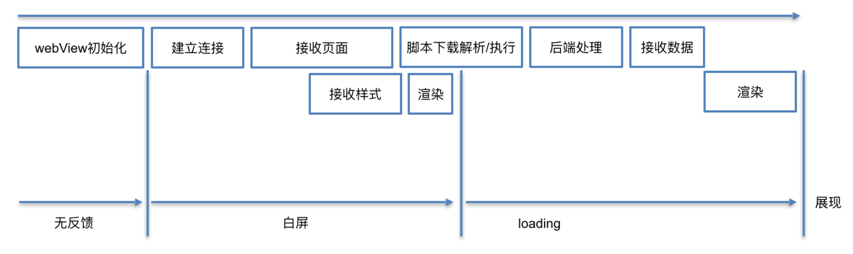
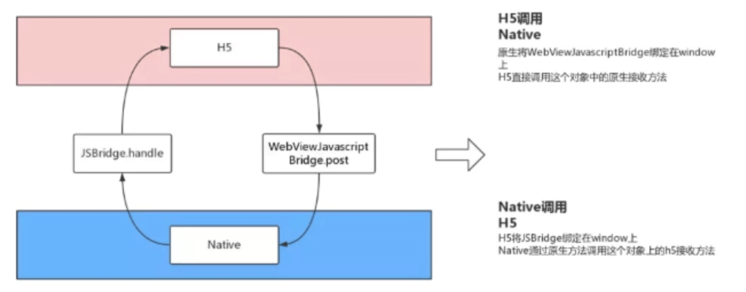

### WebView的启动过程


### 如何提高WebView的加载速度
#### 1.常规设置
- 1.提高渲染的优先级：webSettings.setRenderPriority(RenderPriority.HIGH);
- 2.使把图片加载放在最后来加载渲染： webSettings.setBlockNetworkImage(true);
- 3.开启H5(APPCache)缓存功能：webSettings.setAppCacheEnabled(true);
- 4.webView数据缓存分为两种：AppCache和DOM Storage(Web Storage)。
- 5.开启 DOM storage 功能：webSettings.setDomStorageEnabled(true);
- 6.应用可以有数据库：webSettings.setDatabaseEnabled(true);

#### 2.预加载WebView。
- App中打开WebView的第一步并不是建立连接，而是启动浏览器内核。 常见的方法是全局WebView，在客户端刚启动时，就初始化一个全局的WebView待用，并隐藏；这种方法可以比较有效的减少WebView在App中的首次打开时间。当用户访问页面时，不需要初始化WebView的时间。
- 当然这也带来了一些问题，包括： 额外的内存消耗。 页面间跳转需要清空上一个页面的痕迹，更容易内存泄露。

#### 3.asset存放离线包

### Java调用JS
#### 1.evaluateJavascript()方式
```java
//javascript示例
//（1）javascript = "javascript:javaCallJsNoParam()"
//（2）javascript = "javascript:javaCallJs(" + "'" + numebr + "'" + ")"
 webView.evaluateJavascript(javascript, new ValueCallback<String>() {
            @Override
            public void onReceiveValue(String response) {
                //response为响应数据
            	}
            }
        });

```
#### 2.loadUrl()方式
```java
// js中
// function javaCallJsNoParam(){
//       document.getElementById("result").innerHTML= 'JAVA调用JS成功！';
//               }
//java调用
webView.loadUrl("javascript:javaCallJsNoParam()");
```
### JS调用Java
#### 1.addJavascriptInterface()方式将提供的Java对象注入到此WebView中。
```java
 class JsObject {
    @JavascriptInterface
    public String toString() { return "injectedObject"; }
 }
 webview.getSettings().setJavaScriptEnabled(true);
 webView.addJavascriptInterface(new JsObject(), "injectedObject");
 webView.loadData("", "text/html", null);
 webView.loadUrl("javascript:alert(injectedObject.toString())");
```
#### 2.通过 WebViewClient 的shouldOverrideUrlLoading ()方法回调拦截 url
#### 3.Android通过 WebChromeClient 的onJsAlert()、onJsConfirm()、onJsPrompt（方法回调分别拦截JS对话框（即上述三个方法），得到他们的消息内容，然后解析即可。

### WebView内存泄漏
#### WebView内存泄漏原因
- WebView 内存泄露的主要原因是引用了 Activity/Fragment 的 Context，加之 WebView 本身的设计问题，导致 Activity/Fragment 无法被即时释放

#### WebView内存泄漏解决
- 不要使用 xml 方式创建，而是使用代码把 WebView 给 new 出来
- 引用全局的 Context：val webview = WebView(this.applicationContext)
- 为了保证 Activity/Fragment 界面销毁时将 WebView 从其父控件中移除 ，让 WebView 停止加载页面并释放
```kotlin
override fun onDestroy() {
    // webview?.loadDataWithBaseURL(null, "", "text/html", "utf-8", null)
    // webview?.clearView()
    webview?.loadUrl("about:blank")
    webview?.parent?.let {
        (it as ViewGroup).removeView(webview)
    }
    webview?.stopLoading()
    webview?.settings?.javaScriptEnabled = false
    webview?.clearHistory()
    webview?.clearCache(true)
    webview?.removeAllViewsInLayout()
    webview?.removeAllViews()
    webview?.webViewClient = null
    webview?.webChromeClient = null
    webview?.destroy()
    webview = null
    super.onDestroy()
}

```
### 低版本WebView的漏洞
#### 远程代码执行漏洞
- 由于程序没有正确限制使用addJavascriptInterface方法，当JS拿到Android这个对象后，通过Java反射机制，就可以调用这个Android对象中所有的方法，包括系统类（java.lang.Runtime类），从而进行任意代码执行。
- 解决：如果一定要使用addJavascriptInterface接口，需使用以下方法：Android4.2以上，允许被JavaScript调用的方法必须以@JavascriptInterface进行注解声明，从而避免漏洞攻击。Android4.2以下，采用setWebChromeClient重新onJsPrompt()拦截prompt()消息进行交互。

#### 密码明文存储漏洞
- WebView默认开启密码保存功能 ：mWebView.setSavePassword(true)，开启后，在用户输入密码时，会弹出提示框：询问用户是否保存密码； 如果选择”是”，密码会被明文保到 /data/data/com.package.name/databases/webview.db 中，这样就有被盗取密码的危险。
- 解决：通过 WebSettings.setSavePassword(false) 关闭密码保存提醒功能，防止明文密码存在本地被盗用。

#### 域控制不严格漏洞
- A应用可以通过B应用导出的Activity（android:exported=“true”），让B应用加载一个恶意的file 协议的url，从而可以获取B应用的内部私有文件，从而带来数据泄露威胁。
- 解决：对于不需要使用file协议的应用，禁用file协议，setAllowFileAccess(false); 对于需要使用 file 协议的应用，允许file协议加载 JavaScript。

### JsBridge原理
- JSBridge 就像其名称中的Bridge的意义⼀样，是 Native 和⾮ Native 之间的桥梁，它的核⼼是构建 Native 和⾮ Native 间消息通信的通道，⽽且这个通信的通道是双向的。
- JS 调⽤ Native 逻辑：接收到 JavaScript 消息 => 解析参数，拿到 bridgeName、data 和 callbackId => 根据 bridgeName 找到功能⽅法，以 data 为参数执⾏ => 执⾏返回值和 callbackId ⼀起回传前端。
- Native调⽤ JS 也同样简单，直接⾃动⽣成⼀个唯⼀的 ResponseId，并存储句柄，然后和 data ⼀起发送给前端即可。

