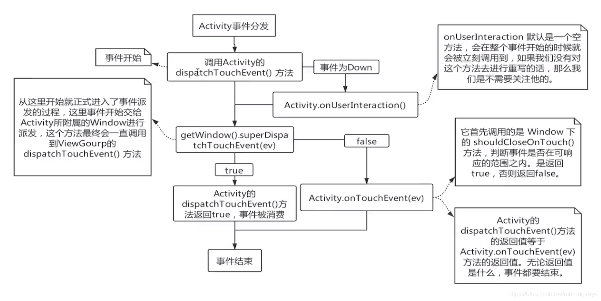
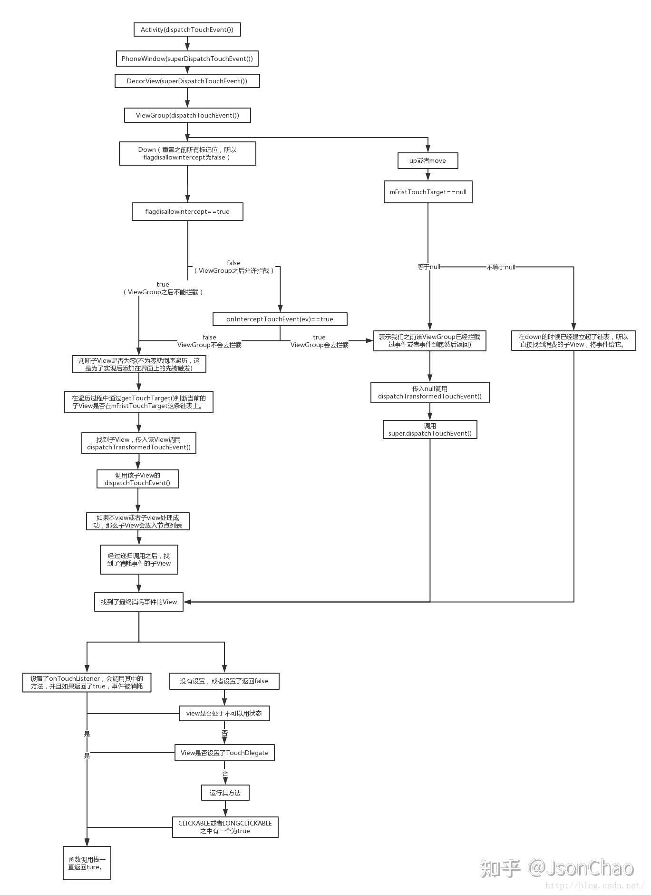

### 我们要处理的事件
- ACTION_DOWN：手指初次接触到屏幕时触发
- ACTION_MOVE：手指在屏幕上滑动时触发
- ACTION_UP：手指离开屏幕时触发
- ACTION_CANCEL：事件被上层拦截时触发

### View类 （不是对象）中只处理，没分发

### ViewGroup类 （不是对象）继承了View，重写了View中的dispatchTouchEvent方法，只分发事件，交给View处理

### Activity分发源码流程图


- 点击事件后，事件会从屏幕到内核、驱动，然后到安卓底层，然后到安卓源码
- 源码层： Activity#dispatchTouchEvent() 内部调用 getWindow().superDiapatchTouchEvent()；getWindow内部获取的是Window的实现类PhoneWindow的对象。
- getWindow().superDiapatchTouchEvent() 中调用的是 mDecor.superDispatchTouchEvent();
- mDecor.superDispatchTouchEvent();中调用的是 ViewGroup的dispatchTouchEvent()；进行事件分发的
- 由 View 的 dispatchTouchEvent(),onTouchEvent进行处理。

### View的事件处理
#### button 设置了onClick，onTouchListener并 onTouch返回true。当点击时执行哪个方法？
- 执行onTouch，不执行onClick。onTouch返回true，已经子View已经消费处理了。

#### button 设置了onClick，onTouchListener并 onTouch返回false。当点击时执行哪个方法？
- 先执行onTouch，当抬起手时，执行onClick

```java
// View中的 dispatchTouchEvent
public boolean dispatchTouchEvent(MotionEvent event){
        if(li!=null&&li.mOnTouchListener!=null
        &&(mViewFlags&ENABLED_MASK)==ENABLED
        &&li.mOnTouchListener.onTouch(this,event)){
        //  只有setOnTouchListener中onTouch返回false时，result才是false
            result=true;
        }
        //  result为false时，onTouchEvent才被短路不会执行
        if(!result&&onTouchEvent(event)){
            result=true;
        }
        return result;
}
```
- onClick 会在 onTouchEvent 中执行的。
- 四大事件从onTouchEvent中处理。onClick在 ACTION_UP 事件处理时。 
- onTouchEvent 中 ACTION_UP 时会有调用 performClick，performClick中 如果onClickListener不为空，就会回调onClick方法

### 事件分发 ViewGroup 中  dispatchTouchEvent ；可能导致的问题：事件冲突
#### ViewGroup 中  dispatchTouchEvent 源码
```java
// 第一块代码：是否拦截子View
            final boolean intercepted;
            if (actionMasked == MotionEvent.ACTION_DOWN|| mFirstTouchTarget != null) {
                //  如果down事件  resetTouchState 会重置标志位FLAG_DISALLOW_INTERCEPT，使得后面disallowIntercept为false
                //  如果是move事件，由于在down事件之后 mFirstTouchTarget已经赋值了，所以不为空。所以依然会走进此判断。
                 if (actionMasked == MotionEvent.ACTION_DOWN) {
                    //  如果是move事件，则不会进入，所以无法执行 resetTouchState 重置判断。
                    //  如果在listview的dispatchTouchEvent中处理DOWN事件时调用了getParent.requestDisallowInterceptToucheEvent(true)，则disallowIntercept会为true
                    cancelAndClearTouchTargets(ev);
                    resetTouchState();
                 }
                // 所以 如果down事件，由于resetTouchState，  disallowIntercept 肯定为false，所以 onInterceptTouchEvent肯定会执行
                // 所以 如果down事件， onInterceptTouchEvent 必须返回false，否则 第二块代码不会执行
                final boolean disallowIntercept = (mGroupFlags & FLAG_DISALLOW_INTERCEPT) != 0;
                // 如果没有设置事件拦截，DOWN事件就会执行onInterceptTouchEvent
                //  如果在listview的dispatchTouchEvent中处理DOWN事件时调用了getParent.requestDisallowInterceptToucheEvent(true)，则disallowIntercept会为true
                //  MOVE 事件来了后 便不会执行 onInterceptTouchEvent方法，会直接走else流程
                if (!disallowIntercept) {
                    intercepted = onInterceptTouchEvent(ev);
                    ev.setAction(action); // restore action in case it was changed
                } else {
                    // MOVE事件
                    intercepted = false;
                }
            } else {
                // There are no touch targets and this action is not an initial down
                // so this view group continues to intercept touches.
                intercepted = true;
            }
// 第二块代码: 遍历子View，选择分发给哪个View处理事件
        if (!canceled && !intercepted) {
            if (actionMasked == MotionEvent.ACTION_DOWN|| (split && actionMasked == MotionEvent.ACTION_POINTER_DOWN|| actionMasked == MotionEvent.ACTION_HOVER_MOVE ){
                // 如果是down事件、多指操作、鼠标事件 才会分发事件给子View；如果没有子view 就直接退出来了
                if (newTouchTarget == null && childrenCount != 0) {
                    // childrenCount 子view个数不为0，buildTouchDispatchChildList 用来给子view进行布局排序
                    final ArrayList<View> preorderedList = buildTouchDispatchChildList();
                    for (int i = childrenCount - 1; i >= 0; i--) {
                        // for 循环倒序遍历自己的子view:放的时候顺序放，取的时候倒序取
                        if (!canViewReceivePointerEvents(child) || !isTransformedTouchPointInView(x, y, child, null)) {
                            // 通过补间动画移动到新的位置，点击位置是否为新的位置，如果判断不满足，就continue
                            ev.setTargetAccessibilityFocus(false);
                            continue;
                        }
                        // 开始询问 同第三部分代码的询问，此时child不为空的，调用到dispatchTransformedTouchEvent中的child.dispatchTouchEvent(transformedEvent);
                        if (dispatchTransformedTouchEvent(ev, false, child, idBitsToAssign)) {
                            // dispatchTransformedTouchEvent 如果返回的是false
                            // dispatchTransformedTouchEvent 如果返回的是true
                            newTouchTarget = addTouchTarget(child, idBitsToAssign);
                            //  addTouchTarget 内部：target = newTouchTarget = mFirstTouchTarget !=null
                            // addTouchTarget 内部：target.next = null
                            // addTouchTarget 中会对 mFirstTouchTarget 赋值，所以第三块的mFirstTouchTarget 便不为null
                            // break掉，后面再有view也不会处理了
                            break;
                        }
                    }
                }
            }   
        }
// 第三块代码：如果没有子View处理事件，询问自己是否处理事件，否则就是子View处理，要分情况（down -- 直接返回true，move -- 询问子view是否处理事件）
       
        if (mFirstTouchTarget == null) {
            //  如果没有子view， 传入的 null 就询问自己
             handled = dispatchTransformedTouchEvent(ev, canceled, null,TouchTarget.ALL_POINTER_IDS);
        } else {
            while (target != null) {
                // 单指操作只进入一次
                //  DOWN事件 会进入下面if。如果子view处理了事件 即 newTouchTarget 从第二块代码中赋的值；直接返回true
                if (alreadyDispatchedToNewTouchTarget && target == newTouchTarget) {
                    handled = true;
                }else{
                    // 如果 intercepted = true，cancelChild 就会为 true
                    final boolean cancelChild = resetCancelNextUpFlag(target.child) || intercepted;
                    // MOVE事件 会走到else流程，会询问子view会不会处理事件 
                    if (dispatchTransformedTouchEvent(ev, cancelChild,target.child, target.pointerIdBits)) {
                        handled = true;
                    }
                    if (cancelChild) {
                        // cancelChild 为true， mFirstTouchTarget就为空了
                        if (predecessor == null) {
                            mFirstTouchTarget = next;
                        } else {
                            predecessor.next = next;
                        }
                        target.recycle();
                        target = next;
                        continue;
                    }
                }
            }
        }
        // 返回上层
        return handled;
```
```java
// dispatchTransformedTouchEvent  内部，调用
private boolean dispatchTransformedTouchEvent(MotionEvent event, boolean cancel,
        View child, int desiredPointerIdBits) {
        //如果 cancel 为true，便会执行这里
        if (cancel || oldAction == MotionEvent.ACTION_CANCEL) {
            // 当事件被拦截后，子view会执行 ACTION_CANCEL事件
            event.setAction(MotionEvent.ACTION_CANCEL);
            if (child == null) {
                handled = super.dispatchTouchEvent(event);
            } else {
                handled = child.dispatchTouchEvent(event);
            }
            event.setAction(oldAction);
            return handled;
        }
        if (child == null) {
            //  通过 super的dispatchTouchEvent，交由View的dispatchTouchEvent处理
            // 如果  View的dispatchTouchEvent 返回true 表示处理，如果返回false，则不处理
                // 自己处理
            handled = super.dispatchTouchEvent(transformedEvent);
        } else {
            // ... 交给子view处理
            handled = child.dispatchTouchEvent(transformedEvent);
        }
        return handled;
}
```


#### 左右滑动的ViewPager嵌套竖向滑动的ListView，ViewPager中 onInterceptTouchEvent 中返回true。那么能否左右滑动，能否上下滑动？
- 左右可以，上下不行。

#### 1.DOWN事件 为什么 onInterceptTouchEvent 中返回 true，上下不能滑动 
- 源码：首先进入 ViewPager 的 dispatchTouchEvent ，进入 上述第一块代码，如果是down事件，执行 onInterceptTouchEvent，会返回true，intercepted = true
- 如果 intercepted 为true，导致无法进入到第二块代码，无法遍历子view，事件便无法分发，这一块是根本原因。
- 直接到第三块代码，mFirstTouchTarget 并没有地方赋值，所以是空，所以会进入到第三块代码，把事件交给自己的dispatchTransformedTouchEvent
- dispatchTransformedTouchEvent 会调用super类View的dispatchTouchEvent去进行事件处理

#### 2.DOWN事件 为什么 onInterceptTouchEvent 中返回 false，上下能滑动，左右不可以
- viewpager - onInterceptTouchEvent 返回false，intercepted也返回false
- viewpager - 会进入第二块代码  if (!canceled && !intercepted) 会遍历子View进行分发。事件从viewpager分发到listview
- listview - 由于listview没有子view，所以listview的dispatchTouchEvent代码中的第二块会直接返回，进入到第三块代码
- listview - 第三块代码中执行 dispatchTransformedTouchEvent，调用自己父类的 dispatchTouchEvent 进行消费，走完了 viewpager的第二块代码
- viewpager - 如果第二块代码返回true消费掉了，便会 mFirstTouchTarget 赋值 ，走到第三块代码
- viewpager - 第三块代码 走到 else 流程 符合这个条件if (alreadyDispatchedToNewTouchTarget && target == newTouchTarget)，就返回ture了，没走 dispatchTransformedTouchEvent 自己消费

#### 3.DOWN事件 为什么 onInterceptTouchEvent 中返回 false，listview中重写 dispatchTouchEvent 返回false，上下不行，左右可以
- 同2，走到第二块代码中，dispatchTransformedTouchEvent返回false，所以不执行target = newTouchTarget = mFirstTouchTarget !=null，所以，mFirstTouchTarget为空
- 走到第三块代码中，会询问自己，继续走到询问自己的流程

#### 4.为什么会产生冲突
- 因为只有一个事件，事件只有一个view处理，如果子view处理的话，父view不会处理。
- 有些没冲突的，google工程师给做了处理

#### 5.为什么 onInterceptTouchEvent 处理冲突的时候 ，在处理DOWN的时候返回false
- 因为子view处理事件，必须保证第二块代码必须让他执行的。
- 由于DOWN事件会有resetTouchState重置标志位状态，使得标志位一直为false，所以onInterceptTouchEvent一定会执行
- 要想保证第二块代码必须让他执行，onInterceptTouchEvent 在DOWN事件的时候必须要返回false。这一块google工程师为我们写好了。

```java
// MyListView中 重写dispatchTouchEvent方法，内部拦截发
public boolean dispatchTouchEvent(MotionEvent event){
    int x = (int) event.getX();
    int y = (int) event.getY();
    switch(event.getAction()){
        case MotionEvent.ACTION_DOWN:
            getParent().requestDiasllowInterceptTouchEvent(true);
            break;
        case MotionEvent.ACTON_MOVE:
             int deltaX = x - mLastX;
             int deltaY = y = mLastY;
             if(Math.abs(deltaX) > Math.abs(deltaY)){
                 // 横向滑动，会走下面一行代码。
                getParent().requestDiasllowInterceptTouchEvent(false);
                // 当再来一个move事件时候，ViewPager的 dispatchTouchEvent 方法中  if (!disallowIntercept) {  intercepted = onInterceptTouchEvent(ev); } 就会执行
                // ViewPager的 onInterceptTouchEvent就会执行 返回为true， intercepted = true。
                // 然后 ViewPager的 dispatchTouchEvent 方法中 第二块代码就不会执行，会走第三块代码的else
                //  第三块：然后会走 while 代码块 if 判断的 else逻辑
                //  第三块：如果 intercepted = true，cancelChild 就会为 true
                // 第三块：询问  dispatchTransformedTouchEvent时，cancelChild 为true
                // 第三块：listview 会执行 cancel事件，我们的事件就会回到了父容器。
                // 第三块：cancelChild 为 true， mFirstTouchTarget = next = null;
                // 当下一个MOVE来了之后 第一块代码 mFirstTouchTarget为空，不满足，直接走进else逻辑 intercepted = true；
                // 第二块不执行，直接进入第三块代码，走进if(mFirstTouchTarget == null)询问自己的代码。 事件交由viewgroup处理。
             }   
             // 如果上下滑动的话，走原有的源码处理事件流程
             break;
        case MotionEvent.ACTION_UP:
                 break;
         default:
             break;
    }
    mLastX = x;
    mLastY = y;
    return super.dispatchTouchEvent(event);
}
```

#### 6.MOVE 为什么能够解决冲突，这个事件是怎么由子view转到父容器的
- 如果在listview的dispatchTouchEvent中处理DOWN事件时调用了getParent.requestDisallowInterceptToucheEvent(true)，则disallowIntercept会为true。如果不做 requestDisallowInterceptToucheEvent，是会进到onInterceptTouchEvent方法的。
- MOVE 事件来了后 便不会执行 onInterceptTouchEvent方法，会走else的 intercepted = false，即第一块代码不拦截。
- MOVE 第二块代码 只有DOWN才会分发，所以MOVE不会分发。直接进入第三块代码
- 在第三块代码中 会走 else 流程 会走while循环，只会走一次。


#### 解决 上述viewpager和listview冲突方法
- 内部拦截法：子view处理事件，必须保证第二块代码必须让他执行的。所以在 listview 的dispatchTouchEvent处理DOWN事件的时候，调用getParent.requestDisallowInterceptToucheEvent(true)，让disallowIntercept = true，强行走到else中的 intercepted = false，保证第二块代码可以执行
- 外部拦截法：事件交由ViewGroup根据情况分发


#### 参考致谢
- https://www.bilibili.com/video/BV19T4y1X7b8?p=3&spm_id_from=pageDriver
- https://www.bilibili.com/video/BV19T4y1X7b8?p=4&spm_id_from=333.880.my_history.page.click