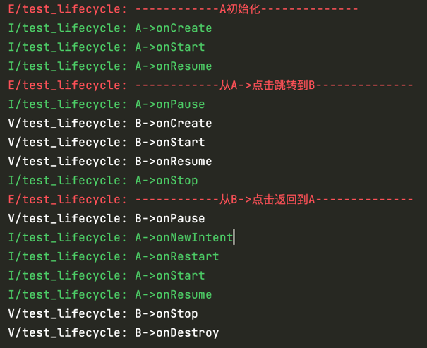

## Activity
### 生命周期
- onCreate onStart onResume onPause onStop onDestroy
- onStart 可见与 onStop 不可见；onResume 可编辑（即焦点）与 onPause

### 安卓进程优先级
- 前台进程：与用户前台交互的，或者在前台activity绑定了service
- 可见进程：activity并不是处于前台，用户不能点击
- 服务进程：在后台开启service服务
- 后台进程：按了Home键，后台进程不会立马kill掉
- 空进程：不属于以上进程，没有活跃组建，安卓随时杀掉它

### 如何保存 Activity 的状态或者(Activiy 重启怎么保存数 据？）
- 当系统内存不足时， 调用 onPause()和 onStop()方法后的 activity 可能会被系统摧毁， 此时内存中就不会存有该 activity 的实例对象了。如果之后这个 activity 重新回到前台， 之前所作的改变就会消失。
- 为了避免此种情况的发生， 我们可以覆写 onSaveInstanceState()方法。onSaveInstanceState()方法接受一 个 Bundle 类型的参数， 开发者可以将状态数据存储到这个 Bundle 对象中， 这样即使 activity 被系统摧毁 ， 当用户重新启动这个 activity 而调用它的 onCreate()方法时， 上述的 Bundle 对象会作为实参传递给 onCreate()方法， 开 发者可以从 Bundle 对象中取出保存的数据， 然后利用这些数据将 activity 恢复 到被摧毁之前的状态。
- 如果调用 onSaveInstanceState()方 法， 调用将发生在 onPause()或 onStop()方法之前。

### stardand模式下：从A跳转B
- A 会调用 onPause()方法，然后 B 调用 onCreate() ，onStart()， onResume()。这个时候 B 覆盖了窗体， A 会调用 onStop()方法。
- B返回A：B 调用onPause，A调用 onRestart，onStart，onResume，B调用onStop，onDestroy。

### A是singleTask，B是stardand

### scheme跳转协议
- 是一种页面跳转协议，通过定义自己的scheme协议，可以方便的跳转app中的各个页面。可以通过通知栏跳转，H5跳转等。

### 横竖屏切换时 Activity 的生命周期（★★★★）
- Android横竖屏切换时会触发onSaveInstanceState()，而还原时会调用onRestoreInstanceState()
- 1．不设置 Activity 的 android:configChanges 时，首先销毁当前 activity，然后重新加载。onPause-onStop-onSaveInstanceState-onDestroy-onCreate-onStart-onRestoreInstanceState-onResume
- 2．设置 Activity android:configChanges="orientation|keyboardHidden|screenSize"时，切 屏不会重新调用各个生命周期，只会执行 onConfigurationChanged

### Task任务栈
- 安卓通过任务栈来管理activity。任务栈并不唯一。

### Activity的四种启动模式
- standard 会不断地新建activity实例，都放⼊同⼀个task中，即每次转到到该Activity就会创建⼀个本activity的实例。适用于大多数场景。
- singleTop 栈内复用：如果当前实例在当前的task的栈顶，则直接复⽤，如果当前实例不再栈顶，则新建实例。应用场景：通知消息打开的页面，登录页面。
- singleTask 栈顶复用：只要是task栈中有这个实例，就会⼀直复⽤，⽽且每次复⽤这个已存在的实例，都会清空上⾯的其他实例， 将⾃⼰直接提升到栈顶位置，显⽰⾃⼰。对于不同的task栈，则会创建该实例。应用场景：返回主页面。
- singleInstance 新开栈：初始时都是新建⼀个task栈给这个页⾯，然后后⾯⼀直复⽤这个栈内的页⾯，具有全局唯⼀性，即整个系统中只会存在⼀个这样的实例。应用场景：系统闹钟页面、来电显示、系统通讯录。

### onNewIntent
- 前提:ActivityA已经启动过,处于当前应用的Activity栈中
- SingleTop时，如果ActivityA在栈顶,且现在要再启动ActivityA，这时会调用onNewIntent()-onRestart()-onStart-onResume
- SingleInstance、SingleTask ：onPause—>跳转其它页面—>onCreate—>onStart—>onResume—onPause—>跳转A—>onNewIntent—>onRestart—>onStart—>onResume

### Android 中的 Context， Activity，Appliction 有 什么区别？（★★）
- 相同：Activity 和 Application 都是 Context 的子类。 Context 从字面上理解就是上下文的意思，在实际应用中它也确实是起到了管理 上下文环境中各个参数和变量的总用，方便我们可以简单的访问到各种资源。
- 一个应用 Context 数量=Activity 个数+service个数+1（Application）
- 不同：维护的生命周期不同。 Context 维护的是当前的 Activity 的生命周期， Application 维护的是整个项目的生命周期。

### 使用 context 的时候，小心内存泄露，防止内存泄露，注意一下几个方面
- 1.不要让生命周期长的对象引用 activity context，即保证引用 activity 的对象 要与 activity 本身生命周期是一样的。
- 2.对于生命周期长的对象，可以使用 application，context。
- 3.避免非静态的内部类，尽量使用静态类，避免生命周期问题，注意内部类对外部对象引用导致的生命周期变化。

### 两个 Activity 之间传递数据，除了 intent，广播接 收者，content provider 还有啥？
- 利用 static 静态数据，public static 成员变量
- viewModel数据持久化
- 利用外部存储的传输，File，SharePreferences，Sqlite

### activity和Service传值
- 在 activity 中通过 startService（intent）即可，同样 intent.putStringExtra()， 然后再 service 中的 onStart 函数中获取该值，this.getIntent()，intent.getString()
- service 可以从 public int onStartCommand(Intent intent， int flags， int startId)中取出从 activity 中传过来的值。intent.getExtra()获得 bundle 对象， 可从中取值。
- activity 也可以用 bindService(intent， conn，BIND_AUTO_CREATE);传值，把要传的值绑定在 intent 里，在 service 的 public IBinder onBind(Intent intent) 方法里取得 intent。
- 同时也可以在 reseiver 里面注册一个广播，在 activity 里 sendbroadcast （intent）传值。 可以传递图片，用 Intent 把图片的地址或者把图片对象用 Intent 传过去，用 bitmap 对象。

## Service
### Service 是否在 main thread 中执行， service 里面是否能执 行耗时的操作?（★★）
- Service 和 activity 是运 行在当前 app 所在进程的 main thread(UI 主线程)里面。 service 里面不能执行耗时的操作(网络请求，拷贝数据库，大文件 ) 特殊情况 ，可以在清单文件配置 service 执行所在的进程 ，让 service 在另 外的进程中执行

### Service启动
- 在 Activity 中可以通过 startService 和 bindService 方法启动 Service。一 般情况下如果想获取 Service 的服务对象那么肯定需要通过 bindService（）方 法，比如音乐播放器，第三方支付等。如果仅仅只是为了开启一个后台任务那么 可以使用 startService（）方法。

### Service生命周期
- 一个原则是 Service 的 onCreate 的方法只会被调用一次，就是你无论多少次的 startService 又 bindService，Service 只被创建一次。
- 如果先是 bind 了，那么 start 的时候就直接运行 Service 的 onStart 方法， 如果先是 start，那么 bind 的时候就直接运行 onBind 方法。
- 如果你只是想要启动一个后台服务长期进行某项任务，那么使用startService便可以了。如果你还想要与正在运行的Service取得联系，就需要startService和bindService一起使用了。

#### 1． 通过 startService
- onCreate —》onStartCommand —》onStart
- 而后，多次调用startService：onStartCommand —》onStart
- 调用stopServcie：—》onDestroy
- 通过startService启动后，service会一直无限期运行下去，只有外部调用了stopService()或stopSelf()方法时，该Service才会停止运行并销毁。

#### 2． 通过 bindService
- onCreate —》onBind  —》（onServiceConnected）
- 多次调用bindService，服务本身未执行任何操作。所以一次unBindService就能结束服务。（若多次调用unBindService，第一次有用，后面会出错）
- 调用unBindService：onUnbind —》onDestroy
- bindService启动服务的生命周期与其绑定的client息息相关。当client销毁时，client会自动与Service解除绑定。当然，client也可以明确调用Context的unbindService()方法与Service解除绑定。

### 先startService，后bindService
- onCreate —》onStartCommand —》onStart —》onBind  —》（onServiceConnected）
- 先unBindServcie，后stopService：unBindService会执行到onUnbind，stopService会执行到onDestroy。
- 先stopService，后unBindServcie：onUnbind —》onDestroy。需注意的是：stopService不会执行任何操作，unBindService会执行到onUnbind—》onDestroy。

### 先bindServcie，后startService
- onCreate —》onBind  —》（onServiceConnected） —》onStartCommand —》onStart
- 先unBindService，后stopService 与 先stopService，后unBindService。服务结束的执行过程：onUnbind —》onDestroy

### IntentService
- 一个封装了HandlerThread和Handler的异步框架。
- 会创建独立的 worker 线程来处理所有的 Intent 请求；
- 会创建独立的 worker 线程来处理 onHandleIntent()方法实现的代码，无需处理多线程问题；
- 所有请求处理完成后，IntentService 会自动停止，无需调用 stopSelf()方法 停止 Service；
- 为 Service 的 onBind()提供默认实现，返回 null；
- 为 Service 的 onStartCommand 提供默认实现，将请求 Intent 添加到队列 中；
- HandlerThread会串行的取出任务并且执行，会调用ServiceHandler的handleMessage去处理任务。
- handlerMessage会去调用我们自定义的onHandleIntent
- 任务执行完毕后通过stopSelf(startId)停止Service。
- 任务结束后，在onDestory()中会退出HandlerThread中Looper的循环。

### BroadcastReceiver广播
- 通过 Android 系统的 Binder 机制实现通信。
- 静态注册：在清单文件中进行如下配置，只要 app 在系统中运行则一直可以接收到广播消息。
- 动态注册：在代码中进行如下注册，当注册的Activity或者Service销毁了那么就接收不到广播 了。
- 为什么这么设计？底层原理是什么？binder机制

## ContentProvider
### ContentProvider 是如何实现数据共享的（★★★）
- ContentProvider 是应用程序之间共享数据的接口。使用的时候首先自定义 一个类继承 ContentProvider，然后覆写 query、insert、update、delete 等 方法。因为其是四大组件之一因此必须在 AndroidManifest 文件中进行注册。 把自己的数据通过 uri 的形式共享出去，android 系统下 不同程序 数据默认 是不能共享访问，需要去实现一个类去继承承 ContentProvider第三方可以通过 ContentResolver 来访问该 Provider。

### 为什么要用 ContentProvider？它和 sql 的实现上有什么差 别？（★★★）
- ContentProvider 屏蔽了数据存储的细节，内部实现对用户完全透明，用户只 需要关心操作数据的 uri 就可以了，ContentProvider 可以实现不同 app 之间 共享。
- Sql 也有增删改查的方法，但是 sql 只能查询本应用下的数据库。而 ContentProvider 还可以去增删改查本地文件. xml 文件的读取等。

### 说说 ContentProvider、ContentResolver、ContentObserver 之间的关系（★★★★）
- ContentProvider 内容提供者，用于对外提供数据
- ContentObserver 内容监听器，可以监听数据的改变状态
- ContentResolver.notifyChange(uri)发出消息
- ContentResolver 内容解析者，用于获取内容提供者提供的数据
- ContentResolver.registerContentObserver()监听消息。

### 使用 contentProvider 获取本地所有的音频文件（★★★）
- Android 中，系统为多媒体类型的文件（比如图片、音频、视频等）建立了 数据库(sqlite 数据库)，将文件的名称、大小等信息存储起来，从而完成多媒体 数据的维护工作；
- 可以根据 ContentResover 获取到一个 Cursor，然后根据这个游标，遍历所 有的歌曲的信息，设置给实体类，得到你想要的音频文件。因为是从本地读取数 据，所以需要添加读权限

### 参考致谢
- https://www.bilibili.com/video/BV1CL4y1a7Uz?p=2&spm_id_from=pageDriver