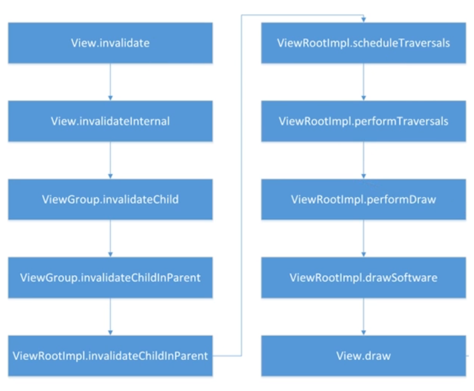

### 自定义View
- 重写构造方法
- 重写onMeasure测量
- 重写onDraw

### 自定义ViewGroup
- 重写构造方法
- 重写onMeasure测量
- 重写onLayout

### Activity界面层级的刷新

- Activity的刷新是从上到下的，decorView都不存在，view是没办法刷新的 

### View的绘制在Activity的哪个生命周期方法执行的？activity与window与view一起工作的？（图中两个流程都要掌握）


- ⚠️：addView是创建流程，在addView之后，setView中调用的requestLayout进行view的刷新
- 在执行完 Activity的 onResume 方法之后,才真正开始了View的绘制工作
- 1.AMS：UI的绘制实际上是在ActivityThread中 handleResumeActivity 方法中执行的， 首先会执行 ActivityClientRecord r = performResumeActivity(token, clearHide);而performResumeActivity就是内部最终会调用Activity的onResume生命周期。所以在onResume之前是没有进行ui绘制的
- 2.WMS：handleResumeActivity中 ViewManager wm= a.getWindowManager()来获取（windowManager是从Framework层## Activity的onCreate之前执行的流程 涉及到创建的）
- 3.window的出现是用来缓和activity和view的关系，绑定activity和view，建立联系之后ui就开始渲染了，所以activity启动的时候就会创建phonewindow同时创建WindowManager
- 4.setContentView中会创建decorview，并未跟Activity产生联系，在 handleResumeActivity方法中 赋值给Activity.mDecor 才完成绑定
- 5.之后 wm会调用UpdateViewLayout方法。（wm是在attach中建立的。wm实际上调用的mGlobal.updateViewLayout，WindowManagerGlobel是WindowManager的一个实现类，WM会把ui刷新会交给WindowManagerGlobel来进行，而WMG会把渲染交给ViewRootImpl来执行）
- 6.WindowManagerGlobel#updateViewLayout中获取到ViewRootImpl对象root，调用它的 ViewRootImpl#setlayoutParams -> ViewRootImpl#setlayoutParams -> ViewRootImpl#requestLayout -> ViewRootImpl#scheduleTraversals（这才是ui绘制的起点）-> doTraversals() -> performTraversals()
- 7.scheduleTraversals、doTraversals 中 都是用handler也是post一个消息。
- 参考致谢：https://www.bilibili.com/video/BV1uK4y1G7Mo?p=3&spm_id_from=pageDriver

### 为什么在子线程中不能更新ui
```java
@Override
public void requestLayout() {
        if (!mHandlingLayoutInLayoutRequest) { 
            checkThread();
            mLayoutRequested = true;
            scheduleTraversals();
        }
}
 
void checkThread() {
        if (mThread != Thread.currentThread()) {
            throw new CalledFromWrongThreadException(
                    "Only the original thread that created a view hierarchy can touch its views.");
        }
    }
```
- 从以上的源码分析可得知，ViewRootImpl对象是在onResume方法回调之后才创建，那么就说明了为什么在生命周期的onCreate方法里，甚至是onResume方法里都可以实现子线程更新UI，因为此时还没有创建ViewRootImpl对象，并不会进行是否为主线程的判断；
- scheduleTraversals()里是对View进行绘制操作，而在绘制之前requestLaout中，都会调用checkThread()检查当前线程是否为主线程mThread，如果不是主线程，就抛出异常；这样做法就限制了开发者在子线程中更新UI的操作；
- 访问UI是没有加对象锁的，在子线程环境下更新UI，会造成不可预期的风险；
- 参考致谢：https://blog.csdn.net/cpcpcp123/article/details/121779098

### View绘制和加载过程


- ViewRoot对应于ViewRootImpl类，它是连接WindowManager和DecorView的纽带，View的绘制流程开始于ViewRoot的performTraversals()方法，只有经过measure、layout、draw三个流程才能最终把View绘制出来
- 当Activity对象创建完毕后，会将DecorView添加到Window中，同时会创建ViewRootImpl对象，并将该对象和DecorView建立关联，在ViewRootImpl里面performTraversals分发。
- 这个流程在onCreate之前，所以会有一段时间的黑屏、白屏。所以在启动的时候解决黑白屏问题，我们会设置主题，因为在onCreate之前会把主题设置进来，之后才会加载xml布局中的问题。
- performTraversals()依次调用performMeasure()、performLayout()和performDraw()三个方法，分别完成顶级View的绘制。
- 其中performMeasure()会调用view的measure()，measure()中又调用view的onMeasure()，实现对其所有子元素的measure过程，这样就完成了一次measure过程；
- 接着子元素会重复父容器的measure过程，如此反复至完成整个View树的遍历
- onLayout和onDraw跟measure方法类似

#### View的measure过程

- View的测量过程首先会调用View的measure()方法，而measure()方法又会调用onMeasure()方法实现具体的测量。onMeasure()主要通过setMeasuredDimension()方法来设置View宽高的测量值
- View的实际测量宽高是通过getDefaultSize()方法来获取的（返回值实际上就是View的SpecSize），该方法的主要逻辑是：根据传进来的View的MeasureSpec，获取对应的SpecMode值和SpecSize值，并判断SpecMode三种测量模式下对应的View的SpecSize的取值。
- 在这里主要关注EXACTLY和AT_MOST两种模式，这两种模式下都是直接返回View的SpecSize值，这个SpecSize就是View的测量宽高大小。
- UNSPECIFIED测量模式的话，则会使用getSuggestedMinimumWidth()和getSuggestedMinimumHeight()提供的默认大小，那么默认大小是多少呢？通过getSuggestedMinimumWidth()方法可以看到：如果View没有设置背景，那么View的测量宽度等于XML布局文件中android:minWidth属性指定的值，如果没有指定则默认为0；如果View设置了背景，那么View的测量宽度等于android:minWidth属性指定的值与背景图Drawable的原始宽度（若无原始宽度则默认为0）两者中的最大值。

#### ViewGroup的measure过程

- ViewGroup的测量过程除了完成自身的测量之外，还会遍历去调用子View的measure()方法。
- ViewGroup是一个抽象类，没有重写View的onMeasure()方法，所以需要子类去实现onMeasure()方法规定具体的测量规则。
- ViewGroup子类复写onMeasure()方法一般有如下三个步骤：
- （1）遍历所有子View并测量其宽高，直接调用ViewGroup的measureChildren()方法；
- （2）合并计算所有子View测量的宽高，最终得到父View的实际测量宽高；
- （3）存储父View实际测量宽高值；
- ViewGroup中提供了measureChildren()方法，该方法主要遍历所有的子View并调用其measureChild()方法，measureChild()主要的逻辑是：取出子View的LayoutParams参数，结合传进来的父View的MeasureSpec参数，通过getChildMeasureSpec()来计算并创建子View的MeasureSpec
- getChildMeasureSpec()方法主要获取父View测量规格中的SpecMode值和SpecSize值，并根据三种SpecMode模式结合子View的LayoutParams参数计算出子View的SpecMode值和SpecSize值，并通过makeMeasureSpec()方法创建对应的MeasureSpec测量规格，然后再把MeasureSpec传递给子View的measure()方法进行测量
- 如此递归下去遍历所有的子View并测量子View的宽高从而得出ViewGroup的实际测量大小。

### MeasureSpec测量规格
#### MeasureSpec的定义
- MeasureSpec是一个32位的int值，前2位表示SpecMode测量模式，后30位表示SpecSize测量大小；在一个View控件的measure过程中，系统会将这个View的LayoutParams结合父容器的MeasureSpec生成一个MeasureSpec，这个MeasureSpec即规定好了如何去测量这个View的规格大小。
- 子View的MeasureSpec  =  父View的MeasureSpec  +  子View的LyaoutParams

#### SpecMode有三种测量模式
- UNSPECIFIED：不确定模式，父控件不会对子控件有任何约束；
- EXACTLY：精确模式，父容器知道View所需要的精确大小，这时候View的最终大小就是SpecSize所指定的值；对应于LyaoutParams中的match_parent或具体数值。
- AT_MOST：最多模式，父容器指定了一个可用的大小SpecSize，View的大小不能超过这个值，View的最终大小要看View的具体实现；对应于LyaoutParams中的wrap_content。

#### View的MeasureSpec创建规则
- 当子View的LyaoutParams为固定宽高时，不管父View的SpecMode是什么，子View的MeasureSpec = EXACTLY模式 + LyaoutParams的实际大小。
- 当子View的LyaoutParams为match_parent时：如果父View的SpecMode为EXACTLY精确模式时，子View的MeasureSpec = EXACTLY模式 + 父容器的剩余空间；如果父View的SpecMode为AT_MOST最大模式时，子View的MeasureSpec = AT_MOST模式 + 父容器的剩余空间（不允许超过）。
- 当子View的LyaoutParams为wrap_content时：不管父View的SpecMode是EXACTLY精确模式还是AT_MOST最大模式，子View的MeasureSpec的SpecMode总是AT_MOST模式且SpecSize不会超过父容器的剩余空间（SpecSize具体大小由子View实现）。

#### 为什么ViewGroup要设计成抽象类自己去实现onMeasure
- ViewGroup抽象类需要子类自己实现onMeasure()方法，因为不同的ViewGroup具有不同的布局特性（LinearLayout、RelativeLayout等），导致测量的细节也不一样，所以没有跟View测量过程一样做onMeasure()的统一处理。

#### 如何正确获取View的测量宽高
- onLayout()中去获取View的测量宽高和最终宽高，getMeasureWidth()和getMeasureHeight()用来获取测量宽高，getWidth()和getHeight()用来获取最终宽高。

#### Handler与View的刷新关系
- 

#### 在Activity启动时，如何正确获取一个View的宽高？在onResume中获取高度有效吗？
- 在首次执行onResume中getWidth与getHeigh无效，为0。因为执行onResume的时候，decor还未与activity绑定。
- 首次onResume中可以 view.post(Runnable)或者new handler.postDelay(runnable,1000)可以，new handler.post(runnable)不可以。
- 因为addView中 都是用handler也是post一个消息；而onResume中直接post(runnable)消息是在刷新addView之前执行
- 再次调用onResume有效，再次调用时不会走onCreat，再次调用时已经完成了绘制。
- 由于View的measure过程和Activity的生命周期是不同步的，所以无法保证Activity的onCreate()或者onResume()方法执行时某个View已经测量完毕，可以通过以下方法来解决：
- （1）在onWindowFocusChanged()方法中获取View的宽高，该方法可能会被频繁调用；
- （2）通过ViewTreeObserver的OnGlobalLayoutListener监听接口，当View树的状态发生改变或者View树内部的View的可见性发生改变时，就会回调onGlobalLayout()方法，在该方法中可以准确获取View的实际宽高；

#### recycleview，listview，viewpager高度无效？
- 都是因为onMeasure度量失效

#### View的Layout过程
- 首先调用View的layout()方法，在该方法中通过setFrame()方法来设定View的四个顶点的位置，即 初始化mLeft、mTop、mRight、mBottom这四个值，View的四个顶点一旦确定，那么View在父容器的位置也就确定了。
- 接着会调用onLayout()方法确定所有子View在父容器中的位置，由于是单一View的layout过程，所以 onLayout()方法为空实现，因为没有子View（如果是ViewGroup需要子类实现 onLayout()方法）。

#### ViewGroup的Layout过程

- 首先会调用自身layout()方法，但和View的layout过程不一样的是，ViewGroup需要子类实现onLayout()方法，循环遍历所有的子View并调用其layout()方法确定子View的位置，从而最终确定ViewGroup在父容器的位置。

#### 如何实现ViewGroup的onLayout()，以LinearLayout为例
- 在onLayout()中首先判断水平或者垂直方向进入相应的处理函数
- 查看垂直处理函数layoutVertical()主要遍历所有子View并调用setChildFrame()
- 在setChildFrame()中调用子View的layout()来确定每个子View的位置，从而最终确定自身的位置。

#### View的Draw过程 和 ViewGroup的Draw过程

- drawBackground()：绘制背景；
- 保存当前的canvas层（不是必须的）；
- onDraw()： 绘制View的内容，这是一个空实现，需要子View根据要绘制的颜色、线条等样式去具体实现，所以要在子View里重写该方法；
- dispatchDraw()： 对所有子View进行绘制；单一View的dispatchDraw()方法是一个空方法，因为单一View没有子View，不需要实现dispatchDraw ()方法，而ViewGroup就不一样了，它实现了dispatchDraw()方法去遍历所有子View进行绘制；
- onDrawForeground()：绘制装饰，比如滚动条；


### 刷新View的方法

- invalidate()： 不会经过measure和layout过程，只会调用draw过程；
- requestLayout() ：会调用measure和layout过程重新测量大小和确定位置，不会调用draw过程。

### 参考致谢
- https://www.jianshu.com/p/a5ea8174d912
