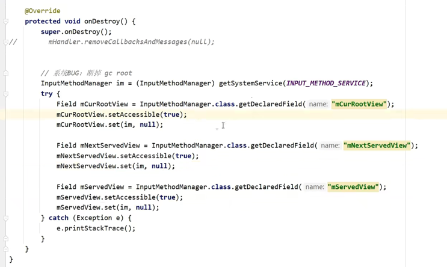
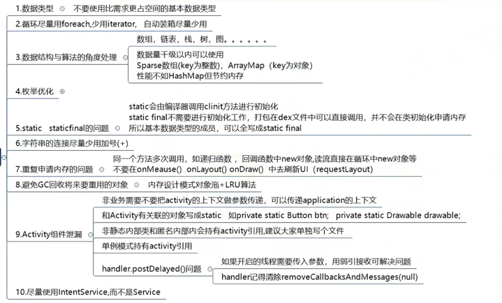

## 读懂了内存，就读懂了程序

### JVM堆区的基本原理

#### 小对象10k，几百k的对象怎么创建出来的
- 小的对象会放到Eden区，该区满了后，会执行Minor-GC，把Eden区能回收的对象都回收掉，不能回收的放到to区里面
- 当再次满了后，再次执行Minor-GC，这次会扫Eden区和to区，找到中间不能回收的放到from区。
- 如果from或to区里面分带年龄达到了阈值比如ART虚拟机GC扫描了6次，这个对象就会进老年代。
- 老年代满了，进行Full-GC。
- GC工作会引起STW现象，会造成卡顿
- GC调优，单个程序申请内存增大，减少GC回收次数
#### 回收算法
- 标记：可达性分析：GCRoot 其实是对象头上面有个1或0来标识的；如果引用链上有个对象放到了栈或方法区，他就不能回收。所以直接查对象头就好。
- 
- 
- 回收：老年代标记清除算法：老年代比较稳定，碎片少。如果出现4k碎片，再申请5k空间会直接抛OOM，所以OOM不仅是内存满了才会溢出。
- 回收：年轻代复制算法，复制完后，格式化原有存储空间，速度快，无碎片

### 常见内存问题：主要处理抖动和泄漏
#### 1.OOM引发原因
- a.内存不够用
- b.申请空间在内存中无连续内存空间
#### 2.内存抖动
- a.内存频繁申请回收
- b.申请次数太多会引发GC，同时还会引起卡顿
- c.申请速度过快:onDraw里面new对象，onDraw里面调用parseColor（该方法涉及到字符串操作，会创建多个字符串）。
#### 3.内存泄漏
- 长引短：长生命周期对象持有了一个短生命周期对象的强引用：某个对象持有activity引用，activity退出的时候，这个对象还未释放，从而导致整个activity引用链不释放。
- Handler内存泄漏，MVP内存泄漏
### 如何验证堆区原理有效性 VisualGC
- 该工具把堆区的各个部分大小，里面存储内容的大小试试展示

### 内存分析工具使用profile MAT
- profile - 分析抖动
- LeakCannary（Activity，Fragment，service）非activity问题 就很难排查
- MAT
#### MAT 
- dump一次，然后把app点击，跳转一个圈后，在返回，然后在dump一次，然后仔细分析这两次dump之间，增加了哪些对象，减少了哪些对象
- 在profile时候，当内存平滑后，点击下箭头的小标（dump java heap）导出，点击跳转后，再dump一次。
- 使用MAT分析，用第一次和第二次的dump文件去对比，看看内存加了多少，减了多少。找到问题后，排除虚引用，只看强引用

### 第三方SDK与系统的内存泄漏怎么处理
- 当第三方sdk或framework层泄漏的时候，通过MAT查找到泄漏的引用链，通过反射拿到该元素，如果在数组中可以直接remove掉或者置为空。
- 

### 解决内存问题最有效的方案

### 引发内存问题常见的十种优化
- 静态内部类
- 自定义view在onDetachedFromWindow()中释放，回收，取消
- 注册的一些监听，在销毁的时候一定要反注册
- 