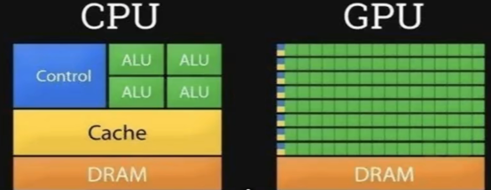
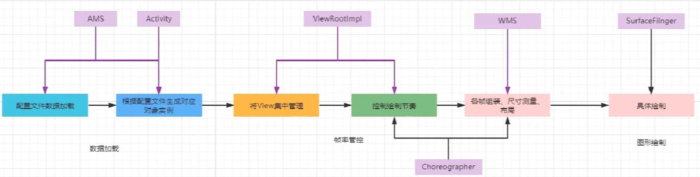

### 数据产生过程GPU
- cpu和gpu区别
  
- cpu更多的是指令的存取、信息的缓存。IO、线程、对象分配。
- gpu对算力提供更多的支持。例如挖矿就是需要更多的算力。 图像的渲染（光影，影深，阴影）需要精致计算。图像的生成。

### 渲染机制主线：xml图像提取-GPU图像生成-到了SurfaceFlinger整个过程是16.66毫秒完成的

- 数据加载阶段（涉及到启动流程：[Activity启动流程](../基础/Framework层App启动流程.md)）在Activity启动时，AMS会提供一些数据给App进程，例如清单文件。而在app进程里面在Activity的onCreate里面，会解析layout布局xml阶段；在onResume阶段将具体解出来的view推给wms进行处理，wms中viewrootImpl去接对应的数据。
- 数据控制阶段 ：测量-布局-控制。当调用到performDraw后，会走到draw方法，之后调用drawSoftware，view.darw等方法 都是调用canvas去绘制，这些绘制最终都会走到底层的native里面。nativie里面会调用skia/OPGL，会提供对GPU的调用处理
- 数据展示阶段 ：在展示阶段，java层（WMS）的suface去接画面的宽高，外框数据；native层的suface去接canvans产生的图像

### 屏幕
- 一秒钟支持图像变更多少次
- 上述GPU和CPU的制图一秒钟可以生成多少张图像数据，FPS帧率
- 如果制图速度>图像刷新速度：跳帧 造成卡顿（展示的时候错过了）
- 制图速度跟不上刷新速度：容易黑屏或白屏
- android不能放任他们随便推数据和更新数据。安卓设置的是一秒钟60帧。1秒/60 = 16.66毫秒。
- SurfaceFlinger所以就采用16.66毫秒启动一次帧缓冲区刷新。在刷新前判定，图像数据是否准备好，如果准备好就推送+刷新
- SurfaceFlinger在发送垂直同步信号的时候，不会管别人的因素，只要一到16.66毫秒，同时满足数据准备完成 就会推送+刷新，否则将会等到下一个16.66毫秒完成
- 16ms主要处理两件事：1.将UI对象转换成多边形和纹理  2.CPU传递数据到GPU，GPU进行绘制

### 造成条帧的因素
#### 常规因素（写代码造成的）
- 层级过多，当前cup 三四层不算什么
- CPU处理加载或内部的for循环计算有超时
- 当前绘图太多了，过度绘制
#### 核心因素
- 内存引起，数据业务和图像绘制可能不到16.66就完成了，可能会有STW（在ART虚拟机里面，对象的内存控件一般是12M，24M，36M，当内存满的是时候会调用GC，GC的时候会stop the world，暂停当前所有业务线程进行内存清理，但是垂直同步信号不会等你）
- 内存影响主要是View绘制时高频调用的方法内部新建对象，导致内存满造成频繁STW
- 线程引起，时间片用完进行线程切换 ，IO阻塞时间 ，锁的排队等待时间，当前阻塞主线程的代码都有可能造成卡顿

### 定位问题
#### systrace：分析卡顿原因，给我们去找事故原因
- 主要是看当前线程状态哪一段呈现深色，例如出现大面积绿色，代表代码实际运行时间确实超过了，代表要么层级多，要么有耗时操作，要么绘制问题。
- 如果大面积紫色，代表代码中有高频创建对象的代码，要么发生在事件，要么发生在draw里面
- 如果大面积灰色，有锁
- 如果大面积蓝色，系统资源不够
- 如果大面积橙色，有io问题

### 定位代码
#### BlockCannary 
- 本质原理是在主线程里面 处理消息之前 和之后的打印日志时间之差 看是否大于 时间阈值

### 解决问题
- 具体看业务，看实际处理过程，看原因
- loading动画下产生的问题