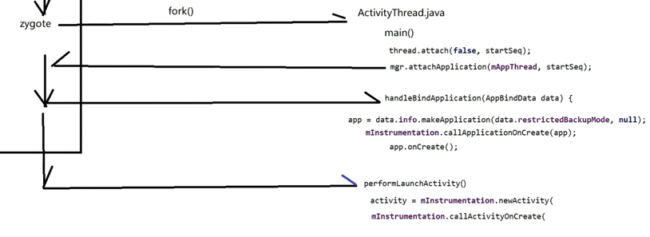

### Android系统启动流程及原理
- 打开电源，引导芯片会将BootLoader引导进RAM
- 然后拉起Linux系统，内核会开一个init进程，读取一个init.rc文件，会开启关键的服务（打电话，摄像头等）
- init开启zygote进程，zygote会fork多个进程（第一个是system_server，JVM初始化，JNI等）
- system_server进程主要功能管理Binder，里面有Binder线程池，进程之间是Binder通信，还有SystemServiceManager
- 之后会开启 AMS，WMS，PMS等80多个。之后Luanch启动，app冷启动流程

### App启动流程
- [App与Activity启动](../基础/Framework层App启动流程.md)
- 冷启动走的是mInstrumentation.execStartActivity，zygote进程会fork出ActivityThrea并执行main方法。
- 热启动走的是Binder通信
- 

### App启动有哪些任务要处理？任务写在哪里？
- 文件系统、数据库、网络
- 签名校验、安全、隐私条款、权限的提示
- 引导页、广告
- 更新提示
- 各种SDK初始化

### 如何查看方法内耗时时间与方法分析
- adb shell am start -W 命令
- profile工具 

### 启动过程必处理的七个问题
#### 1.黑白屏问题：图片或动画
#### 2.setContentView 处理过度绘制
- setContentView方法内部，会执行inflate解析布局文件。
- 内部会循环调用rInflateChildren方法来解析子标签。
- 如果ViewGroup层次过多，循环调用rInflateChildren会越多，方法区栈帧就会越多，会造成栈溢出
#### 3.减少布局中ViewGroup的层次
#### 4.尽量不要在欢迎页面 和 application的onCreate写初始化代码，那在哪里呢？
- 在ActivityThread里面，会调用handleResumeActivity，里面会调用performResume，里面mInstrumentation会走onResume方法。
- performResume 之后，会执行wm.addView(decor,1); 会通过桥接模式跑到ViewRootImpl里面走setView，之后会走requestLayout
- 接下来就执行performTraversals-performMeasure-performLayout-performDraw 来绘制展现ui
- 之后wms通过handler发送一个窗口焦点事件，走handleWindowFoucsChanaged()，分发窗口焦点事件，执行Activity的onWindowFocusChanged(true)：第一个能交互的方法
- 注：这个加载写到 欢迎界面 Activity#onWindowFocusChanged 中完成第一次初始化
#### 5.使用启动框架（把任务进行多线程排序，拓扑排序） + 懒加载 + 预加载
- 懒加载：ViewStup，HashMap扩容，ViewPager，Fragment，jetpack做分页的pagging，APT的执行，网络访问对象，数据库对象
- 伪优化：欢迎页 两三秒做初始化，跳过button 设置很小，很难点
- 预加载：根据业务需求，预加载本地数据，然后其他数据慢慢填上去
#### 6.有些初始化放到contentProvider的onCreate里面执行
#### 7.代码质量上的优化：阿里安卓开发规范（https://edu.aliyun.com/certification/cldt04）

### 字节码插桩
- https://blog.csdn.net/shulianghan/article/details/120298969