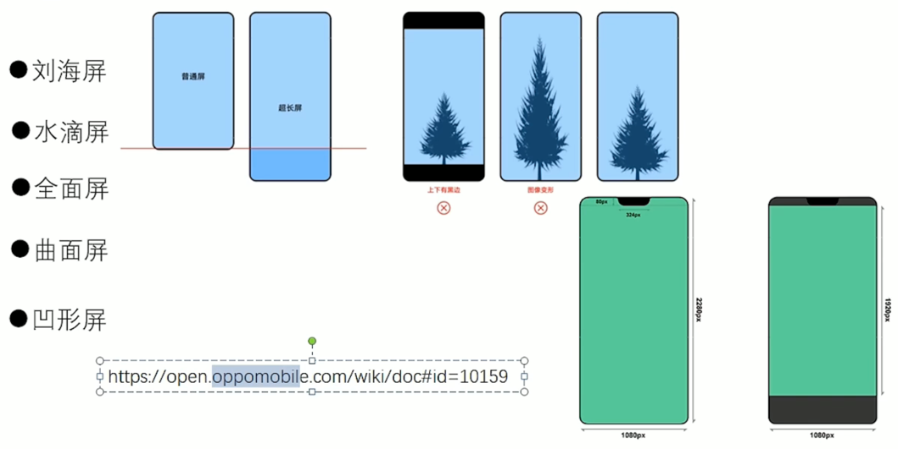

### 屏幕适配核心原理
- 分屏，水滴屏，曲面屏，刘海屏，全面屏，凹屏


#### 屏幕适配两个关键点
- 核心一：要解决超长屏，的适配问题。超长评，以宽度为标杆，高度可以滚动
- 核心二：防止内容被刘海遮挡。刘海屏如果不做适配，顶部会空出一块黑色区域，整体布局下移动。通过反射解决。

#### 刘海屏
- 刘海就是statusBar区域，安卓P Build.VERSION.SDK_INT = 28，全屏与刘海屏关系
- 其中有个变量layoutInDisplayCutoutMode：DEFAULT 默认，默认情况，全屏页面不可用刘海区域，非全屏页面可以进行使用
- NEVER：不允许使用刘海区域，会出现黑色效果，不占用刘海(窗口不允许和刘海屏重叠)；
- SHOT_EDGE：允许页面延伸到刘海区域。
- 根据需求设置完参数后，还要获取到statusBar的高度，动态的把布局整体下移，空出statusBar的内容

### 传统屏幕适配
- px = dp * density
- density = dpi / 160
- density屏幕密度
- ppi（每寸存储多少颗粒）越大，越清晰。ppi减小了，意味着同样的像素要更多的尺寸去展示
- 而dpi是根据屏幕真实的分辨率和尺寸来计算的，每个设备都可能不一样的

### 头条适配方案
- DisplayMetrics 类中有 density = 2.75,width = 1080,height = 2061,scaledDensity=2.75,xdpi =397.565 ,ydpi=474.688
- 如果我们想再所有设备上显示完全一致，是不现实的。因为屏幕高宽比是不固定的。只需要保证所有设备中宽的维度显示一致即可
- px = dp * density，设计稿上宽度的像素px是定死的，我们动态控制density去适配不同机型
- 假设设计图的宽度是360dp，适配后的density = 设备真实宽度（px）/360，保证设计图总宽度不变
- 缺陷：所有控件强制使用我们自身设计的尺寸，当系统或三方控件设计图尺寸和我们自身设计图尺寸差距非常大时就有缺陷了
- 这个问题怎么解决：借助于设计模式深度解决。这个尺寸我们需要更灵活
```java
// 系统的Density
 private static float sNoncompatDensity;
 // 系统的ScaledDensity
 private static float sNoncompatScaledDensity;

 public static void setCustomDensity(Activity activity, Application application) {
        DisplayMetrics displayMetrics = application.getResources().getDisplayMetrics();
        if (sNoncompatDensity == 0) {
            sNoncompatDensity = displayMetrics.density;
            sNoncompatScaledDensity = displayMetrics.scaledDensity;
            // 监听在系统设置中切换字体
            application.registerComponentCallbacks(new ComponentCallbacks() {
                @Override
                public void onConfigurationChanged(Configuration newConfig) {
                    if (newConfig != null && newConfig.fontScale > 0) {
                        sNoncompatScaledDensity=application.getResources().getDisplayMetrics().scaledDensity;
                    }
                }

                @Override
                public void onLowMemory() {
                }
            });
        }
        // 此处以360dp的设计图作为例子
        float targetDensity=displayMetrics.widthPixels/360;
        float targetScaledDensity=targetDensity*(sNoncompatScaledDensity/sNoncompatDensity);
        int targetDensityDpi= (int) (160 * targetDensity);
        displayMetrics.density = targetDensity;
        displayMetrics.scaledDensity = targetScaledDensity;
        displayMetrics.densityDpi = targetDensityDpi;

        DisplayMetrics activityDisplayMetrics = activity.getResources().getDisplayMetrics();
        activityDisplayMetrics.density = targetDensity;
        activityDisplayMetrics.scaledDensity = targetScaledDensity;
        activityDisplayMetrics.densityDpi = targetDensityDpi;
    }
```

### ScreenAdaptation框架分析
- 设计图最小宽度dp = 设计图宽度 / 几倍图
- smallestWidth限定符适配原理：系统根据限定符去找对应的dimens.xml文件
- 会生成很多不同类型的dimens文件，增加App体积；高入侵性，商业化不能用；不能自动支持横竖屏切换。