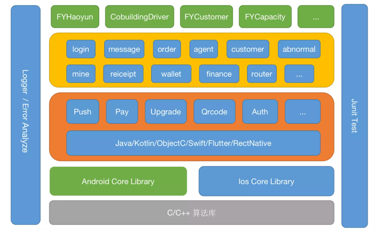

### 组件化开发

- 模块可以单独运行测试，提高编译速度
- 超级解耦，模块之间不存在耦合，便于更新维护
- 功能重用
- 便于团队开发

### 组件话开发的问题
- 注意包名和资源名冲突，要遵循命名规则
- Gradle中版本号要统一管理
- 组件在Application和Library之间如何做到随意切换，在最终打包发布的时候让所有模块都为library
- AdnroidManifest.xml文件的区分
- Library不能在gradle中有application

#### 版本号要统一管理
- 把版本号变为公共变量来管理：
- 1.直接定义在gradle.properties里面
```java
 MIN_SDK_VERSION = 21
 TAR_SDK_VERSION = 30
 COMPILER_SDK_VERSION = 30
 BUILD_TOOL_VERSION = 29.0.0
 APP_COMPAT = 'androidx.appcompat:appcompat:1.1.0'
 VER_CODE = 1
 VER_NAME = 1
 IS_APPLICATION = true
```
- 2.自己定义在build.gradle里面
- 3.自己定义一个gradle文件，记得要加载

#### 组件在Application和Library之间如何做到随意切换
- 业务逻辑模块的gradle中
```java
if(IS_APPLICATION.toBoolean()){
    apply plugin 'com.android.application'
}else{
    apply plugin 'com.android.library'
}
// 如果是'com.android.library'模块，则不需要设置applicationid
```
- 针对不同情况加载不同的AndroidManifest.xml，那么在何时加载呢？
- 在主app的gradle中，只有library的时候才加载无application设置的清单文件
```java
sourceSets{
    main{
        if(IS_APPLICATION.toBoolean()){
            manifest.srcFile 'src/main/AndroidManifest.xml'
        }else{
            manifest.srcFile 'src/main/manifest/AndroidManifest.xml'
        }
    }
}
```
- 在主app的gradle中，只有其他模块是library的时候才会加载
```java
dependencies{
    if(!IS_APPLICATION.toBoolean()){
        imlementation project(path:':login')
    }
}
```
### 手写实现ARouter
- https://github.com/chsring/SrRouter

### 自定义ARouter
- 注解处理器的依赖方式： annotationProcessor() 
- annotationProcessor 被此标记的 模块，会找到这个模块，遍历这个模块里面所有的类，看哪个类中带有@AutoService()注解，如果获取到这个类，他就会获取到注解处理器，回调它的Process方法，同时把需要的东西对象化
- 因为好多模块都会依赖 annotationProcessor，那么有几个模块依赖，就会执行多少次。因为是编译时技术，所以只会影响编译效率，不会影响运行速度


### 参考致谢
- https://www.bilibili.com/video/BV1Uv411i7i4/?spm_id_from=333.788.recommend_more_video.-1