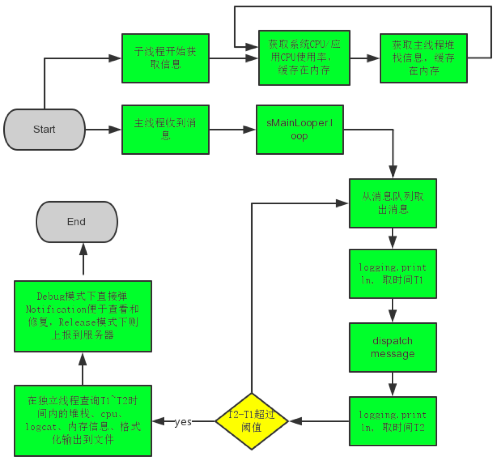

## 卡顿问题
### 破译Android性能优化中的16ms问题
- 在优化卡顿问题时，理想的标准就是绘制一帧的时间不要超过16ms
- 在GPU控制的一块缓冲区中，这块缓冲区叫做Frame Buffer(也就是帧缓冲区)
- Frame Buffer中的数据是不断变化的，为了应对这种变化，手机屏幕的逻辑电路会定期用Frame Buffer中的数据刷新屏幕上的像素点。
- 目前，主流的刷新频率是60次/秒，折算出来就是16ms刷新一次。

### 丢帧
- 红色的小球向上移动了一段距离。但由于你的应用没能在16ms内完成界面更新，导致你的用户盯着第一个屏幕看了32ms，然后发现小球跳到了一个新的高度，而不是平滑地移动到了新的高度。 这种情况称作“丢帧”。

### 作为开发者，怎样优化应用避免丢帧
- 为了让用户有流畅的动画体验，我们优化的目标就是不要丢帧，也就是在动画进行的过程中，我们要确保更新一帧的时间不要超过16ms。
- 减少视图层次，尽量使用扁平化的视图布局，相对布局。
- 减少不必要的View的invalidate调用。
- 去除View中不必要的background，因为许多background并不会显示在最终的屏幕上。比如ImageView， 假如它显示的图片填满了它的空间，你就没有必要给它设置一个背景色。
- 在绘制时减少不必要的流程，这16ms不是全给你绘制界面的，还有layout、measure呢，Android的一些子系统也要占用这宝贵的16ms完成一些自己的任务，真正留给你绘制自己的界面的时间肯定是少于16ms。
- 减少频繁的gc


### BlockCannery原理

- 整个应用的主线程，只有这一个loopr
- 每个消息的处理都是在 msg.target.dispatchMessage(msg) 这里面处理，如果主线程卡住了，不就是在dispatchMessage里卡住了吗？
- 而在msg.target.dispatchMessage(msg);前后都有一个打印语句。
```java
public static void loop() {
    ...
    for (;;) {
        ...
        Printer logging = me.mLogging;
        if (logging != null) {
            logging.println(">>>>> Dispatching to " + msg.target + " " +
                    msg.callback + ": " + msg.what);
        }
        msg.target.dispatchMessage(msg);
        if (logging != null) {
            logging.println("<<<<< Finished to " + msg.target + " " + msg.callback);
        }
        ...
    }
}
```
- 该组件利用了主线程的消息队列处理机制，通过Looper.getMainLooper().setMessageLogging(mainLooperPrinter);并在mainLooperPrinter中判断start和end，来获取主线程dispatch该message的开始和结束时间
- 判定该时间超过阈值(如2000毫秒)为主线程卡慢发生，并dump出各种信息，提供开发者分析性能瓶颈。