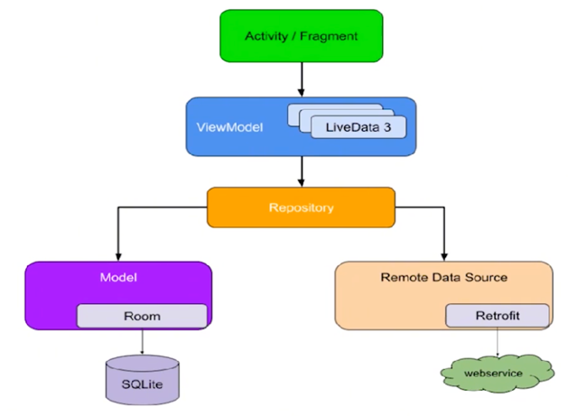
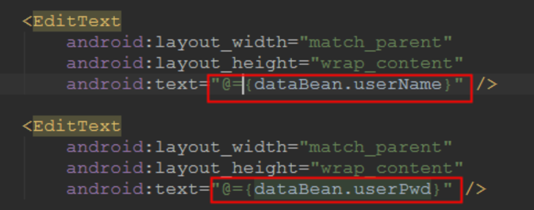

### Jetpack架构
- Jetpack 主要包括 4 个部分，分别是【Architecture：架构】、【UI：界面】、【behavior：行 为】和【foundation：基础】
- Architecture： databinding，lifecycles，livedata，viewmodel
- ui：Animation and Transition，Emoji，Fragment
- Behavior：CameraX，媒体，通知，权限
- Foundationy：Android KTX，AppCompa，检测，多Dex处理


### DataBinding
- 使用DataBinding可以轻松实现MVVM模式，并实现数据的双向绑定
- 在Google推出的Android Jetpack组件中，也将DataBinding放在了Architecture类别之中

### apt编译
- 布局中引入引入layout、data标签，并在gradle文件中开启dataBinding，Databinding在编译时会生成对应的DataBinding类，利用的技术是Apt
- 编译期间会扫描res/layout目录下所有的布局文件，只要有data标签，都会生成两个布局文件:配置文件和带标签的布局文件
- 布局文件主要是生成控件的tag值
- 配置文件主要是通过tag能够快速定位绑定的控件

### databinding双向绑定源码分析，布局文建以下图为例

- 点击 DataBindingUtil.setContentView()进入源码中。依次跟踪方法setContentView()—>bindToAddedViews()—>bind()—>sMapper.getDataBinder。最终发现这个方法是一个抽象方法，那么我们就需要去子类中查看该方法，这个子类就是我们编译时生成的DataBinderMapperImpl.class
- 进入app/build/generated/ap_generated_sources/debug/output/com/包名/DataBinderMapperImpl.class中，找到getDataBinder()方法，内部最终返回一个ActivityMainBindingImpl对象
```java
public ViewDataBinding getDataBinder(DataBindingComponent component, View view, int layoutId) {
    int localizedLayoutId = INTERNAL_LAYOUT_ID_LOOKUP.get(layoutId);
    if(localizedLayoutId > 0) {
    //找到布局文件的父节点是否有tag，没有的话就抛出异常
      final Object tag = view.getTag();
      if(tag == null) {
        throw new RuntimeException("view must have a tag");
      }
      switch(localizedLayoutId) {
        case  LAYOUT_ACTIVITYDATABINDING: {
        //找到的话，进入ActivityDatabindingBindingImpl
          if ("layout/activity_databinding_0".equals(tag)) {
            return new ActivityDatabindingBindingImpl(component, view);
          }
          throw new IllegalArgumentException("The tag for activity_databinding is invalid. Received: " + tag);
        }
      }
    }
    return null;
  }
```
- ActivityDatabindingBindingImpl.class 构造方法中，首先将bindings数组强转为我们的控件类型
- 然后调用invalidateAll()方法
```java
// views
public ActivityDatabindingBindingImpl(@Nullable android.databinding.DataBindingComponent bindingComponent, @NonNull View root) {
        this(bindingComponent, root, mapBindings(bindingComponent, root, 3, sIncludes, sViewsWithIds));
    }
    private ActivityDatabindingBindingImpl(android.databinding.DataBindingComponent bindingComponent, View root, Object[] bindings) {
        super(bindingComponent, root, 2
            );
        
        //根据tag找到控件
        this.mboundView0 = (android.widget.LinearLayout) bindings[0];
        this.mboundView0.setTag(null);
        this.mboundView1 = (android.widget.EditText) bindings[1];
        this.mboundView1.setTag(null);
        this.mboundView2 = (android.widget.EditText) bindings[2];
        this.mboundView2.setTag(null);
        setRootTag(root);
        // listeners
        invalidateAll();
    }
```
- invalidateAll()内部调用了 requestRebind()方法，requestRebind()方法内部 会通过通过handler形式发送一个mRebindRunnable任务
```java
    protected void requestRebind() {
        if (mContainingBinding != null) {
            mContainingBinding.requestRebind();
        } else {
           ...
            if (USE_CHOREOGRAPHER) {
                mChoreographer.postFrameCallback(mFrameCallback);
            } else {
                //通过handler形式更新ui
                mUIThreadHandler.post(mRebindRunnable);
            }
        }
    }
```
- mRebindRunnable任务的run方法会执行，内部最终会调用到 ActivityDatabindingBindingImpl 的executeBindings()
```java
protected void executeBindings() {
        long dirtyFlags = 0;
        synchronized(this) {
            dirtyFlags = mDirtyFlags;
            mDirtyFlags = 0;
        }
        java.lang.String dataBeanUserPwdGet = null;
        java.lang.String dataBeanUserNameGet = null;
        android.databinding.ObservableField<java.lang.String> dataBeanUserPwd = null;
        android.databinding.ObservableField<java.lang.String> dataBeanUserName = null;
        com.xinyartech.mymvpdemo.dataBinding.DataBean2 dataBean = mDataBean;
        if ((dirtyFlags & 0xfL) != 0) {
            if ((dirtyFlags & 0xdL) != 0) {
                    if (dataBean != null) {
                        // read dataBean.userPwd
                        dataBeanUserPwd = dataBean.userPwd;
                    }
                    updateRegistration(0, dataBeanUserPwd);
                    if (dataBeanUserPwd != null) {
                        // read dataBean.userPwd.get()
                        dataBeanUserPwdGet = dataBeanUserPwd.get();
                    }
            }
            if ((dirtyFlags & 0xeL) != 0) {
                    if (dataBean != null) {
                        // read dataBean.userName
                        dataBeanUserName = dataBean.userName;
                    }
                    updateRegistration(1, dataBeanUserName);
                    if (dataBeanUserName != null) {
                        // read dataBean.userName.get()
                        dataBeanUserNameGet = dataBeanUserName.get();
                    }
            }
        }
        // batch finished
        if ((dirtyFlags & 0xeL) != 0) {
            // api target 1
            android.databinding.adapters.TextViewBindingAdapter.setText(this.mboundView1, dataBeanUserNameGet);
        }
       ...
        if ((dirtyFlags & 0xdL) != 0) {
            // api target 1
            android.databinding.adapters.TextViewBindingAdapter.setText(this.mboundView2, dataBeanUserPwdGet);
        }
    }
```
- 至此我们一目了然了，Model->View，是因为在executeBindings中执行了注释为 // api target 1的setText方法
- View->Model，是因为executeBindings中添加了mboundView1androidTextAttrChanged监听，在监听的onChange方法中调用了viewmodel的dataBeanUserName.set(((java.lang.String) (callbackArg_0)));方法

### databinding带来的问题
- 所有的布局控件都会放到一个数组对象中，那么这个数组对象大小是不定的，如果你有多个activity就会存在多个数组对象，这是比较占用内存的。
- 所有的model更新都是通过handler通知view进行更新的，handler内部拥有一个Looper对象，是不断的在执行消息循环。每一个activity都会存在一个handler，这样也会导致内存的大量消耗。

