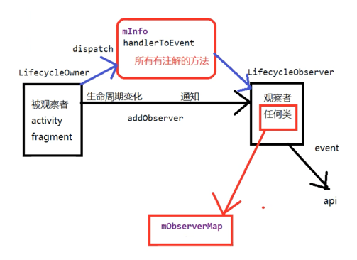

### 使用Lifcycle解耦页面与组件
```java
//自定义view 需要实现LifecycleOberver
//添加生命周期的注解
@OnLifecycleEvent(Lifecycle.Event.ON_RESUME)
private void start(){}
@OnLifecycleEvent(Lifecycle.Event.ON_PAUSE)
private void stop(){}
```
```java
//在activity 中注册生命周期的方法
getLifecycle().addObserver(chronometer);
```

### Lifecycle使用与实现原理
- 注解+反射+中间的状态机

### addObserver方法
- addObserver 是一个抽象方法，具体实现在LifecycleRegistry中，首先会把observer（就是我们的Presenter）和状态信息initialState包装在ObserverWithState中
```java
// LifecycleRegistry
    public void addObserver(@NonNull LifecycleObserver observer) {
        State initialState = mState == DESTROYED ? DESTROYED : INITIALIZED;
        ObserverWithState statefulObserver = new ObserverWithState(observer, initialState);
        ObserverWithState previous = mObserverMap.putIfAbsent(observer, statefulObserver);
        // ...
    }
```
- 接下来会把observer放到一个mObserverMap中，这样map中会包含观察者的所有类，而且做了包装。
```java
    static class ObserverWithState {
        State mState;
        LifecycleEventObserver mLifecycleObserver;

        ObserverWithState(LifecycleObserver observer, State initialState) {
            mLifecycleObserver = Lifecycling.lifecycleEventObserver(observer);
            mState = initialState;
        }

        void dispatchEvent(LifecycleOwner owner, Event event) {
            State newState = getStateAfter(event);
            mState = min(mState, newState);
            mLifecycleObserver.onStateChanged(owner, event);
            mState = newState;
        }
    }
```
- ObserverWithState 构造方法中会把我们的observer最终传到 ReflectiveGenericLifecycleObserver 中
```java
class ReflectiveGenericLifecycleObserver implements LifecycleEventObserver {
    private final Object mWrapped;
    private final CallbackInfo mInfo;

    ReflectiveGenericLifecycleObserver(Object wrapped) {
        mWrapped = wrapped;
        // mInfo存储了所有 有注解的方法。
        mInfo = ClassesInfoCache.sInstance.getInfo(mWrapped.getClass());
    }

    @Override
    public void onStateChanged(LifecycleOwner source, Event event) {
        mInfo.invokeCallbacks(source, event, mWrapped);
    }
}
```
- 在 ReflectiveGenericLifecycleObserver 构造方法中，会通过反射拿到 对应Oberver（presenter）的class对象，然后进到getInfo的api
- getInfo再往里走 调用createInfo 会通过反射拿到Presenter的所有方法对应的反射对象。
- 然后会进行遍历所有方法，如果方法头上有OnLifecycleEvent注解，则会将方法用MethodReference包装一次，放到Map集合中，然后将map存到CallbackInfo中，即上面的mInfo
```java
    private CallbackInfo createInfo(Class klass, @Nullable Method[] declaredMethods) {
        //拿到注解对象
        Method[] methods = declaredMethods != null ? declaredMethods : getDeclaredMethods(klass);
        boolean hasLifecycleMethods = false;
        // 遍历
        for (Method method : methods) {
            // 方法头上是否有OnLifecycleEvent注解
            OnLifecycleEvent annotation = method.getAnnotation(OnLifecycleEvent.class);
            if (annotation == null) {
                continue;
            }
            //...
           
            MethodReference methodReference = new MethodReference(callType, method);
            verifyAndPutHandler(handlerToEvent, methodReference, event, klass);
        }
        CallbackInfo info = new CallbackInfo(handlerToEvent);
        mCallbackMap.put(klass, info);
        mHasLifecycleMethods.put(klass, hasLifecycleMethods);
        return info;
```
- addObserver 执行完成之后，监听哪些生命周期的方法，都绑定到mInfo里面的map集合里面了

### 当生命周期变化之后，怎么去通知观察者执行对应的方法呢？
- 基本原理：去mInfo中的集合去找，找到之后通过反射的方式去发通知。
- 在ComponentActivity中，会创建一个不带布局文件的的fragment，如果acitivity生命周期发生变化，则这个fragment对应的生命周期也会执行
```java
public class ReportFragment extends Fragment {
// ...

    private ActivityInitializationListener mProcessListener;

    private void dispatchCreate(ActivityInitializationListener listener) {
        if (listener != null) {
            listener.onCreate();
        }
    }

    private void dispatchStart(ActivityInitializationListener listener) {
        if (listener != null) {
            listener.onStart();
        }
    }

    private void dispatchResume(ActivityInitializationListener listener) {
        if (listener != null) {
            listener.onResume();
        }
    }

    @Override
    public void onActivityCreated(Bundle savedInstanceState) {
        super.onActivityCreated(savedInstanceState);
        dispatchCreate(mProcessListener);
        dispatch(Lifecycle.Event.ON_CREATE);
    }

    @Override
    public void onStart() {
        super.onStart();
        dispatchStart(mProcessListener);
        dispatch(Lifecycle.Event.ON_START);
    }

    @Override
    public void onResume() {
        super.onResume();
        dispatchResume(mProcessListener);
        dispatch(Lifecycle.Event.ON_RESUME);
    }

    @Override
    public void onPause() {
        super.onPause();
        dispatch(Lifecycle.Event.ON_PAUSE);
    }

    @Override
    public void onStop() {
        super.onStop();
        dispatch(Lifecycle.Event.ON_STOP);
    }

    @Override
    public void onDestroy() {
        super.onDestroy();
        dispatch(Lifecycle.Event.ON_DESTROY);
        // just want to be sure that we won't leak reference to an activity
        mProcessListener = null;
    }

    private void dispatch(Lifecycle.Event event) {
        Activity activity = getActivity();
        if (activity instanceof LifecycleRegistryOwner) {
            ((LifecycleRegistryOwner) activity).getLifecycle().handleLifecycleEvent(event);
            return;
        }

        if (activity instanceof LifecycleOwner) {
            Lifecycle lifecycle = ((LifecycleOwner) activity).getLifecycle();
            if (lifecycle instanceof LifecycleRegistry) {
                ((LifecycleRegistry) lifecycle).handleLifecycleEvent(event);
            }
        }
    }

    void setProcessListener(ActivityInitializationListener processListener) {
        mProcessListener = processListener;
    }

    interface ActivityInitializationListener {
        void onCreate();

        void onStart();

        void onResume();
    }
}
```
- 在fragment生命周期方法执行时，会调用dispatch 遍历mObserverMap中所有的观察者，然后调用每一个观察者的observer.diapatchEvent分发生命周期事件
- 而dispatchEvent方法正是 ObserverWithState 类中的dispatchEvent方法，里面调用mLifecycleObserver.onStateChanged(owner, event);
```java
void dispatchEvent(LifecycleOwner owner, Event event) {
        State newState = getStateAfter(event);
        mState = min(mState, newState);
        mLifecycleObserver.onStateChanged(owner, event);
        mState = newState;
}
```
- onStateChanged是一个抽象方法，它的实现类正是 我们上面所说的 ReflectiveGenericLifecycleObserver，执行它的onStateChanged方法，通过event事件从map中找到对应的方法，然后通过反射去执行该方法。

