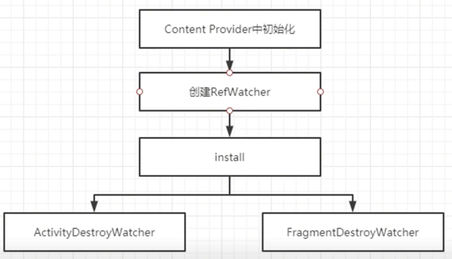
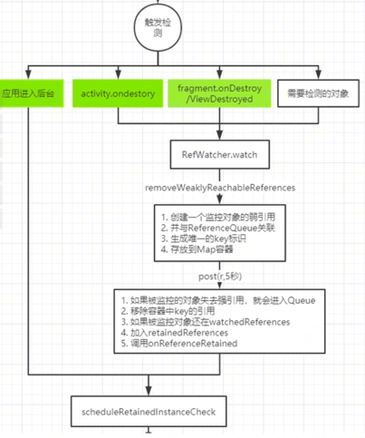
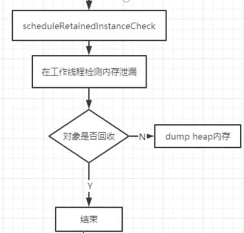

### 新版本LeakCannery不用在Appcliation做初始化就可以使用原因：
- 在LeakCannery的清单文建中，提供一个provider
- app打包流程中有个mergeManifest：会把引用到的module，aar中的清单文件merge到主app的清单文建中会合并
- App启动的时候，会走到handlerBindApplication这个方法内部通过makeApplication创建出Application
- 会检测如果注册了provider，会调用installContentProvider方法，
```java
//ActivityThreadd.java
private void handleBindApplication(){
    ...
    app = data.info.makeApplication(data.restrictedBackupMode, null);
    app.setAutofillCompatibilityEnabled(data.autofillCompatibilityEnabled);
    mInitialApplication = app;
    if (!data.restrictedBackupMode) {
        if (!ArrayUtils.isEmpty(data.providers)) {
            installContentProviders(app, data.providers);
            mH.sendEmptyMessageDelayed(H.ENABLE_JIT, 10*1000);
        }
    }
    try {
        mInstrumentation.onCreate(data.instrumentationArgs);
    }
    ...
}
```
- installContentProvider内部经过层层调用会走到attachInfo方法中，最终会调用ContentProvider.this.onCreate()
- 从上述方法出来之后，Instrumentation调用Application的onCreate的方法
- 结论：如果app中有ContentProvider的话，ContentProvider的onCreate会比Application的onCreate先调用
- 因为清单文件的存在，我可以在三方库中的ContentProvider的onCreate中拿到application实例，然后进行LeakCannery的初始化。

### 如果所有三方 都从ContentProvider中做初始化，不能乱用
- 涉及到app启动速度优化
- LeakCannery主要应用在开发debug阶段，所以可以这样用 

### LeakCannery 如何检测内存泄漏的,检测Activity退出的原理

- 注册ActivityLifeCycleCallback 后，会走Activity生命周期的回调，可以检测Activity的生命周期
- Fragment有个FragmentLifeCycleCallback，流程和 Activity类似
- 当执行 onDestroyed 的时候，会检测该Activity是否被销毁，如果没有被销毁，可能会泄漏L e
- 在Activity走到onDestroy的时候，会通过RefWatcher对象 执行watch方法，监控 activity
- 内部会通过mainHandler 五秒之后去post一个消息，也就是过5秒后会检测 activity有没有真正被销毁
- 如果没有被销毁，进行可达性分析看是否发生了泄漏
- 真正负责检测的是在一个工作线程里面，通过HeapDumpTrigger进行分析 
### 回顾java四种引用
- 强：gc扫描即使oom也不会回收
- 软：gc扫描到，内存够就不会回收；内存不够就会回收
- 弱：gc扫描到，就会回收
- 虚：一种标识

### ReferenceQueue引用队列
- 保存的是四种引用对象 
- 所引用的对象被GC回收时，该引用对象就会加入引用队列的末尾
- 如果经过GC后没有进入引用队列，说明该对象没有被回收，说明可能存在内存泄漏

### 能不能检测bitmap？
- 在我们认为这个对象不需要使用了，进行null检测，我们自己调用AppWatcher.watch(该对象)

### 什么时候触发检测



### 常见内存泄漏场景
- 结合类：当使用集合时，只有添加元素，没有对应的删除元素。如EventBus只有注册，没有注销
- 静态成员/单例：作为GC ROOT 持有段生命周期引用（Activity）导致其短生命周期对象无法释放
- 未关闭释放资源：FileOutputStream未close
- Handler/Thread（非静态内部类）：安卓程序员，70%的内存泄漏都来自于它。持有链：sendmsg-> MessageQueue -> looper -> msg -> handler -> Activity。如果是延迟消息，这个消息还在消息队列中没做处理，导致Activity没有释放
- 内部类实际上会持有外部类的引用，如果Handler是内部类，会持有Activity引用。
- TextView 设置成static，就会造成泄漏：textview常生命周期，会持有activity的引用
- 系统Bug，自定义listView，WebView，inputMethodManager等
