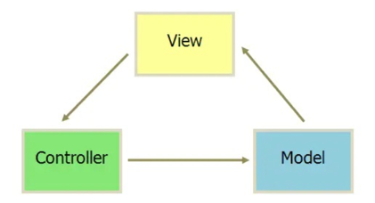
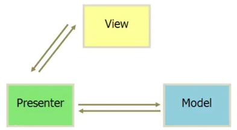
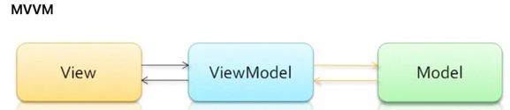

### MVC

- Android App原本就是MVC的，View对应布局文件Xml，Controller对应Activity，Model对应数据库、网络请求、业务计算等操作。
- 举个简单的例子，按下界面上的一个Button去网络上下载一个文件，这个按钮是View层的，我们是通过Xml来定义的，而网络请求等复用性很高的相关代码写在一个专门的DownloadHelper类中，其实这就是我们所说的Model层，最后通过button.setOnClickListener()函数将View层和Model层联系起来，这个函数就写在了Activity中，即Controller层的实现。

#### MVC缺点
- View层的XML控制力实在是太弱了，众多View层的处理最终都放在了Activity中去做，从而导致Activity既包含了View又包含了Controller，两层之间耦合高，不利于维护拓展，可读性也变差。

### MVP

- Model：主要提供数据存取功能。View：可能是指Activity、Fragment或者View。Presenter：通过Model存取数据，连接View和Model，从Model中取出数据交给View。

#### MVP优点
- 1.降低了耦合度，实现了model和view的完全分离，解决了MVC中维护难的问题
- 2.Presenter 可以复用，一个 Presenter 可以用于多个 View，而不需要更改 Presenter 的逻辑
- 3.View 可以进行组件化，在MVP当中，View 不依赖 Model

#### MVP缺点
- 1.于我们使用了接口的方式去连接View层和Presenter层，如果有一个逻辑很复杂的页面，接口会有很多，维护接口的成本会很大。
- 2.由于Presenter 经常性的持有Activity 的强引用，如果在一些请求结束之前Activity 被销毁了，Activity对象将无法被回收，此时就会发生内存泄露。

#### MVP内存泄漏的解决
- View层需要抽象出一层父类BaseActivity，并利用Activity的生命周期方法对View层和Presenter层实现绑定和解绑：在onCreate方法中调用P层的attachView，在onDestroy方法中去释放view
- Presenter层也抽象出BasePresenter类，使Presenter层持有Activity的软引用

### MVVM

- MVVM和MVP的区别其实不大，只不过是把Presenter层换成了ViewModel层
- 再有就是View层和ViewModel层是双向绑定的关系，当我们更新ViewModel层的数据的时候，View层会相应的更新UI。
- MVVM在Android中的实现方式是通过data-binding框架来做的

#### 优点
- 解耦彻底
- 视图（View）可以独立于Model变化和修改

#### MVVM缺点
- 数据绑定使得 Bug 很难被调试
- 过大的项目，数据绑定需要花费更多的内存。DataBinding会带来内存问题。