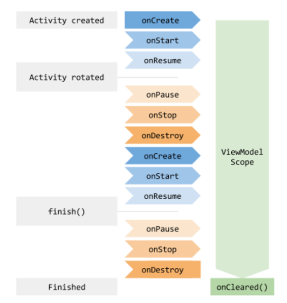

### ViewModel
- ViewModel旨在以生命周期意识的方式存储和管理用户界面相关的数据
- 可以用来管理Activity和Fragment中的数据。还可以拿来处理Fragment与Fragment之间的通信等等
- 用来做数据的持久化
- 当Activity或者Fragment创建了关联的ViewModel，那么该Activity或Fragment只要处于活动状态，那么该ViewModel就不会被销毁，即使是该Activity屏幕旋转时重建了。所以也可以拿来做数据的暂存
- ViewModel主要是拿来获取或者保留Activity/Fragment所需要的数据的，开发者可以在Activity/Fragment中观察ViewModel中的数据更改(这里需要配合LiveData使用)。

### ViewModel创建

- ViewModel的初始化很简单，通过ViewModelProvider就可以获取到ViewModel实例。那么从这里入手开始分析ViewModel的创建过程。
```java
final UserModel userModel = ViewModelProvider.get(UserModel.class);
public ViewModelProvider(@NonNull ViewModelStoreOwner owner) {
        this(owner.getViewModelStore(), owner instanceof HasDefaultViewModelProviderFactory
        ? ((HasDefaultViewModelProviderFactory) owner).getDefaultViewModelProviderFactory()
        : NewInstanceFactory.getInstance());
}
public ViewModelProvider(@NonNull ViewModelStoreOwner owner, @NonNull Factory factory) {
        this(owner.getViewModelStore(), factory);
}
```
- 从ViewModelProvider的构造方法中可以看到最终是需要两个参数ViewModelStoreOwner以及Factory。这两个参数中ViewModelStoreOwner是用来存储ViewModel对象的，Factory是用来创建ViewModel对象。
- 第二步是通过ViewModelProvider的get()方法获取ViewModel实例。
```java
public <T extends ViewModel> T get(@NonNull String key, @NonNull Class<T> modelClass) {
        ViewModel viewModel = mViewModelStore.get(key); // 1.是否有缓存ViewModel实例缓存

        ...
        if (mFactory instanceof KeyedFactory) {
            viewModel = ((KeyedFactory) (mFactory)).create(key, modelClass);
        } else {
            viewModel = (mFactory).create(modelClass);
        }
        mViewModelStore.put(key, viewModel);
        return (T) viewModel;
    }
```
- 在get()方法中可以看到是通过mFactory的类型来创建ViewModel的。而Factory的类型是由ViewModelStoreOwner决定的，这是ViewModelProvider的构造方法中的逻辑。
- 其中有两种Factory，一种是SavedStateViewModelFactory，另一种是NewInstanceFactory。
### SavedStateViewModelFactory创建ViewModel
```java
public <T extends ViewModel> T create(@NonNull String key, @NonNull Class<T> modelClass) {
        boolean isAndroidViewModel = AndroidViewModel.class.isAssignableFrom(modelClass);
        Constructor<T> constructor;
        ...
        SavedStateHandleController controller = SavedStateHandleController.create(
                mSavedStateRegistry, mLifecycle, key, mDefaultArgs);
        try {
            T viewmodel;
            if (isAndroidViewModel) {
                viewmodel = constructor.newInstance(mApplication, controller.getHandle());
            } else {
                viewmodel = constructor.newInstance(controller.getHandle());
            }
            viewmodel.setTagIfAbsent(TAG_SAVED_STATE_HANDLE_CONTROLLER, controller);
            return viewmodel;
        } 
        ...
    }
```
- 在代码中可以看到，ViewModel有分为AndroidViewModel跟ViewModel，它们的区别是AndroidViewModel创建时会加入Application参数。
### NewInstanceFactory通过Class的newInstance()方法直接创建ViewModel实例。
```java
public <T extends ViewModel> T create(@NonNull Class<T> modelClass) {
            //noinspection TryWithIdenticalCatches
            try {
                return modelClass.newInstance();
            } catch (InstantiationException e) {
                throw new RuntimeException("Cannot create an instance of " + modelClass, e);
            } catch (IllegalAccessException e) {
                throw new RuntimeException("Cannot create an instance of " + modelClass, e);
            }
        }
```
### ViewModel销毁
- 这里还要分开两处说，一个是在Activity中的销毁过程，一个是在Fragment中销毁过程。
- 在ComponentActivity的构造方法中，可以看到通过Lifecycle在ON_DESTROY事件中销毁ViewModel。
```java
 public ComponentActivity() {
 	getLifecycle().addObserver(new LifecycleEventObserver() {
            @Override
            public void onStateChanged(@NonNull LifecycleOwner source,
                    @NonNull Lifecycle.Event event) {
                if (event == Lifecycle.Event.ON_DESTROY) {
                    if (!isChangingConfigurations()) {
                        // 销毁ViewModel
                        getViewModelStore().clear();
                    }
                }
            }
        });
 }
```
- FragmentManagerViewModel类的clearNonConfigState()方法中找到了ViewModel的销毁逻辑
```java
void clearNonConfigState(@NonNull Fragment f) {
    ...
    // Clear and remove the Fragment's ViewModelStore
    ViewModelStore viewModelStore = mViewModelStores.get(f.mWho);
    if (viewModelStore != null) {
        // 销毁ViewModel
        viewModelStore.clear();
        mViewModelStores.remove(f.mWho);
    }
}
```
### ViewModel的生命周期绑定
- 在上面分了ViewModel的创建与销毁过程中就可以得出ViewModel生命周期是如何与组件交互的了。主要还是通过Lifecycle和组件的生命周期方法来进行回调管理。

### 在Activity重建时会执行destory生命周期事件，那么为什么ViewModel没有销毁呢
- 通过对ComponentActivity的getViewModelStore()方法进行分析。可以知道mViewModelStore变量如果是null的话，会从NonConfigurationInstances实例中取。
- onRetainNonConfigurationInstance中会存储ViewModelStore实例
```java
public ViewModelStore getViewModelStore() {
    	...
        if (mViewModelStore == null) {
            NonConfigurationInstances nc =
                    (NonConfigurationInstances) getLastNonConfigurationInstance();
            if (nc != null) {
                // Restore the ViewModelStore from NonConfigurationInstances
                mViewModelStore = nc.viewModelStore;
            }
            if (mViewModelStore == null) {
                mViewModelStore = new ViewModelStore();
            }
        }
        return mViewModelStore;
    }

```

