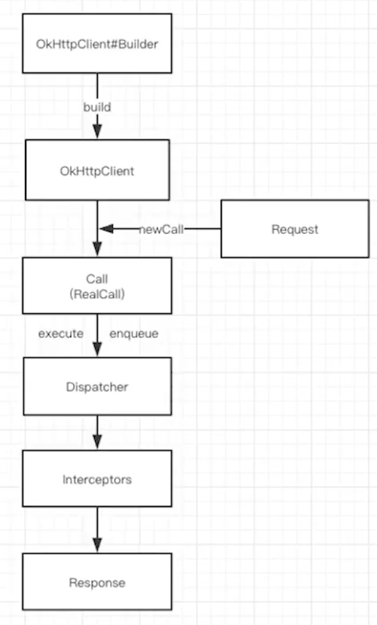
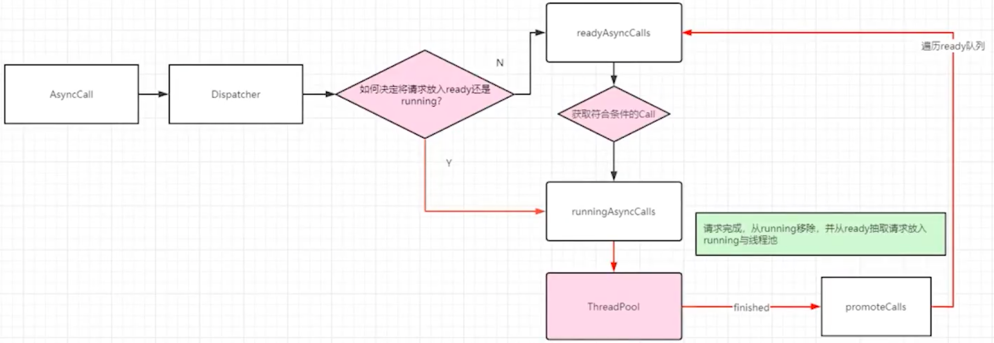
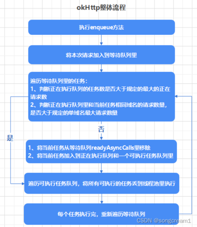
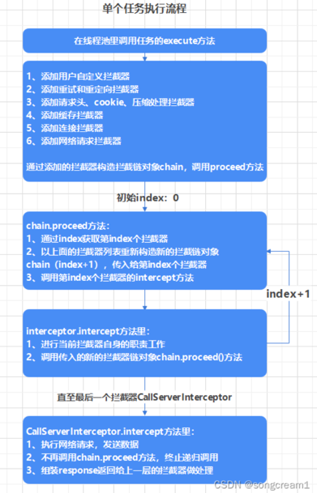

### http请求过程
- 域名DNS解析，把域名解析出IP
- 根据域名解析出的IP建立TCP连接，经过三次握手
- 如果用代码表示的话 就是完成了一个socket连接，得到了socket对象
- 把请求组装成报文，利用socket的outputStream写出去，完成http请求。

### OkHttp流程

- 通过OkHttpClientBuilder构建一个OkHttpClient对象
- 把Request对象交给OkHttpClient的newCall方法得到realCall对象
- Call的 execute 执行同步请求，enqueue 执行异步请求，无论是哪个请求，最终都要进入分发器完成任务的调配
- 分发器Dispatcher：内部维护队列与线程池，完成请求调配
- 拦截器Interceptors：完成整个请求过程，例如http请求过程。还完成一系列优化工作。

### RealCall源码
```java
// RealCall的enqueue方法
  @Override public void enqueue(Callback responseCallback) {
    // 内置锁的作用：限制同一个call对象只能执行一次enqueue，否则抛异常，如果想再次执行，可以调用clone方法后再执行enqueue
    synchronized (this) {
      if (executed) throw new IllegalStateException("Already Executed");
      executed = true;
    }
    transmitter.callStart();
    // 最终调用分发器的 enqueue 方法。AsyncCall包装了请求信息
    client.dispatcher().enqueue(new AsyncCall(responseCallback));
  }
```


### 分发器
- 里面维护了三个队列 
- readyAsyncCalls：准备队列；
- runningAsyncCalls：异步running队列，包括未完成已经取消的请求；
- runningSyncCalls：同步running队列，包括未完成已经取消的请求。


#### 异步请求工作流程


- 异步请求会调用enqueue方法，该方法传入一个AsyncCall对象，每个AsyncCall对象都封装了一个请求所需要的所有信息。同时，将当前请求加入到追呗队列，最后调用promoteAndExecute方法
```java
// 分发器
  void enqueue(AsyncCall call) {
    synchronized (this) {
        //请求任务添加到一个准备队列去
      readyAsyncCalls.add(call);
      //...
    // 最后一行调用promoteAndExecute方法
    promoteAndExecute();
  }
```
- promoteAndExecute 首先遍历准备队列
- 其次判断如果正在执行的任务数量超过规定的最大请求数量则跳出；判断如果当前域名的请求数超过规定的最大单域名请求数量则当前请求不做处理；
- 否则，从待执行列表里移除当前请求，将它添加到正在执行队列和可执行列表里
- 遍历可执行列表，将刚才的待执行任务，全部丢到线程池里去执行
```java
private boolean promoteAndExecute() {
    assert (!Thread.holdsLock(this));

    //生命一个AsyncCall集合
    List<AsyncCall> executableCalls = new ArrayList<>();
    boolean isRunning;
    synchronized (this) {
        //遍历准备队列
      for (Iterator<AsyncCall> i = readyAsyncCalls.iterator(); i.hasNext(); ) {
        AsyncCall asyncCall = i.next();
      //如果正在运行的任务队列大于设置的最大请求数maxRequests，直接跳出循环
        if (runningAsyncCalls.size() >= maxRequests) break; // Max capacity.
      //如果同一个相同Host的请求数量，也就是请求同一个主机的请求数量大于等于设置的最大数量maxRequestsPerHost，continue
        if (asyncCall.callsPerHost().get() >= maxRequestsPerHost) continue; // Host max capacity.
    //如果以上不满足，就将当前遍历的请求任务移除准备队列，放入运行队列
        i.remove();
        asyncCall.callsPerHost().incrementAndGet();
        executableCalls.add(asyncCall);
        runningAsyncCalls.add(asyncCall);
      }
      isRunning = runningCallsCount() > 0;
    }
  //同时给每一个请求任务设置一个线程池对象。改线程池对象是单例的
    for (int i = 0, size = executableCalls.size(); i < size; i++) {
      AsyncCall asyncCall = executableCalls.get(i);
      // executorService 自定义一个没有核心线程，非核心线程不限的，且在闲置的时候，一分钟后会被回收的线程池
      asyncCall.executeOn(executorService());
      // executeOn方法中调用了 executorService.execute(this) 开启执行任务
    }

    return isRunning;
  }
```
- 丢到线程池后，会执行每个请求AsyncCall的execute方法，execute()方法主要的两个功能：
- 调用getResponseWithInterceptorChain方法，构造拦截器链，对请求进行处理
- 任务结束时调用dispatcher.finish方法，将当前请求移出running队列，重新遍历准备行队列间，将待执行任务推到线程池中执行
```java
// 接上面开启线程池之后，会执行AsuncCall的run方法，进而执行到AsuncCall#execute()方法。
protected void execute() {
    //.....
    try {
      //构造拦截器链，执行各种拦截器后得到响应
      Response response = getResponseWithInterceptorChain();
      signalledCallback = true;
      responseCallback.onResponse(RealCall.this, response);
    } catch (IOException e) {
     //...
    } catch (Throwable t) {
      //...
    } finally {
      //任务结束，调用finished方法，将当前请求移出running队列，内部又去调用了promoteAndExecute()方法
      client.dispatcher().finished(this);
    }
  }
}

```
- getResponseWithInterceptorChain()方法，这个方法主要构造一个拦截器链对象，并调用它的proceed方法
- 这几个拦截器 请求是从上往下，请求回来之后是冲下往上处理

```java
Response getResponseWithInterceptorChain() throws IOException {
    List<Interceptor> interceptors = new ArrayList<>();
    //添加用户自定义的拦截器
    interceptors.addAll(client.interceptors());
    //添加重定向拦截器：重连和重定向
    interceptors.add(retryAndFollowUpInterceptor);
    //添加桥接拦截器：请求头、cookie、压缩处理
    interceptors.add(new BridgeInterceptor(client.cookieJar()));
    //添加缓存处理拦截器：判断缓存是否可用，得到响应之后是否缓存
    interceptors.add(new CacheInterceptor(client.internalCache()));
    //添加连接拦截器：找到或新建一个链接，并获得对应的socket流
    interceptors.add(new ConnectInterceptor(client));
    if (!forWebSocket) {
      interceptors.addAll(client.networkInterceptors());
    }
    //添加发送请求拦截器：想服务器发送数据，解析度去的响应数据
    interceptors.add(new CallServerInterceptor(forWebSocket));
	//构造拦截器链对象，index传入0
    Interceptor.Chain chain = new RealInterceptorChain(interceptors, null, null, null, 0,originalRequest, this, eventListener, client.connectTimeoutMillis(),
    client.readTimeoutMillis(), client.writeTimeoutMillis());
	//调用链对象的proceed方法
    Response response = chain.proceed(originalRequest);
    if (retryAndFollowUpInterceptor.isCanceled()) {
      closeQuietly(response);
      throw new IOException("Canceled");
    }
    return response;
  }

```
- 除了CallServerInterceptor外，其他所有的interceptor.intercept方法，都会调用chain.proceed()方法
```java
public Response proceed(Request request, StreamAllocation streamAllocation, HttpCodec httpCodec,
      RealConnection connection) throws IOException {
  //.....
  //使用原有的拦截器列表构造新的拦截链对象，index+1
  RealInterceptorChain next = new RealInterceptorChain(interceptors, streamAllocation, httpCodec,
      connection, index + 1, request, call, eventListener, connectTimeout, readTimeout,
      writeTimeout);
  //获取当前index的拦截器
  Interceptor interceptor = interceptors.get(index);
  //调用当前拦截器的intercept方法，并且传入新的拦截链对象（index已经+1的）
  Response response = interceptor.intercept(next);
  //.....
  return response;
}

```
```java
public Response intercept(Chain chain) throws IOException {
  //.....
  1、做自身拦截器的职责
  2、调用chain.proceed()方法，由于传入的chain为新构造的，index加了1，于是重新执行上面的chain.proceed方法时，获取的拦截器就是下一个的，并且又会构造index+2的新的拦截链对象，传入index+1的拦截器中
}

```
- 直到最后一个拦截器CallServerInterceptor就不会调用chain.proceed()方法，而是请求网络，构造返回Response对象，后面会单独将每个拦截器的代码

### 拦截器
- 拦截器的构造主要是在 AsuncCall#execute()中，通过getResponseWithInterceptorChain构造的
- 责任链模式，行为行设计模式，责任链上的处理者负责处理请求，客户只需要将请求放到责任链上，无需关心请求处理的细节，责任链将请求的发送者和处理者解耦了


### 参考致谢
- https://blog.csdn.net/laigengsong/article/details/122786872


