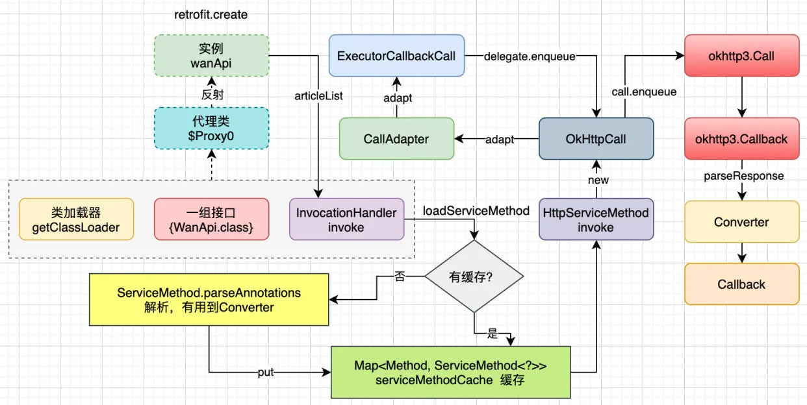

### Retrofit把OkHttp进一步解耦，职责更加清晰
```java
class RetrofitActivity : AppCompatActivity() {
    override fun onCreate(savedInstanceState: Bundle?) {
        super.onCreate(savedInstanceState)
        //初始化一个Retrofit对象
        val retrofit = Retrofit.Builder()
            .baseUrl("https://api.github.com/")
            .addConverterFactory(GsonConverterFactory.create())
            .build()
        //创建出GitHubApiService对象
        val service = retrofit.create(GitHubApiService::class.java)
        //返回一个 Call 对象
        val repos = service.listRepos("octocat")
        //调用 enqueue 方法在回调方法里处理结果
        repos.enqueue(object : Callback<List<Repo>?> {
            override fun onFailure(call: Call<List<Repo>?>, t: Throwable) {
                                t.printStackTrace()
            }

            override fun onResponse(call: Call<List<Repo>?>, response: Response<List<Repo>?>) {
                "response.code() = ${response.code()}".logE()
            }
        })

    }
}
复制代码
//自己定义的 API 请求接口
interface GitHubApiService {
    @GET("users/{user}/repos")
    fun listRepos(@Path("user") user: String?): Call<List<Repo>>
}
```
### 工作原理
- 通过Retrofit.Builder来构建一个retrofit对象
- 通过retrofit.create来获取接口代理对象
- 获取具体请求业务方法
- 发起请求

#### create方法
- 动态代理在retrofit中其实就是在运行期间去创建api接口对象。我们在使用时都会创建一个interface类，里面再添加一些接口方法。
- 在create方法中return一个代理类，通过这种方式组建okhttp的request 和 Call 进行请求。
```java
public <T> T create(final Class<T> service) {
        return (T)
        Proxy.newProxyInstance(
                //有三个参数
            service.getClassLoader(), //获取一个 ClassLoader 对象
            new Class<?>[] {service}, // 将接口的字节码对象传到数组中去，也即是我们要代理的具体接口
            new InvocationHandler() { //InvocationHandler 的 invoke 是关键，会执行 InvocationHandler 的invoke的方法体。
                .....
            }
}

```
- 动态代理的主要操作是在InvocationHandler#invoke中，里面最终会走到loadServiceMethod方法，它返回一个HttpServiceMethod对象调用invoke方法
- 接下来我们分别看一下 loadServiceMethod 方法和 invoke 方法
```java
public @Nullable Object invoke(Object proxy, Method method, @Nullable Object[] args)
                  throws Throwable {
                 // 因为有代理类的生成，默认继承 Object 类，所以如果是 Object.class 走，默认调用它的方法
                if (method.getDeclaringClass() == Object.class) {
                  return method.invoke(this, args);
                }
                args = args != null ? args : emptyArgs;
                // loadServiceMethod(method).invoke(args);这个方法是我们这个 Retrofit 最关键的代码，也是分析的重点入口
                return platform.isDefaultMethod(method)
                    ? platform.invokeDefaultMethod(method, service, proxy, args)
                    // 调用 HttpServiceMethod 对象的 invoke方法
                    : loadServiceMethod(method).invoke(args);
              }
```
- loadServiceMethod主要是为了获取ServiceMethod对象，通过代理方式获取之后缓存起来下次直接取。如果本次没获取到将会调用ServiceMethod#parseAnnotations解析注解和方法。
```java
ServiceMethod<?> loadServiceMethod(Method method) {
    // 从 ConcurrentHashMap 中取一个 ServiceMethod 如果存在直接返回
    ServiceMethod<?> result = serviceMethodCache.get(method);
    if (result != null) return result;

    synchronized (serviceMethodCache) {
      result = serviceMethodCache.get(method);
      if (result == null) {
          // 通过 ServiceMethod.parseAnnotations(this, method);方法创建一个 ServiceMethod 对象
        result = ServiceMethod.parseAnnotations(this, method);
        // 用 Map 把创建的 ServiceMethod 对象缓存起来，因为我们的请求方法可能会调用多次，缓存提升性能。
        serviceMethodCache.put(method, result);
      }
    }
    return result;
  }

```
- ServiceMethod#parseAnnotations方法内调用 HttpServiceMethod.parseAnnotations 最终会返回一个HttpServiceMethod对象
```java
//ServiceMethod.java
static <T> ServiceMethod<T> parseAnnotations(Retrofit retrofit, Method method) {
    // 开始注解解析
    RequestFactory requestFactory = RequestFactory.parseAnnotations(retrofit, method);
    Type returnType = method.getGenericReturnType();
    if (Utils.hasUnresolvableType(returnType)) {
        throw methodError( method, "Method return type must not include a type variable or wildcard: %s", returnType);
    }
    if (returnType == void.class) {
        throw methodError(method, "Service methods cannot return void.");
    }
  return HttpServiceMethod.parseAnnotations(retrofit, method, requestFactory);
}
```
- HttpServiceMethod#parseAnnotations 方法内部会通过反射解析注解解析出HttpServiceMethod对象，调用createCallAdapter创建CallAdapter；调用createResponseConvert来创建转换器，之后返回一个CallAdapter。我们先讨论主流程，看下它的 invoke 方法
- HttpServiceMethod 的 invoke方法内部创建了一个Call对象，然后调用它的adapter方法。
- Retrofit把网络请求最终封装成一个call，为了适配Rxjava等形式，会有不同的Adapter：CallAdapter（适配器模式来增强call的功能。在构建callAdapter的时候油菜永乐工厂模式）
- 范型有个统一的父类Type，通过这个类解析成不同的范型信息
- 常见的CallAdapter有：guava，java8，rxjava，rxjava2等
- Convert接口，数据转换接口，例如：GsonConvertFactory，具体转换工作通过工厂模式定义不同的转换器进行转换。
```java
//HttpServiceMethod.java
@Override
final @Nullable ReturnT invoke(Object[] args) {
  Call<ResponseT> call = new OkHttpCall<>(requestFactory, args, callFactory, responseConverter);
  //是一个 adapt 方法，在不使用 Kotlin 协程的情况下，其实调用的是子类 CallAdapted 的 adapt，这个会在下面具体分析，包括 Kotlin 协程的 suspend 函数
        return adapt(call, args);
}
```
- CallAdapted 继承自HttpServiceMethod，HttpServiceMethod中invoke调用的adapter方法实际上调用的是CallAdapted的adapter方法
```java
   protected ReturnT adapt(Call<ResponseT> call, Object[] args) {
      return callAdapter.adapt(call);
    }
```
- 至此create中InvocationHandler的invoke方法就返回一个CallAdapter，并且调用到了adapter方法，是适配器模式，根据使用的不同类型进行适配。
- 如果我们适配的是rxjava，那么就找对应的RxJava2CallAdapter类，里面的adapt方法返回一个 Observable<T> 对象
- 如果默认的，就找 DefaultCallAdapterFactory 里面adapter返回一个 Call<Object> 对象
```java
 public Object adapt(Call<R> call) {
    Observable<Response<R>> responseObservable =
        isAsync ? new CallEnqueueObservable<>(call) : new CallExecuteObservable<>(call);
    //...
    return RxJavaPlugins.onAssembly(observable);
  }
```
#### 至此我们走完了create方法，接下来我们看 enqueue方法是如何创建OkHttp的：
- 1.声明一个 okhttp3.Call 对象，并通过createRawCall() 内部通过callFactory来给call赋值，callFactory 实际是一个 OkHttpClient 对象，callFactory.newCall(requestFactory.create(args));方法中的 requestFactory.create(args)方法会返回一个 Request 的对象
- 2.调用 okhttp3.Call 的 enqueue 方法，进行真正的网络请求
- 3.解析响应，请求成功的回调，请求失败的回调

#### 接下来我们看求响应结果是如何解析的
- 比如我们在构造 Retrofit 的时候加上 addConverterFactory(GsonConverterFactory.create())这行代码，我们的响应结果是如何通过 Gson 直接解析成数据模型的？
- 在 OkHttpCall 的enqueue方法的onResponse中调用了parseResponse方法
```java
//OkHttpCall.java
@Override
public void enqueue(final Callback<T> callback) {

  okhttp3.Call call;
    ...
  call.enqueue(
      new okhttp3.Callback() {
        @Override
        public void onResponse(okhttp3.Call call, okhttp3.Response rawResponse) {
          Response<T> response;
          try {
            //1 解析响应 通过parseResponse解析响应返回给回调接口
            response = parseResponse(rawResponse);
          } catch (Throwable e) {
            throwIfFatal(e);
            callFailure(e);
            return;
          }
        }
    ...
      });
}
```
- responseConverter内部调用了 responseConverter.convert方法,对应的Converter的具体实现类的convert方法
```java
//OkHttpCall.java
private final Converter<ResponseBody, T> responseConverter;
Response<T> parseResponse(okhttp3.Response rawResponse) throws IOException {
  ResponseBody rawBody = rawResponse.body();
    ...
  ExceptionCatchingResponseBody catchingBody = new ExceptionCatchingResponseBody(rawBody);
  try {
    //1 通过 responseConverter 转换 ResponseBody
    T body = responseConverter.convert(catchingBody);
    return Response.success(body, rawResponse);
  } catch (RuntimeException e) {
    catchingBody.throwIfCaught();
    throw e;
  }
}
```
- 我们的responseConverter是在HttpServiceMethod#parseAnnotations内部调用createResponseConverter方法，继续深入后发现，是从 converterFactories工厂中遍历取出
```java
public <T> Converter<ResponseBody, T> nextResponseBodyConverter(
    @Nullable Converter.Factory skipPast, Type type, Annotation[] annotations) {
    ...
  //1 从 converterFactories 遍历取出一个来调用 responseBodyConverter 方法，注意根据 responseType 返回值类型来取到对应的 Converter，如果不为空，直接返回此 Converter 对象
  int start = converterFactories.indexOf(skipPast) + 1;
  for (int i = start, count = converterFactories.size(); i < count; i++) {
    Converter<ResponseBody, ?> converter =
        converterFactories.get(i).responseBodyConverter(type, annotations, this);
    if (converter != null) {
      //noinspection unchecked
      return (Converter<ResponseBody, T>) converter;
    }
  }
  ...
}
```

### 面试问题
#### 什么是动态代理？
- 动态指的是在运行期，而代理指的是实现了某个接口的具体类，称之为代理，会调用了 InvocationHandler 的 invoke方法。
- retrofit中的实现：在代码运行中，会动态创建 GitHubApiService 接口的实现类，作为代理对象，代理接口的方法
- 在我们调用GitHubApiService 接口的实现类的 listRepos方法时，会调用了 InvocationHandler 的 invoke方法
- 本质上是在运行期，生成了 GitHubApiService 接口的实现类，调用了 InvocationHandler 的 invoke方法

#### 整个请求流程
- 我们在调用 GitHubApiService 接口的 listRepos方法时，会调用 InvocationHandler 的 invoke方法
- 然后执行 loadServiceMethod方法并返回一个 HttpServiceMethod 对象并调用它的 invoke方法
- 然后执行 OkHttpCall的 enqueue方法，本质执行的是 okhttp3.Call 的 enqueue方法
- 当然这期间会解析方法上的注解，方法的参数注解，拼成 okhttp3.Call 需要的 okhttp3.Request 对象
- 然后通过 Converter 来解析返回的响应数据，并回调 CallBack 接口

#### 方法上的注解是什么时候解析的，怎么解析的？
- 在 ServiceMethod.parseAnnotations(this, method); 方法中开始的
- 具体内容是在 RequestFactory 类中，调用 RequestFactory.parseAnnotations(retrofit, method); 方法实现的

#### Converter 的转换过程，怎么通过 Gson 转成对应的数据模型的？
- 通过成功回调的 parseResponse(rawResponse);方法开始
- 通过 responseConverter 的 convert 方法
- responseConverter 是通过 converterFactories 通过遍历，根据返回值类型来使用对应的 Converter 解析

#### CallAdapter 的替换过程，怎么转成 RxJava 进行操作的？
- 通过配置 addCallAdapterFactory(RxJava2CallAdapterFactory.create()) 在 callAdapterFactories 这个 list 中添加 RxJava2CallAdapterFactory
- 如果不是 Kotlin 挂起函数最终调用的是 CallAdapted 的 adapt方法
- callAdapter 的实例是通过 callAdapterFactories 这个 list 通过遍历，根据返回值类型来选择合适的CallAdapter


### 参考致谢
- https://zhuanlan.zhihu.com/p/421401880
- https://www.bilibili.com/video/BV1DZ4y1N7nL?p=2