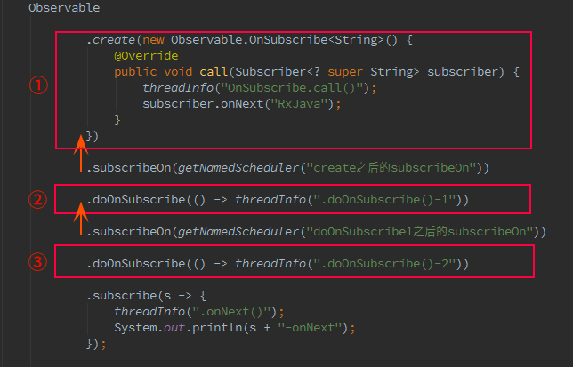
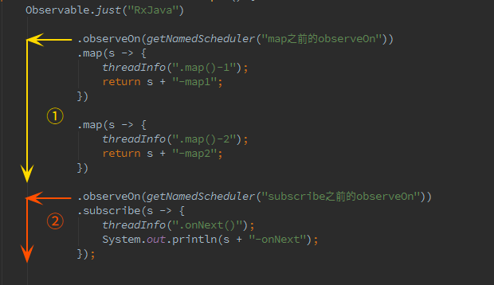

### Rxjava流向图
- Observable -> map需求 -> map需求 -> ... -> Observer
- RxJava 有四个基本概念：Observable (可观察者，即被观察者)、 Observer (观察者)、 subscribe (订阅)、事件。Observable 和 Observer 通过 subscribe() ⽅法实现订阅关系，从⽽ Observable 可以在需要的时候发出事件来通知 Observer。
- RxJava 的事件回调⽅法除了普通事件 onNext() （相当于 onClick() / onEvent()）之外，还定义了两个特殊的事件：onCompleted() 和 onError()
- onCompleted(): 事件队列完结。RxJava 不仅把每个事件单独处理，还会把它们看做⼀个队列。RxJava 规定，当不会再有新的 onNext() 发出时，需要触发onCompleted() ⽅法作为标志。
- onError(): 事件队列异常。在事件处理过程中出异常时，onError() 会被触发，同时队列⾃动终⽌，不允许再有事件发出。
- 在⼀个正确运⾏的事件序列中, onCompleted() 和 onError() 有且只有⼀个，并且是事件序列中的最后⼀个。需要注意的是，onCompleted() 和 onError() ⼆者也是互斥的，即在队列中调⽤了其中⼀个，就不应该再调⽤另⼀个。

### Oberver观察者
- 它决定事件触发的时候将有怎样的⾏为。
- 除了 Observer 接⼝之外，RxJava 还内置了⼀个实现了 Observer 的抽象类：Subscriber。 Subscriber 对 Observer 接⼝进⾏了⼀些扩展，但他们的基本使⽤⽅式是完全⼀样的
- 在 RxJava 的 subscribe 过程中，Observer 也总是会先被转换成⼀个 Subscriber 再使⽤。所以如果你只想使⽤基本功能，选择 Observer 和 Subscriber 是完全⼀样的
```java
Subscriber<String> subscriber = new Subscriber<String>() {
    @Override
    public void onNext(String s) {
        Log.d(tag, "Item: " + s);
    }
    @Override
    public void onCompleted() {
        Log.d(tag, "Completed!");
    }
    @Override
    public void onError(Throwable e){
        Log.d(tag,"onError!");
    }
}
```

### Observable被观察者
- 它决定什么时候触发事件以及触发怎样的事件。 RxJava 使⽤ create() ⽅法来创建⼀个 Observable ，并为它定义事件触发规则：
```java
//创建⼀个上游被观察者 Observable：
    Observable<Integer> observable = Observable.create(new ObservableOnSubscribe<Integer>() {
        @Override
        public void subscribe(ObservableEmitter<Integer> emitter) throws Exception {
            emitter.onNext(1);
            emitter.onNext(2);
            emitter.onNext(3);
        }
    });
```

### Subscribe订阅
- 创建了 Observable 和 Observer 之后，再⽤ subscribe() ⽅法将它们联结起来，整条链⼦就可以⼯作了
```java
observable.subscribe(observer);
```

### flatMap操作
```java
        Observable.just(f.getPath())
                .flatMap((Function<String, Observable<String>>) qnUploadPresenter::driverUploadPic)
                .flatMap((Function<String, Observable<CheckIdCardEntity>>) imagePath -> {
                    String pImagePath = imagePath;
                    if (null != imagePath && TextUtils.isEmpty(imagePath)) {
                        pImagePath = "";
                    }

                    return FoYoNet.builder().params("imageUrl", pImagePath)
                            .service(DriverInfoService.class)
                            .method((IMethod<DriverInfoService>) DriverInfoService::userCheckCard)
                            .build().request();
                }).subscribeOn(Schedulers.io())
                .observeOn(AndroidSchedulers.mainThread())
                .subscribe(new FoYoObserver<CheckIdCardEntity>() {
                    @Override
                    public void onSuccess(CheckIdCardEntity entity) {
                        if (null != entity && entity.data != null && entity.data.size() > 0 && 0 == entity.status.code) {//status 等于N 说明 数据正常返回 但数据有错误
                            callback.onTaskLoaded(entity);
                        }
                    }

                    @Override
                    public void onFailure(int code, String desc) {
                        callback.onDataNotAvailable(code, desc);
                    }

                });
```

### subscribeOn()和observeOn()的区别
- subscribeOn()改变调用它之前代码的线程

- observeOn()改变调用它之后代码的线程

