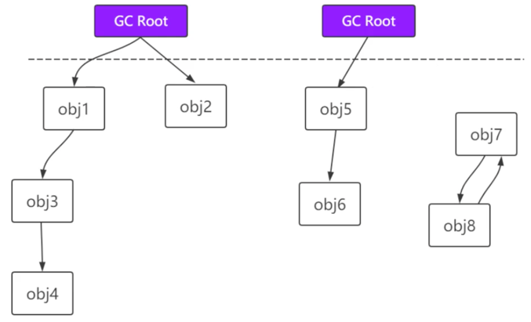

## JVM
- 编译流程：编译器 将java文件 编译成class文件，交给jvm运行
### 类加载机制
- 虚拟机把class文件加载到内存中，并对数据进行校验，转换解析和初始化，形成可以虚拟机直接使用的java类型即.class

### 类加载过程
#### 装载
- 通过一个类的限定名获取这个类的二进制字节流；
- 将这个字节流所代表的静态存储结构转换为方法区运行时数据结构；
- 在java堆中生成一个代表这个类的class对象，这个对象作为我们访问方法区的数据访问入口。
#### 链接
- 1.验证：保证我们加载类的正确性（文件格式，源数据，字节码，符号引用）；
- 2.准备：为类的静态变量分配内存，并将其初始化为当前类型的默认值；static int a = 1；那么它在这个准备阶段 a=0；
- 3.解析：把类中的符号引用转换成直接引用。
#### 初始化
- 为静态变量赋值，初始化静态代码块，初始化当前类的父类
### 类加载器层级

### 双亲委派机制（父类委派机制）

- 在源码中已经存在了java.lang.String;但是我有自己写了个java.lang.String，这是应该加载哪个？优先加载源码中的String
```java
    // ClassLoader中的loadClass方法
    protected Class<?> loadClass(String name, boolean resolve)throws ClassNotFoundException{
        synchronized (getClassLoadingLock(name)) {
            // 判断是否加载过，如果加载过,直接拿过来用；否则走下面
            Class<?> c = findLoadedClass(name); //类加载机制中的缓存机制
            if (c == null) {
                long t0 = System.nanoTime();
                try {
                    if (parent != null) { // 递归调用父类的 loadClass。双亲委派 本质依赖于本层递归。
                        c = parent.loadClass(name, false);
                    } else { // 如果递归到
                        c = findBootstrapClassOrNull(name);
                    }
                } catch (ClassNotFoundException e) {
                    // ClassNotFoundException thrown if class not found
                    // from the non-null parent class loader
                }

                if (c == null) {
                    // If still not found, then invoke findClass in order
                    // to find the class.
                    long t1 = System.nanoTime();
                    c = findClass(name);

                    // this is the defining class loader; record the stats
                    PerfCounter.getParentDelegationTime().addTime(t1 - t0);
                    PerfCounter.getFindClassTime().addElapsedTimeFrom(t1);
                    PerfCounter.getFindClasses().increment();
                }
            }
            if (resolve) {
                resolveClass(c);
            }
            return c;
        }
    }
```
### 打破双亲委派机制
- 继承classload类，重写loadclass方法，把  c = parent.loadClass(name, false) 去掉
- SPI机制：Service Provider Interface 服务提供接口；通过接口，将这些装配的控制权移到外部，可以随时替换实现。
- OSGI：它支持热部署，热更新的。

### 运行时数据区

- 运行时数据区是运行时的一块内存区域，划分为上图五块内容。

#### 方法区
- 虚拟机启动时创建，线程共享，逻辑上是堆的一部分，即非堆内存。如果内存不足，会抛出一个oom
- 运行时常量池，字段和方法数据，以及方法和构造函数的代码，包括：类、实力初始化、接口初始化中使用的特殊方法。

#### 堆
- 线程共享。如果内存不足，会抛出一个oom
- 存放对象实例，数组。

#### Java虚拟机栈
- 执行java方法，是线程私有的，栈深度不够，压不进这么多栈帧了，会StackOverFlow
- 栈中单位是栈帧，一个栈帧代表一个方法的执行。

#### 本地方法栈
- 执行native方法，线程私有的，栈深度不够，压不进这么多栈帧了，会StackOverFlow

#### 程序计数器
- 记录程序继承的位置，是线程私有的。无法进入到本地方法栈。本地方法栈是隔离的。

### 栈帧结构


#### 局部变量表
- 方法中定义的局部变量以及方法的参数

#### 操作数栈
- 以压栈 以及出栈的方式存储操作数

```java
int a = 1;  //把 a 从局部变量表中拿出来 放到操作数栈
int b = 1;  //把 b 从局部变量表中拿出来 放到操作数栈
int c = a + b;  //把 a 和 b 拿出来进行运算，完成之后把 c = 2 放到局部变量表
```
#### 方法的返回地址
- 遇到方法返回的字节码指令return
- 出现了异常，有异常处理器则交给一场处理器，没有则抛异常

#### 动态链接
- 运行时 将对方法的符号引用 链接成 对调用方法的直接引用。
```java
void a(){ b(); }
void b(){ c(); }
void c(){}
// 方法具体调用的哪一个，只有执行了之后我才能直到
```
### java堆的分代设计：新生代，老年代，永久代

- 新老年代划分：新对象先进入新生代，经过几轮gc后，依然存活的进老年代。垃圾回收主要在新生代进行。
- Eden区：经过几轮回收后，会产生空间碎片，再次new新对象时，明明有空间但是无法创建成功。于是将新生代再次划分空间Eden区。
- 将Eden区一部分空间划分为大小相等的两块，s0和s1，每次使用其中一块，每次gc时我将这两块的内容 移动到另一块区域，以额外空间消耗来换取空间无碎片化。
- Eden ：s0 ：s1大小 8：1：1； Eden区是存放新生对象的。Eden区越小 gc次数越多。
- 当新生代内存吃紧的时候，新生代的对象会直接进入老年代，因为老年代有担保机制。
- 永久代：在堆区之外还有一个代就是永久代（Permanet Generation），它用来存储class类、常量、方法描述等。对永久代的回收主要回收两部分内容：废弃常量和无用的类。


### 对象创建过程


### 什么时候进行垃圾回收
#### 1.自动进行垃圾回收
- 当Eden区 或者s区不够用了
- 老年代空间不够用了
- 方法区（非堆）空间不够用了
#### 2.手动回收
- 手动调用System.gc() 用的比较少，耗性能。时机不确定，只是发一个通知。一般让线程睡500毫秒来等待线程操作。

### 如何判定一个对象是垃圾
- 通过引用计数法，引用为0的对象便是垃圾，引用数目>0则不是垃圾。效率高，但是如果AB相互持有引用，循环引用（容易造成内存泄漏——>堆积起来 容易导致内存溢出），导致永远不能被回收，该方法被虚拟机抛弃。
- 可达性分析（根搜索），目前虚拟机使用的算法。

#### GCRoot 根节点
- 类加载器，Thread，虚拟机栈的本地变量表，本地方法栈的JNI引用的对象，方法区中static成员，方法区中常量引用。

#### 可达性
- gc可达对象：从gcRoot开始往下遍历，形成一个引用链，能够遍历到的对象都成为可达对象。对于循环引用，它不会在引用链上，所以顺理成章的进行回收。


### 垃圾收集算法
#### 1.标记-清除算法
- 标记阶段的任务是标记出所有需要被回收的对象，清除阶段就是回收被标记的对象所占用的空间
- 缺点：容易产生内存碎片

#### 2.复制算法
- 它将可用内存按容量划分为大小相等的两块，每次只使用其中的一块。当这一块的内存用完了，就将还存活着的对象复制到另外一块上面，然后再把已使用的内存空间一次清理掉，这样一来就不容易出现内存碎片的问题。
- 这种算法虽然实现简单，运行高效且不容易产生内存碎片，但是却对内存空间的使用做出了高昂的代价，因为能够使用的内存缩减到原来的一半。

#### 3.标记-整理算法
- 标记阶段的任务是标记出所有需要被回收的对象，它不是直接清理可回收对象，而是将存活对象都向一端移动，然后清理掉端边界以外的内存

#### 4.分代回收算法
- 分代收集算法是目前大部分JVM的垃圾收集器采用的算法
- 它的核心思想是根据对象存活的生命周期将内存划分为老年代和新生代，老年代的特点是每次垃圾收集时只有少量对象需要被回收，而新生代的特点是每次垃圾回收时都有大量的对象需要被回收，那么就可以根据不同代的特点采取最适合的收集算法。
- 老年代的特点是每次回收都只回收少量对象，一般使用的是标记整理算法
- 新生代采取复制算法，新生代中每次垃圾回收都要回收大部分对象，也就是说需要复制的操作次数较少，一般来说是将新生代划分为一块较大的Eden空间和两块较小的Survivor（s0和s1）空间，每次使用Eden空间和其中的一块s0空间，当进行回收时，将Eden和Survivor中还存活的对象复制到另一块s1空间中，然后清理掉Eden和刚才使用过的Survivor空间。

#### 垃圾回收器划分
- Minor GC、Major GC、Full GC
- Minor GC用于清理年轻代区域
- Major GC 用于清理老年区域
- Full GC 用于清理年轻代、年老代区域。成本较高，会对系统产生影响。System.gc 会出发Full GC，代价高。

### 参考致谢
- https://www.bilibili.com/video/BV1AY411H7DY?p=20
