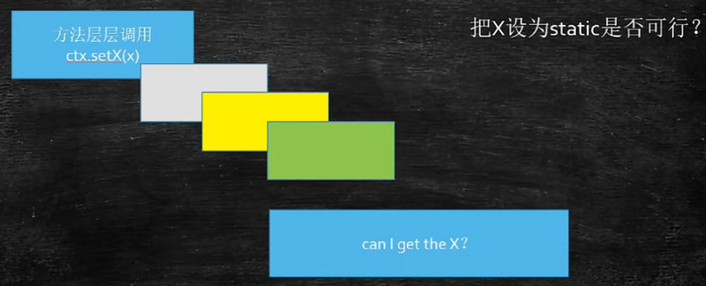
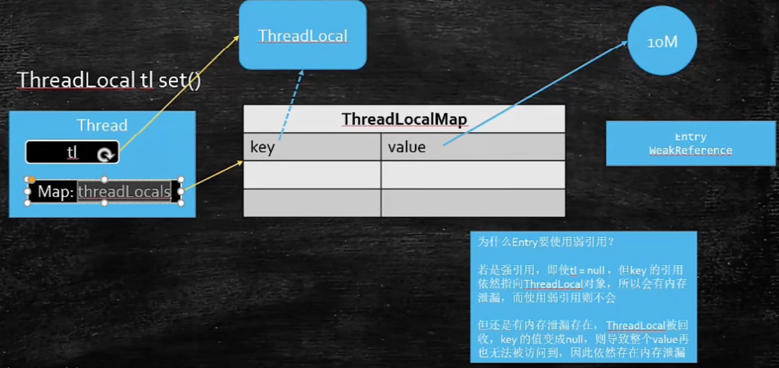

## ThreadLocal
- ThreadLocal 提供了线程本地的实例。它与普通变量的区别在于，每个使用该变量的线程都会初始化一个完全独立的实例副本，该变量对其他线程而言是隔离的。ThreadLocal 变量通常被private static修饰。当一个线程结束时，它所使用的所有 ThreadLocal 相对的实例副本都可被回收。
- ThreadLocal 适用于每个线程需要自己独立的实例且该实例需要在多个方法中被使用，也即变量在线程间隔离而在方法或类间共享的场景
- ThreadLocal 天然隔离线程的作用，一个线程往里放内容，但是其他线程是拿不到的。
- ThreadLocal 应用与spring的transtion事物，mybatis关于分页处理

- 方法一：把x一层一层往下传，如果中间有别人写好的类库，就无法传。
- 方法二：x设置为static，多线程下不安全。
- 方法三：放到ThreadLocal里面，必须保证每个方法里面用的对象都是同一个。又保证了安全。


### set方法
- static ThreadLocal<Person> tl = new ThreadLocal<>();
- tl.set(new Person) // 拿到当前线程独有的map，然后把 tl 为key ，new Person 为 value 装到一个map里。
```java
    public void set(T value) {
        Thread t = Thread.currentThread(); //获取当前线程
        // 每个线程有独有的 ThreadLocalMap 。 Map的key可以有多个ThradLocal
        ThreadLocalMap map = getMap(t);   // ThreadLocal 是个 map。 getMap 是当前线程的 threadLocals 。所以 线程之间不能互相串。
        if (map != null) {
            map.set(this, value);  // 把 value 放到 map 里。this 是 new 出来的 ThreadLocal 对象 tl 
        } else {
            createMap(t, value); // 如果map没有 ，则创建出来。
        }
    }
```
```java
        private void set(ThreadLocal<?> key, Object value) {

            Entry[] tab = table;
            int len = tab.length;
            int i = key.threadLocalHashCode & (len-1);

            for (Entry e = tab[i];
                 e != null;
                 e = tab[i = nextIndex(i, len)]) {
                ThreadLocal<?> k = e.get();

                if (k == key) {
                    e.value = value;
                    return;
                }

                if (k == null) {
                    replaceStaleEntry(key, value, i);
                    return;
                }
            }
            // set的时候是new了一个 Entry 进行set的，Entry是若引用的子类，在new Entry的时候会调用父类构造方法，生成 WeakReference 弱引用，弱引用指向的是 k，即ThreadLocal
            tab[i] = new Entry(key, value);              
            int sz = ++size;
            if (!cleanSomeSlots(i, sz) && sz >= threshold)
                rehash();
        }
```
```java
        static class Entry extends WeakReference<ThreadLocal<?>> {
            /** Entry是若引用的子类 */
            Object value;

            Entry(ThreadLocal<?> k, Object v) {
                super(k);
                value = v;
            }
        }
```
### 为什么要是用弱引用
- 如果是强引用，只要线程不退，就回收不了。即使 tl = null ，但key的引用依然指向 ThreadLocal 对象，所以会造成内存泄漏。
- 如果是弱引用，只要垃圾回收器监测到就会回收。回收后key是空值，value依然会存在，容易造成value的内存泄漏，所以一旦不用的时候，要及时remove掉。
- 如果是在线程池中，任务完成后，首先要清理ThreadLocal，要不然下次用，Map里面有旧记录，有可能就会出现问题。

