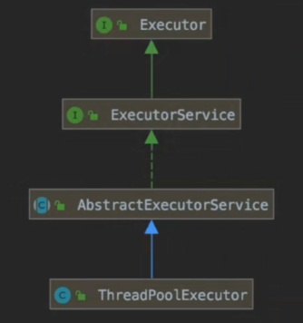
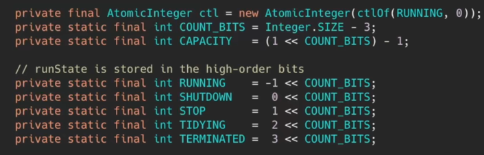
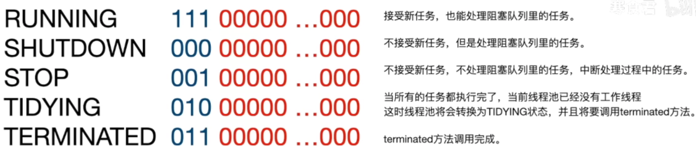
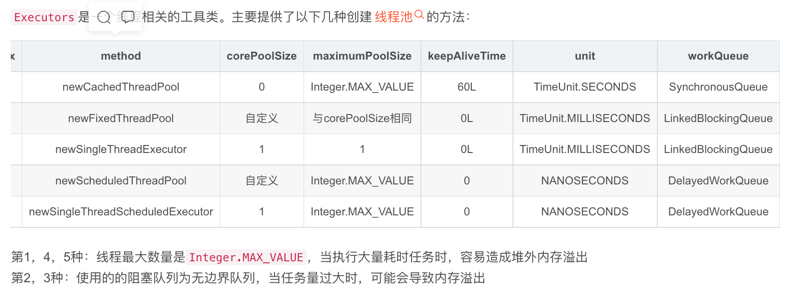
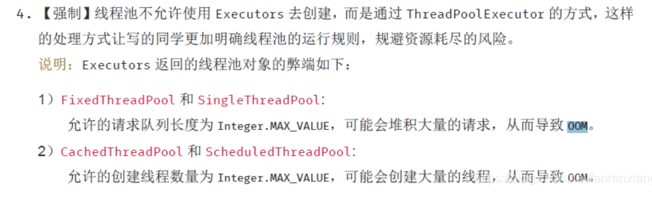
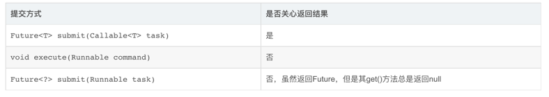
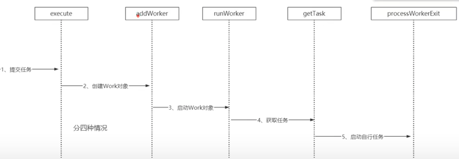
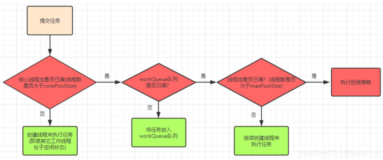
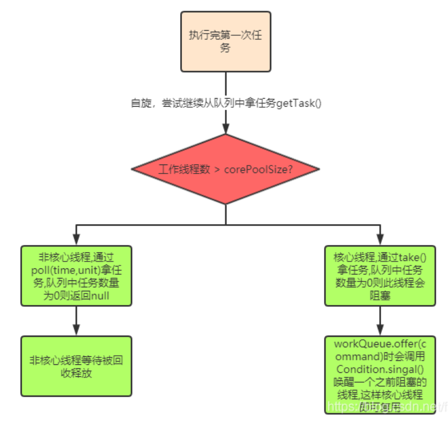

## 线程池
- 降低线程创建回收频率减少开销，提高资源利用率；控制并发数，提高响应速度；便于管理
### ThreadPoolExecutor 源码：继承关系-> 变量 -> 内部方类 ->方法




#### ThreadPoolExecutor(参数) 核心参数
- corePoolSize： 核心线程数 不会回收
- maximumPoolSize: 最大线程数，在核心线程数的基础上可能会额外增加一些非核心线程，需要注意的是只有当workQueue队列填满时才会创建多于corePoolSize的线程
- keepAliveTime： 非核心线程在空闲状态下的存活时间，corePoolSize=maxPoolSize时，keepAliveTime参数也就不起作用了(因为不存在非核心线程)；
- unit： keepAliveTime存活时间的单位
- workQueue： 工作队列，当核心线程满了新进的请求会被添加到工作队列中，是阻塞队列
- ThreadFactory：创建线程的工厂对象，默认使用Executors.defaultThreadFactory()
- rejectedExecutionHandler：当线程池中的线程达到了最大线程数，再有新的请求进来的时候的拒绝策略
-  ⚠️ corePoolSize和maximumPoolSize设置不当会影响效率，甚至耗尽线程； workQueue设置不当容易导致OOM； handler设置不当会导致提交任务时抛出异常。
#### 核心线程数
- cpu密集型的任务 ：cpu核心数+ 1, 加一的目的是因为cpu可能会出现内存页缺失或任务异常时可以最大限度的发挥多核cpu的优势。
- io密集型： 2*(cpu核心数) + 1

#### 阻塞队列
- SynchronousQueue(同步移交队列)：队列不作为任务的缓冲方式，可以简单理解为队列长度为零
- LinkedBlockingQueue(无界队列)：队列长度不受限制，当请求越来越多时(任务处理速度跟不上任务提交速度造成请求堆积)可能导致内存占用过多或OOM
- ArrayBlockintQueue(有界队列)：队列长度受限，当队列满了就需要创建多余的线程来执行任务
- DelayedWorkQueue(延迟队列)：从队列中延迟取节点,用数组实现的堆
#### 拒绝策略
- CallerRunsPolicy - 当触发拒绝策略，只要线程池没有关闭的话，则使用调用者所在的线程直接运行任务。一般并发比较小，性能要求不高，不允许失败。但是，由于调用者自己运行任务，如果任务提交速度过快，可能导致程序阻塞，性能效率上必然的损失较大
- AbortPolicy - 丢弃任务，并抛出拒绝执行 RejectedExecutionException 异常信息。线程池默认的拒绝策略。必须处理好抛出的异常，否则会打断当前的执行流程，影响后续的任务执行。
- DiscardPolicy - 直接丢弃，其他啥都没有
- DiscardOldestPolicy - 当触发拒绝策略，只要线程池没有关闭的话，丢弃阻塞队列 workQueue 中最老的一个任务，并将新任务加入
### 线程池的创建方法
#### Executors的默认方法

#### ThreadPoolExecutor
- 通过guava的ThreadFactory工厂类还可以指定线程组名称，这对于后期定位错误时也是很有帮助的
```java
ThreadFactory threadFactory = new ThreadFactoryBuilder().setNameFormat("thread-pool-d%").build();
```
- 使用guava包中的ThreadFactoryBuilder工厂类
```java
private static ThreadFactory threadFactory = new ThreadFactoryBuilder().build();
private static ExecutorService executorService = new ThreadPoolExecutor(10, 10, 60L, TimeUnit.SECONDS, new ArrayBlockingQueue<Runnable>(10), threadFactory, new ThreadPoolExecutor.AbortPolicy());
```
- 建立自己的线程工厂类，灵活设置关键参数：
```java
//这里默认拒绝策略为AbortPolicy
private static ExecutorService executor = new ThreadPoolExecutor(10,10,60L, TimeUnit.SECONDS,new ArrayBlockingQueue(10));
```


#### 为什么不推荐使用Executors的默认方法

#### 三种提交任务方式

- execute 用于提交无返回值的方法
- submit用于提交有返回值的任务，线程池会返回一个future对象，通过这个对象我们可以判断任务是否执行成功。并且可以通过future.get获取任务执行结果
#### 线程池提交任务和执行任务
- 提交任务：execute，将我们想要异步执行的任务提交给线程池去执行。
- 执行任务：Worker的run方法
#### 可以向线程池提交的任务有两种：Runnable和Callable，二者区别：
- 方法签名不同，void Runnable.run(), V Callable.call() throws Exception
- 是否允许有返回值，Callable允许有返回值
- 是否允许抛出异常，Callable允许抛出异常

- execute流程到底是怎样的呢？线程是又是怎样完成线程的复用的呢？execute 源码如下，看完源码，也就明白了以上两个问题。


```java
// 线程池是通过 corePoolSize 和 maximumPoolSize 来控制线程
    public void execute(Runnable command) {
        if (command == null)
            throw new NullPointerException();
        // ctl线程池中控制状态变量,是共享变量，如何解决线程安全问题？synchronized 写多读少，CAS+volatile 读多写少，CAS只能保证原子性，不能保证可见性；volatile保证可见性，不保证原子性。
        // 线程池中两个重要的标识：1. 线程池的运行状态（分五种）； 2. 线程池中工作状态
        // 为什么 用一个ctl变量标识两个含义呢？CAS+volatile 方法只能保证单一变量的原子性操作
        // ctl实际上是 AutomicInteger ，构造函数里面赋值给volatile 修饰的int 类型 value。
        // 把这个int变量，32位，分为高低位，前三位标识线程池运行状态。 后29位标识线程池工作线程数。
        int c = ctl.get();
        // runStateOf 获取线程状态
        // workerCountOf 获取当前工作线程数 ，判断是否小于 corePoolSize 核心线程数
        if (workerCountOf(c) < corePoolSize) {
            //如果小于 corePoolSize 核心线程数， 通过addWorker尝试添加核心工作线程 ，添加成功则结束该方法
            //即便当前活动的线程有空闲的，只要这个活动的线程数量小于设定的核心线程数，那么依旧会启动一个新线程来执行任务。也就是说不会去复用任何线程。
            if (addWorker(command, true))
                return;
            //若添加不成功，继续走下一步
            c = ctl.get();
        }
        // 将任务尝试添加到阻塞队列，如果成功的话 会进行二次检查
        if (isRunning(c) && workQueue.offer(command)) {
            int recheck = ctl.get();
            // 判断线程状态，如果此时非running状态，尝试移除任务，如果成功移除该任务，则出发拒绝策略。
            if (! isRunning(recheck) && remove(command))
                reject(command);
            // 如果移除失败了，就给这个任务被执行的机会，尝试新增worker去消费阻塞队列里面的任务。
            else if (workerCountOf(recheck) == 0)
                addWorker(null, false);
        }
        //如果阻塞队列满，未添加成功，尝试启动非核心工作线程
        else if (!addWorker(command, false))
            reject(command); //如果启动不了非核心线程执行，说明到达了最大线程数量的限制，会使用第7个参数抛出异常
    }
```
```java
private boolean addWorker(Runnable firstTask, boolean core) {
        // ...
        // ctl cas操作 只有一个线程 执行新增work的逻辑，调用compareAndSet方法 线程数+1，其他线程自旋等待
        // ...
        //前面都是线程池状态的判断，暂时不理会
        
        // 只要代码执行到这里，线程池的工作状态一定是RUNNING
        boolean workerStarted = false;  //工作线程能够启动的标识
        boolean workerAdded = false;    // 工作线程是否添加成功的标识
        Worker w = null;
        try {
            //1. 创建worker对象（Worker 实际上继承了AQS 实现了Runnable接口）这个对象包含了待执行的任务，并且新建一个线程
            // 为什么线程池有 ReentrantLock（基础AQS实现的轻量级锁）之后还要将工作线程继承AQS呢？
            // 为什么要实现Runnable接口？为了复用线程，减少线程创建带来的性能损耗
            w = new Worker(firstTask);
            final Thread t = w.thread;
            if (t != null) {
                // 基于AQS实现的轻量级锁，可重入的非公平排他锁（AQS可实现公平锁和非公平锁）。
                final ReentrantLock mainLock = this.mainLock;
                // 上锁操作。接下来要干什么？为什么要上锁？
                // 实现线程安全的两种方式：1. synchronized  2. 组合方法：Lock 实现也就是AQS + volatile实现。例如ReentrantLock保证原子性，volatile 保证可见性 有序性
                // 我们要操作线程池中的共享变量 hashset，hashset有可能出现安全问题，所以要上锁。
                mainLock.lock();
                try {
                    int c = ctl.get(); //获取线程池的运行状态，ctl的高三位
                    if (isRunning(c) || (runStateLessThan(c, STOP) && firstTask == null)) {
                        if (t.getState() != Thread.State.NEW)
                            throw new IllegalThreadStateException();
                        // private final HashSet<Worker> workers = new HashSet<>(); 
                        workers.add(w);
                        workerAdded = true;
                        int s = workers.size();
                        if (s > largestPoolSize)
                            largestPoolSize = s;
                    }
                } finally {
                    mainLock.unlock();
                }
                if (workerAdded) {
                    t.start(); // 启动刚创建的worker对象里面的thread执行启动工作线程
                    workerStarted = true;
                }
            }
        } finally {
            if (! workerStarted)
                // 如果上述调用失败，会把工作线程数 -1
                addWorkerFailed(w);
        }
        return workerStarted;
    }
```
- 方法虽然有点长，但是我们只考虑两个关键的地方，先是创建一个worker对象，创建成功并且对线程池状态判断成功后，就去执行该worker对象的thread的启动。也就是说在这个方法里面启动了一个关联到worker的线程，但是这个线程是如何执行我们传进来的runnable任务的呢？接下来看看这个Worker对象到底做了什么。
```java
    // ThreadPoolExecutor中的 Worker
    private final class Worker extends AbstractQueuedSynchronizer implements Runnable {
        // 
        // worker本身实现了Runnable接口
        // 执行 当前工作线程的 线程；Thread堪称一个载体执行Worker中的run方法，在worker的run方法里面执行我们提交的firstTask任务。
        final Thread thread;
        //当前工作线程执行的任务
        Runnable firstTask;
        volatile long completedTasks;
        Worker(Runnable firstTask) {
            setState(-1);  //在初始化时不接受中断信号
            this.firstTask = firstTask; // 持有外部传进来的runnable任务
          //创建了一个thread对象，并把自身这个runnable对象给了thread，一旦该thread执行start方法，就会执行worker的run方法
            this.thread = getThreadFactory().newThread(this);
        }
      public void run() {
        runWorker(this);
      }
      // 中断线程的方法
      void interruptIfStarted() {
        Thread t;
        if (getState() >= 0 && (t = thread) != null && !t.isInterrupted()) {
            try { 
                    t.interrupt();
                } catch (SecurityException ignore) {
            }
        }
      }
    }
```

```java
    // ThreadPoolExecutor中的 runWorker()
    final void runWorker(Worker w) {
        Thread wt = Thread.currentThread(); 
        Runnable task = w.firstTask;  // 1.取出worker的runnable任务
        w.firstTask = null;
        w.unlock(); 
        boolean completedAbruptly = true;
        try {
            // 2. 循环不断的判断任务是否为空，当第一个判断task为null，或者执行第二个判断不task是核心线程为null 就会继续执行循环里的代码；只要出现null就会跳出循环
            // 这个task啥时候为null呢？ 要么w.firstTask为null，要么是执行了一遍while循环，在下面的finally中执行了task=null；
            // 还记得我们在execute方法第二步的时候，执行addWorker的时候传进来的runnable是null吗？
            // 执行优先级 队列在后面的原因：task 为空时，task = getTask() 就不执行。
            while (task != null || (task = getTask()) != null) {
                w.lock();
                // 
                if ((runStateAtLeast(ctl.get(), STOP) || (Thread.interrupted() && runStateAtLeast(ctl.get(), STOP))) && !wt.isInterrupted() wt.interrupt();
                try {
                    beforeExecute(wt, task);
                    try {
                        task.run();  // 3.任务不为空，就会执行任务的run方法，也就是runnable的run方法
                        afterExecute(task, null);
                    } catch (Throwable ex) {
                        afterExecute(task, ex);
                        throw ex;
                    }
                } finally {
                    task = null; // 4. 执行完把runnable 置空
                    w.completedTasks++; //完成任务数++
                    w.unlock(); // 释放锁
                }
            }
            completedAbruptly = false;
        } finally {
            processWorkerExit(w, completedAbruptly); //对当前work进行回收
        }
    }
```
- 假如我们不考虑此方法里面的while循环的第二个判断，在我们的线程开启的时候，顺序执行了runWorker方法后，当前worker的run就执行完成了。 既然执行完了那么这个线程也就没用了，只有等待虚拟机销毁了。那么回顾一下我们的目标：Java线程池中的线程是如何被重复利用的？好像并没有重复利用啊，新建一个线程，执行一个任务，然后就结束了，销毁了。没什么特别的啊，难道有什么地方漏掉了，被忽略了？ 仔细回顾下该方法中的while循环的第二个判断（task = getTask）！=null 玄机就在getTask方法中。
```java
/** getTask() 线程池 动态维护线程的核心逻辑
 * 我们的预期：
 * 1. 如果阻塞队列里获取了任务，则返回该任务。
 * 2. 如果阻塞队列里没任务，应该阻塞等待 直到队列里有任务
 * 3. 如果该worker应该会收，返回null
 */
    private Runnable getTask() {
        boolean timedOut = false; // 记录上一次从阻塞队列里poll任务是否超时
        for (;;) {
            int c = ctl.get();
            if (runStateAtLeast(c, SHUTDOWN) && (runStateAtLeast(c, STOP) || workQueue.isEmpty())) {
                decrementWorkerCount();
                // 如果线程池状态是 SHUTDOWN 以上，或者阻塞队列为空 ，则返回null，代表该worker需要回收。满足预期3
                return null;
            }
            int wc = workerCountOf(c);
            // timed变量用于判断是否需要进行超时控制。
            // allowCoreThreadTimeOut默认是false，也就是核心线程不允许进行超时；
            // wc > corePoolSize，表示当前线程池中的线程数量大于核心线程数量；
            // 对于 超过核心线程数量的这些线程 或者 允许核心线程进行超时控制的时候 即非核心线程，需要进行超时控制
            boolean timed = allowCoreThreadTimeOut || wc > corePoolSize; //用来区分 否是核心线程。
            // 如果需要进行超时控制，且上次从缓存队列中获取任务时发生了超时（timedOut开始为false，后面的循环末尾超时时会置为true)
            // 或者当前线程数量已经超过了最大线程数量，那么尝试将workerCount减1,即当前活动线程数减1，
            if ((wc > maximumPoolSize || (timed && timedOut)) && (wc > 1 || workQueue.isEmpty())) {
                if (compareAndDecrementWorkerCount(c))
                    // 如果减1成功，则返回null，这就意味着runWorker()方法中的while循环会被退出，执行完所有方法后其对应的线程就要销毁了，也就是线程池中少了一个线程了
                    return null;
                continue;
            }
            
            try {
                // 注意workQueue中的poll()方法与take()方法的区别
                // 非核心线程：poll,最长等待keepAliveTime的时长，取不到返回null。这也是为什么非核心线程在等待keepAliveTime后会被销毁
                // 核心线程：take，若队列为空,则进入阻塞状态，直到能取出对象为止
                // 符合预期1 和 2 
                Runnable r = timed ? workQueue.poll(keepAliveTime, TimeUnit.NANOSECONDS) : workQueue.take(); 
                if (r != null)
                    return r;
                timedOut = true;
            } catch (InterruptedException retry) {
                timedOut = false;
            }
        }
    }
```

### 线程池工作流程

#### 关闭线程池
- shutdownNow()：立即关闭线程池(暴力)，正在执行中的及队列中的任务会被中断，同时该方法会返回被中断的队列中的任务列表
- shutdown()：平滑关闭线程池，正在执行中的及队列中的任务能执行完成，后续进来的任务会被执行拒绝策略
- isTerminated()：当正在执行的任务及对列中的任务全部都执行（清空）完就会返回true

#### 线程池中线程复用的原理
- 当前线程数 < 核心线程时，就会新建线程。当前线程数 = 核心线程时 时，如果阻塞队列里为空没有任务，核心线程就会一直阻塞。而非核心线程 便会销毁回收。
- 1.线程池里执行的是任务,核心逻辑在ThreadPoolExecutor类的execute方法中,同时ThreadPoolExecutor中维护了HashSet<Worker> workers；
- 2.addWorker()方法来创建线程执行任务,如果是核心线程的任务,会赋值给Worker的firstTask属性；
- 3.Worker实现了Runnable,本质上也是任务,核心在run()方法里；
- 4.run()方法的执行核心runWorker(),自旋拿任务while (task != null || (task = getTask()) != null))，task要么是核心线程Worker的firstTask要么就从getTask()中取；
- 5.getTask()的核心逻辑:
- 1.若当前工作线程数量大于核心线程数->说明此线程是非核心工作线程,通过poll()拿任务,未拿到任务即getTask()返回null,然后会在runWorker#processWorkerExit(w, completedAbruptly)方法释放掉这个非核心工作线程的引用;
- 2.若当前工作线程数量小于核心线程数->说明此时线程是核心工作线程,通过take()拿任务 
- 3.take()方式取任务,如果队列中没有任务了会调用await()阻塞当前线程,直到新任务到来,所以核心工作线程不会被回收; 当执行execute方法里的workQueue.offer(command)时会调用Condition.singal()方法唤醒一个之前阻塞的线程,这样核心线程即可复用


#### 线程的执行顺序：
- 核心线程数5，最大数50，队列100。并发200情况下，线程处理顺序如何？
- 1.前5个会被核心线程直接处理
- 2.6-105个会进队列等待处理
- 3.106-155个会创建非核心线程处理
- 4.剩下的线程直接放弃。
