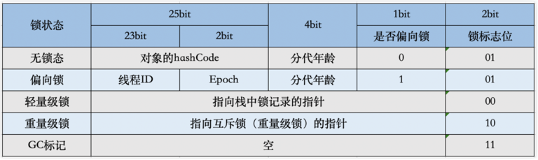
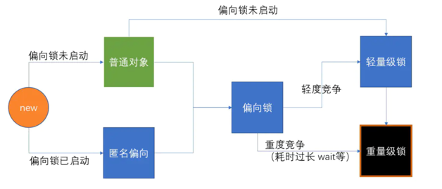

## 锁
### 什么是锁
- 并发环境下，多个线程会对同一个资源进行争抢，会导致数据不一致的问题，为此编程语言引入锁机制。通过抽象的锁对资源进行锁定。在java中每个object都存在一把锁，锁存在与对象头中。java中每个对象包含三个部分，对象头，实例数据，填充字节。对齐填充字节是为了满足java对象的大小必须是8比特的倍数而设计的。实例数据包含属性，方法。对象头存放对象运行时信息包含两部分，mark word：当前对象运行时信息，如hashcode，锁标识位；class point ：指针指向当前对象类型锁在方法区忠德对象类型
- 轻量级锁：不会占用太多资源，性能高。
- 重量级锁：耗费资源，性能低。synchronized

### 锁分类
- 乐观锁CAS（无锁）：JDK中提供乐观锁，例如原子操作类，Atomic系列。CAS响应速度快，使用cpu的自旋决定的，缺点是吃cpu。
- Lock（显式锁）：是一个接口，它的实现有 AbstractQueuedLongSynchronizer、ReentrantLock
- Synchronized（内置锁）：

### CAS（比较并交换）
- CAS 操作包含三个操作数 —— 内存位置（V）、预期原值（A）和新值(B)。
- 如果当前内存位置的值等于预期原值A的话，就将B赋值。否则，处理器 不做任何操作。整个比较并替换的操作是一个原子操作。这样做就不用害怕其它线程同时修改变量。
- compareAndSet，compareAndSwap
- 可以称作：无锁，自旋锁，乐观锁，轻量级锁

### 原子操作代替锁，提高性能
- AtomicInteger （CAS机制）代替锁；其内部是有个 volitale int value 进行操作的。
- 先跟内存中的值进行比较，如果跟原有的值一样的话，就交换。

```java
AtomicInteger ai = new AtomicInteger();
ai.incrementAndGet();
//incrementAndGet 内部源码为
while(true){
    //开启while循环
        int oldValue = ai.get();
        int newValue = oldValue +1;
        if(ai.compareAndSet(oldValue,newValue)){
            // CAS 操作成功后跳出循环。
            // 如果其中一个线程执行失败了，则继续循环执行此方法。
            brek;
        }
}
```
### Lock 显式锁运行机制，运用到了CAS机制
#### ReentrantLock
- lock.lock() 加锁，lock.unlock()解锁。
- 常写的方式：在finally中写unlock解锁方法。
#### 手写Lock：实现Lock接口，实现lock方法，实现unlock方法
```java
import java.util.concurrent.LinkedBlockingDeque;
import java.util.concurrent.atomic.AtomicReference;
import java.util.concurrent.locks.LockSupport;

public class MyLock implements Lock {
    AtomicReference<Thread> owner = new AtomicReference<>();
    // 阻塞队列用来存放没有抢到锁的线程,线程安全高效
    LinkedBlockingDeque waiters = new LinkedBlockingDeque();

    // 实现 lock 与 unlock
    public void lock() {
        //期待值如果是null，则替换成当前线程。加锁用CAS
        while (!owner.compareAndSet(null, Thread.currentThread())) {
            // 如果false 抢不到 当前线程等待（其他线程拿到锁会阻塞）
            waiters.add(Thread.currentThread());
            LockSupport.park();//让当前线程阻塞，相当于当前线程已经睡了，打了断点。当线程调用LockSupport.unpark之后 才会执行下面语句
            // 如果waiters 只有add，没有remove，会造成隐患内存泄漏
            waiters.remove(Thread.currentThread());
        }
    }

    public void unlock() {
        //只有持有锁的线程才能解锁
        if(owner.compareAndSet(Thread.currentThread(),null)){
            // 唤醒哪些等待的线程
            for(Object o :waiters.toArray()){
                Thread new = (Thread)o;
                // 唤醒其他线程
                LockSupport.unpark(next);
            }
        }else{
            //失败了 不做任何操作。
        }
    }
}
```

### synchronized 
- synchronized 是内置锁，互斥锁，悲观锁，同步锁；等待的线程会进入到一个队列中。
- 早期是重量级锁，- java 6 开始引入了 偏向锁，轻量级锁。所以markword 标识位锁总共分为4种状态：01无锁-标识位0，01偏向锁，00轻量级锁，10重量级锁，就对应了mark word中的四种状态。它会从某一状态升级到另一状态。锁只能升级不能降级。
- 加了 synchronized之后 ，可以是轻量级锁（CAS 实现，响应速度快，利用cpu自旋，吃cpu性能）；如果线程比较多，自旋就比较吃性能，所以进行升级成重量级锁（线程阻塞，相应速度慢，不吃cpu，吞吐量提高）。
- synchronized 被javac编译后会生成monitor-enter和monitor-exit字节码指令，依赖这两个指令进行线程同步，在这两个指令之间包裹的就是需要执行同步的代码。
- synchronized 会存在性能问题，编译后生成的两条字节码指令，是依赖于操作系统的，mutex lock实现，java线程实际上是对操作系统线程的映射，所以每当挂起或者唤醒一个线程，都涉及内核态和用户态之间的切换，是重量级的，某些情况下，切换时间可能超过任务执行时间。

### 锁的级别
- 
- 对象头中 会存储两部分内容
- 对象⾃身运⾏时所需的数据，也被称为Mark Word，也就是⽤于轻量级锁和偏向锁的关键点。具体的内容包含对象的hashcode、分代年龄、轻量级锁指针、重量级锁指针、GC标记、偏向锁线程。
- 存储类型指针，也就是指向类的元数据的指针，通过这个指针才能确定对象是属于哪个类的实例。如果是数组的话，则还包含了数组的⻓度

#### 无锁 

#### 偏向锁 markwrod-01
- 理想情况下 不通过mutex lock线程切换，也不通过cas获取锁。执行速度非常快。
- 就算是CAS也有判断、 比较、 交换。而偏向锁 只有一个 if (线程第一次运行){ 在对象头中 写入线程id。}else (线程第二次运行){ 直接拿出对象头中的线程 }
- 如果线程存在锁竞争，会带来额外的锁撤销的消耗。
- 偏向锁往往适用与只有一个线程访问同步块场。


#### 轻量级锁 
- 操作系统状态分为用户态，内核态。JVM 就跑在用户态。进行加锁或者解锁的时候，不需要向操作系统内核进行申请，对操作系统内核依赖性轻。
- 使用CAS自旋，不会阻塞线程，得不到锁竞争的线程会使用自旋来消耗cpu性能。
- 追求响应时间，同步速度快

#### 重量级锁 
- 进行加锁或者解锁的时候，需要向操作系统内核进行申请，对操作系统内核依赖性重。
- 线程竞争不用自旋，阻塞线程，响应时间缓慢，不消耗cpu。
- 追求吞吐量，同步速度长

### synchronized锁的升级

- 1.当Thread-1访问对象的时候，首先通过cas操作去获取偏向锁并将锁的偏向位更改为1；
- 2.当另一个线程（thread-2）到达的时候会比较自身线程id和对象头中id是否一致，发现不一致就会去检测对象头中的线程是否存活，如果Thread-1还是存活的就升级为轻量级锁；
- 3.但是如果多个线程在同一时刻进入临界区，会导致轻量级锁膨胀升级重量级锁。
- 3.1 如果此时处在偏向锁，出现了重度竞争，会直接升级为重量级锁。

### synchronized锁定的到底是什么元素
#### 1.修饰方法
- 非静态方法，锁定的是方法调用者，同一个类的不同对象调用，不会锁。相当于锁的是上厕所的人。
- 静态方法，锁定的是类，而不是方法调用者。相当于锁的是厕所。

```java
import java.util.concurrent.TimeUnit;
public class Test{
    public static void main(String[] args){
        Data data = new Data();
        new Thread(()->{data.func1();},"A").start;
        TimeUnit.SECONDS.sleep(1);
        new Thread(()->{data.func2();},"B").start;
        /*         非静态方法 对象锁           */
        // 情景一：若同一个类中func1、fun2 两个方法 都加了 synchronized 非静态方法锁，则锁定的是data；A与B同时执行的话，肯定是A能拿到data运行结果 3秒钟后，1与2 同时输出
        // 情景二： 只有 func1 加了synchronized，则先输出 2，后输出1。

        Data data1 = new Data();
        Data data2 = new Data();
        new Thread(()->{data1.func1();},"A").start;
        TimeUnit.SECONDS.sleep(1);
        new Thread(()->{data2.func2();},"B").start;
        // 情景一： 由于不同的对象调用的，所以不存在排队
        // 情景四： 由于锁定的是类,虽然有两个对象，但是只有一个类，所以排队
        // 情景三： 不会排队，func1，func2两个厕所，func1 锁了，func2没锁。
      
      
    }
}

class Data {
    // 情景一
    public synchronized void func1() {
        try {
            TimeUnit.SECONDS.sleep(3);
        }
        System.out.println("1...");
    }

    public synchronized void fun2() {
        System.out.println("2...");
    }

    // 情景二
      public synchronized void func1() {
        try {
            TimeUnit.SECONDS.sleep(3);
        }
        System.out.println("1...");
      }

      public void fun2() {
        System.out.println("2...");
      }

  // 情景三
      public static synchronized void func1() {
        try {
            TimeUnit.SECONDS.sleep(3);
        }
        System.out.println("1...");
      }

      public  static synchronized void fun2() {
        System.out.println("2...");
      }
  // 情景四
      public static synchronized void func1() {
        try {
            TimeUnit.SECONDS.sleep(3);
        }
        System.out.println("1...");
      }

      public  static  void fun2() {
        System.out.println("2...");
      }
}
```
#### 1.修饰代码块 
- this，num 锁定的是传入的对象，就看里面有一个还是多个，锁一个会同步，锁多个，不会同步
- Data.class 锁的是类，类只有一个

```java
import java.util.concurrent.TimeUnit;
public class Test{
    public static void main(String[] args){
        Data2 data2 = new Data2();
        for(int i = 0 ; i < 5 ; i++){
            new Thread(()->{
                data2.func();
            }).start();
        }
        //情景一： 同时输出5个start...，之后输出5个end...
        //情景二： start 完之后再 end，依次进行5个。5个线程 公用一个data2对象，而锁的是this 即data2对象。所以等第一个线程data2执行完释放后第二个线程的data2才能运行。
        
      
      for(int i = 0 ; i < 5 ; i++){
        new Thread(()->{
            Data2 data2 = new Data2();
          data2.func();
        }).start();
      }
      //情景二： 同时开始，同时结束。因为5个线程用的不同的data2
      //情景三： 锁的是类， start 完之后再 end，依次进行5个。
      //情景四： num只有一个，所以还是排队的

      Data2 data2 = new Data2();
      for(int i = 0 ; i < 5 ; i++){
        new Thread(()->{
            Integer num = 1；
          data2.func(num);
          //情景五： num内存中只有一个，所以还是排队的

          Integer num = new Integer(1);
          data2.func(num);
          //情景五： 不排队，因为new出来的在堆内存中，所以不会排队
        }).start();
      }
    }
}
class Data2 {
    // 情景一
  public void func() {
    System.out.println("start...");
    TimeUnit.SECONDS.sleep(1);
    System.out.println("end...");
  }
  
  // 情景二
    public void func() {
        synchronized (this){ // this指的是当前的对象
            System.out.println("start...");
            TimeUnit.SECONDS.sleep(1);
            System.out.println("end...");
        }
    }

  // 情景三
  public void func() {
    synchronized (Data2.class){ // 锁的是这个类
      System.out.println("start...");
      TimeUnit.SECONDS.sleep(1);
      System.out.println("end...");
    }
  }

  // 情景四
  public void func() {
      Integer num = 1； 
        String num = "sss"； //字符串常量池中 只有一个，会排队
        String num = new String("sss"); //堆内存中，new出来的，不同线程有不同个，不会排队
    synchronized (num){ // 锁的是这个类
      System.out.println("start...");
      TimeUnit.SECONDS.sleep(1);
      System.out.println("end...");
    }
  }

  // 情景五
  public void func(Integer num) {
    synchronized (num){ // 锁的是这个类
      System.out.println("start...");
      TimeUnit.SECONDS.sleep(1);
      System.out.println("end...");
    }
  }
}
```


### 怎样保证线程安全？
- 使用锁保证线程安全，如sychronized、volite、ReentryLock。
### volite两个特性是什么？
- volite的两个特性是可见性和禁止指令重排序。可见性是线程在获取volite属性时，需要去主内存刷新数据到线程内存中，写数据要去更新到主内存中。禁止指令重排序最经典的例子是单例的DCL，由于创建对象分为3个步骤，分配内存空间，初始化成员属性和构造方法，将引用指向内存空间，。由于Java是乱序执行，在多线程环境，创建对象的第二步最后执行，会出现对象已经不为空，但是调用使用它的属性去调用方法会崩溃，因为此时还没有初始化成员属性。
### sychronized和volite有什么区别？
- sychronized仅有获得锁的当前线程访问，其他线程不能访问。volite所有线程都可以访问，需要从主内存渎值。
- sychronized可以作用在类、方法，代码块。volite可以作用在变量。
- sychronized保证原子性，volite不能保证原子性。
- sychronized会造成线程阻塞，volite不会造成线程阻塞。
- synchronized可以被编译器优化，volite不可以被编译器优化。
