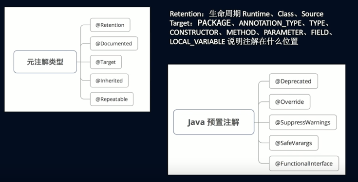

## 开源框架通用技术-编译时注解
### 目前App架构，你是怎么做的
- corelib，coreui 之上形成工具组件，之后功能组件

### 传统架构模式缺点
- 编译耗时（gradle并发，增量）
- 多人git冲突
- 不易于维护，app没有层次感

### Router跳转可以用什么实现，路由结构
- 用Intent实现
- EventBus
- 广播
- 隐式意图
- 类加载Style
- 数据结构Map来保存路径

### 组件话解决什么问题？
- 设置模块之间的依赖，且使得业务模块可以单独编译
- 解耦，解决页面之间的依赖关系
- 解决业务模块之间的页面跳转以及通信

### 编译时技术
#### 使用APT（Annotation Processing Tool）的框架
- ButterKnife
- Dagger
- EventBus
- ARouter
- Room
- Retrofit

### 注解
- Java注解是附加在代码中的一些元信息，用于一些工具在编译、运行时进行解析和使用，起到说明、配置的功能。
- 注解本质是一个继承了Annotation 的特殊接口，其具体实现类是Java 运行时生成的动态代理类。
- 我们通过反射获取注解时，返回的是Java 运行时生成的动态代理对象$Proxy1。通过代理对象调用自定义注解（接口）的方法，会最终调用AnnotationInvocationHandler 的invoke 方法。该方法会从memberValues 这个Map 中索引出对应的值。而memberValues 的来源是Java 常量池。

### Retention生命周期
- Runtime运行时能获取到注解，它会到JVM，到内存中
- Class类注解，在编译期间能获取
- Source注解，只在代码层面

### 如何获取注解
- isAnnotationPresent(AptCreate.class) 拿到boolean类型的值，如果应用到了注解，就为true，
- 然后可以通过GetAnnotation来获取到注解对象，通过注解对象获取注解值 

### ServiceLoader 与 ClassLoader
- JVM利用ClassLoader将类加载进内存，做java类生命周期的处理：加载，链接，初始化，使用，卸载
- ServiceLoader服务加载。 服务提供者可以通过扩展的形式（插件plugin）安装在java平台的实现中，也就是将jar文件放入任意常用的扩展目标中。也可以通过将提供者加入应用程序类路径，或者通过其他某些特定子平台的方式使其可用。

### AutoService主要用于组件化开发
- 当开发的时候，我们只能知道接口而不能知道实现类，所以无法访问，如何解决这个问题？
- 遍历dex文件找到实现类并动态注册（ARouter会自己实现，知道原理）。反射性能的问题
- 修改字节码动态插入（AutoRegister框架） 打包慢
- AutoService+ServiceLoader 反射

### 参考致谢
- https://www.bilibili.com/video/BV1hZ4y1C7Vd?p=3