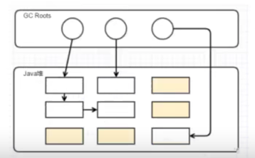

## ArrayList 与 LinkedList

### ArrayList

- ArrayList 里面维护了一个Object[]数组

#### 第i个位置插入元素E add(int index,E)

- rangeCheckForAdd 检查下标是否越界
- elementData 元素个数+1；
- 然后通过 arrayCopy() 方法，把 i 位置之后的元素全部依次往后挪动一个位置；
- 把元素E赋值到第i个位置

```java
public static void arraycopy(
        Object src,     //源数组
        int srcPos,     //源数组中的起始位置
        Object dest,    //目标数组
        int destPos,    //目标数组中的起始位置
        int length)     //要复制的数组元素数量

public void add(int index,E element){
        rangeCheckForAdd(index);
        modCount++;
        final int s;
        Object[]elementData;
        if((s=size)==(elementData=this.elementData).length)
            elementData=grow();
        System.arraycopy(elementData,index,elementData,index+1,s-index);
        elementData[index]=element;
        size=s+1;
   }
```

#### 删除元素remove(int index)

- 数组个数-1
- 通过arraycopy()将数组从index位置向前移动

```java
public E remove(int index){
    Objects.checkIndex(index,size); //检查下标是否越界
    final Object[]es=elementData;
    @SuppressWarnings("unchecked") 
    E oldValue=(E)es[index];
    fastRemove(es,index);
     return oldValue;
}
```
```java
private void fastRemove(Object[]es,int i){
    modCount++;
    final int newSize;
    if((newSize=size-1)>i)
        System.arraycopy(es,i+1,es,i,newSize-i);
    es[size=newSize]=null;
}
```

### LinkedList

- 里面维护了一个 Node 双向链表

```java
    //LinkedList
public class LinkedList<E>
        extends AbstractSequentialList<E>
        implements List<E>, Deque<E>, Cloneable, java.io.Serializable {
    transient int size = 0;
    //表头
    transient Node<E> first;
    //表尾
    transient Node<E> last;
    //...
}
```

```java
//  每个结点
private static class Node<E> {
    E item;
    Node<E> next; //后继
    Node<E> prev; //前驱

    Node(Node<E> prev, E element, Node<E> next) {
        this.item = element;
        this.next = next;
        this.prev = prev;
    }
}
```

#### add(E)

```java
 public boolean add(E e){
    linkLast(e);
    return true;
}
```

```java
void linkLast(E e){
    final Node<E> l=last;     //找到最后一个位置
    final Node<E> newNode=new Node<>(l,e,null);
    last=newNode;             //将新元素作插入到最后
    if(l==null)
        first=newNode;        //如果链表为空 表头为 newNode
    else
        l.next=newNode;       //否则 将最后一个结点指向newNode
    size++;
    modCount++;
}
```

### 一个数组插入删除查找和链表的插入删除的效率对比（腾讯）
- 插入：LinkedList 移动指针，ArrayList要复制移动元素
- 查找：ArrayList 可以随机查找，LinkedList 只能顺序遍历查找
- 删除：LinkedList 移动指针，ArrayList要复制移动元素

### 如果一个数组反复插入删除，怎么降低时间复杂度（腾讯）
- 对数组反复插入删除，需要不断移动，会造成内存损耗
- 思路借鉴一下JVM里面标记回收算法
- 先把需要删除的结点标记为null，我不会真正的删除。我只是标记你删除了。如果内存不够了，把所有标记为null删除。
- 如果这时候插入到标记为null时，直接把null修改
- SparseArray

#### 垃圾回收算法中 标记回收算法
- 通过JVM中 可达性分析标记出不可达的内存块
  
- 对不可达的内存快进行回收,但是会产生内存碎片（现在用标记整理）

#### SparseArray
