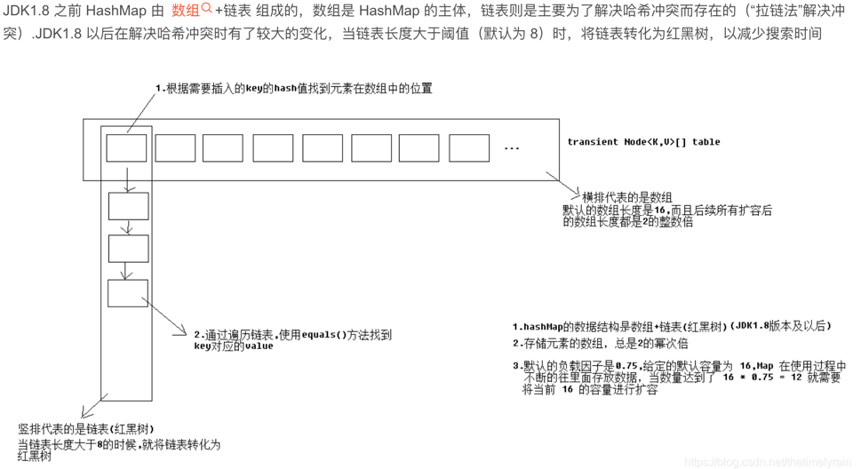
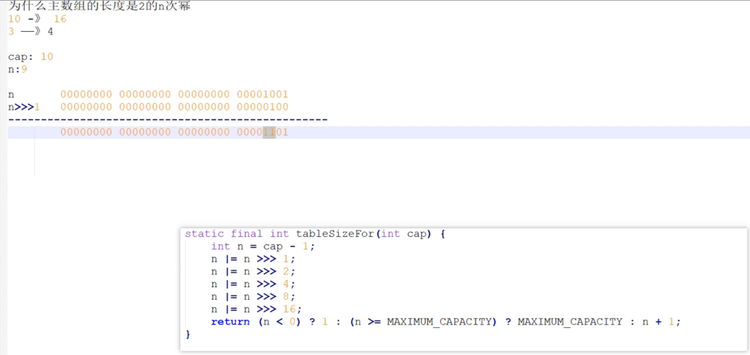
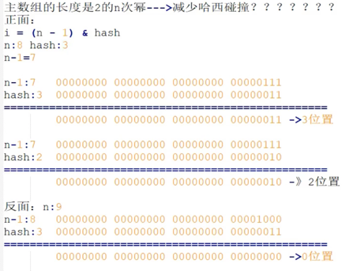
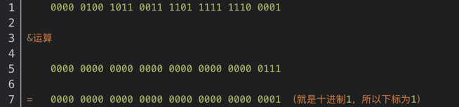

###  HashMap 源码解析

- JDK1.8中的HashMap较于前代有了较大的变更，主要变化在于扩容机制的改变。在JDK1.7及之前HashMap在扩容进行数组拷贝的时候采用的是头插法，因此会造成并发情景下形成环状链表造成死循环的问题。JDK1.8中改用了尾插法进行数组拷贝，修复了这个问题。同时JDK1.8开始HashMap改用数组+链表/红黑树组合的数据结构来提高查询效率，降低哈希冲突产生的链表过长导致的查询效率减缓现象。

- 主要属性：loadFactor 扩容因子，在单参构造函数中 默认赋值为 DEFAULT_LOAD_FACTOR 即 0.75；
- 主要属性：DEFAULT_INITIAL_CAPACITY 默认初始化长度 为16
- 主要属性：threshold，在构造函数中 初始化时赋值为 tableSizeFor()，在resize()扩容方法中赋值 = newCap * loadFactor
- 主要属性：TREEIFY_THRESHOLD = 8 ，每个链表最大长度，超过后进入treeifyBin(),会进行二次判断，如果 小于MIN_TREEIFY_CAPACITY = 64，会再次扩容，若大于64 则转化为红黑树
- 主要属性：UNTREEIFY_THRESHOLD = 6 ， 树退化时的阈值
- 主要属性：Node<K,V>[] table 底层数组；Node 类中 含有k，v，next下一个结点，hash值
- 空构造器：内部只有一个赋值语句 loadFactor = DEAULT_LOAD_FACTOR
- 单参构造器：内部调用 this(initialCapactiy,DEAULT_LOAD_FACTOR)
- 双参构造器：this(initialCapactiy,loadFactory)，对loadFactor 和 threshold=tableSizeFor()

#### tableSizeFor() 
- 返回 大于cap，且最接近cap的2的n次幂，如果传10 ，则返回16。目的是确定主数组长度
```java
  static final int tableSizeFor(int cap) {
        int n = -1 >>> Integer.numberOfLeadingZeros(cap - 1);
        //右移位之后 进行异或操作
        //为什么移到16位不移了
        return (n < 0) ? 1 : (n >= MAXIMUM_CAPACITY) ? MAXIMUM_CAPACITY : n + 1;
    }
```


```java
    //Integer
    public static int numberOfLeadingZeros(int i) {
        // HD, Count leading 0's
        if (i <= 0)
            return i == 0 ? 32 : 0;
        int n = 31;
        if (i >= 1 << 16) { n -= 16; i >>>= 16; }
        if (i >= 1 <<  8) { n -=  8; i >>>=  8; }
        if (i >= 1 <<  4) { n -=  4; i >>>=  4; }
        if (i >= 1 <<  2) { n -=  2; i >>>=  2; }
        return n - (i >>> 1);
    }
```


#### put方法
```java
public V put(K key, V value) {
    //  计算key的哈希码
        return putVal(hash(key), key, value, false, true);
    }
```
```java
    // 为了尽量减少数据存放时发生哈希冲突的概率，HashMap会根据每个元素的key计算出一个hash值，用于散列时求出其在数组中的索引位置。具体计算方法如下：
    // 这一段神秘代码的精髓在于h = key.hashCode() ^ (h >>> 16)这句话。它的作用是让key的hashCode高十六位与第十六位进行异或操作得出较为分散的hash值。这样操作的原因我们放在下面解释。  
    static final int hash(Object key) {
        int h;
        // key.hashCode()：返回散列值也就是hashcode
        // ^ ：按位异或
        // >>>:无符号右移，忽略符号位，空位都以0补齐
        return (key == null) ? 0 : (h = key.hashCode()) ^ (h >>> 16);
    }

```
```java
final V putVal(int hash, K key, V value, boolean onlyIfAbsent,boolean evict) {
        Node<K,V>[] tab; Node<K,V> p; int n, i;
        // table未初始化或者长度为0，调用resize()进行扩容，调用resize(),若table为空，内部会创建一个长度 16 的Node类型数组赋值给table
        // 第二次put 不走
        if ((tab = table/*底层数组*/) == null || (n = tab.length) == 0)
            n = (tab = resize()).length;
        // 位置 i = (n - 1) & hash 确定元素具体位置，存放在哪个桶中，桶为空，新生成结点放入桶中(此时，这个结点是放在数组中)
        if ((p = tab[i = (n - 1) & hash]) == null)
            // 将 hash key vale 封装成新的Node 给tab
            tab[i] = newNode(hash, key, value, null);
        // 如果 桶中已经存在元素则走 else
        else {
            Node<K,V> e; K k;
            // 比较需要存放的元素 与 桶中第一个元素(数组中的结点)的hash值相等，key是否相等，p指向桶中的第一个元素
            // 阿里面试题：为什么key要选择String类型？因为key选了String类型，当发生hash碰撞的时候（hash想等，key不等），后面 (key != null && key.equals(k)) 直接不用比较，提高效率
            // equals 不一定能走到；hash == hash 且 key 相等，则发生碰撞
            // hash相等，key 相等 用于覆盖
             if (p.hash == hash &&((k = p.key) == key || (key != null && key.equals(k))))
            // 将第一个元素赋值给e，用e来记录
                 e = p;
             // hash值不相等，即key不相等；为红黑树结点
            else if (p instanceof TreeNode)
            // 放入树中
                e = ((TreeNode<K,V>)p).putTreeVal(this, tab, hash, key, value);
            // 为链表结点
            else {
                // hash 相等，key不等 即发生碰撞
                // 发生碰撞在链表最末插入结点；1.7是头插法，1.8之后是尾插法
                // binCount 桶的个数，链表中，每个结点算一个桶
                for (int binCount = 0; ; ++binCount) {
                     // 查找到达链表的尾部
                    if ((e = p.next) == null) {
                         // 封装新节点，在尾部插入新结点   
                         p.next = newNode(hash, key, value, null);
                         // 结点数量达到阈值，转化为红黑树，TREEIFY_THRESHOLD = 8
                         if (binCount >= TREEIFY_THRESHOLD - 1) // -1 for 1st
                             treeifyBin(tab, hash);
                                // 跳出循环
                        break;
                     }
                    // 判断链表中结点的key值与插入的元素的key值是否相等
                    if (e.hash == hash &&((k = e.key) == key || (key != null && key.equals(k))))
                         // 相等，跳出循环
                         break;
                        // 用于遍历桶中的链表，与前面的e = p.next组合，可以遍历链表
                    p = e;
                }
            }
            
            // 表示在桶中找到 key值、hash 值与插入元素相等的结点（即 覆盖key相同的value）
            if (e != null) {
                 // 记录e的value
                 V oldValue = e.value;
                // onlyIfAbsent为false或者旧值为null
                if (!onlyIfAbsent || oldValue == null)
                    //用新值替换旧值
                    e.value = value;
                    // 访问后回调
                    afterNodeAccess(e);
                    // 返回旧值
                    return oldValue;
            }
        }
        // 结构性修改
        ++modCount;
        // 实际大小大于阈值则扩容
        if (++size > threshold)
            resize();
            // 插入后回调
        afterNodeInsertion(evict);
        return null;
    }
```
```java
    // 树化 并非 binCount （链表中元素个数） > 8 就树化，在数组长度小于64时，先扩容
    // 退化的时候 是 6
    // 为什么 选择 8 和 6，包括 扩容的因素 容量16，是因为符合统计学中泊松分布，得来的比较客观的值
    final void treeifyBin(Node<K,V>[] tab, int hash) {
        int n, index; Node<K,V> e;
        if (tab == null || (n = tab.length) < MIN_TREEIFY_CAPACITY)
            resize();
        else if ((e = tab[index = (n - 1) & hash]) != null) {
            TreeNode<K,V> hd = null, tl = null;
            do {
                //把单向链表变为双向链表
                TreeNode<K,V> p = replacementTreeNode(e, null);
                if (tl == null)
                    hd = p;
                else {
                    p.prev = tl;
                    tl.next = p;
                }
                tl = p;
            } while ((e = e.next) != null);
            if ((tab[index] = hd) != null)
                // 树化方法，进行 左旋右旋，红黑树的变化
                hd.treeify(tab);
        }
    }
```
```java
    final Node<K,V>[] resize() {
        Node<K,V>[] oldTab = table;                 // table:null  oldTab:null
        int oldCap = (oldTab == null) ? 0 : oldTab.length;  //oldCap:0
        int oldThr = threshold;                     // oldThr:如果掉有参构造器，则会赋初值
        int newCap, newThr = 0;
        
        if (oldCap > 0) {
            if (oldCap >= MAXIMUM_CAPACITY) {
                threshold = Integer.MAX_VALUE;
                return oldTab;
            }
            else if ((newCap = oldCap << 1) < MAXIMUM_CAPACITY &&
                     oldCap >= DEFAULT_INITIAL_CAPACITY)
                newThr = oldThr << 1; // double threshold 
        }
        else if (oldThr > 0) // initial capacity was placed in threshold
            newCap = oldThr;        
        else {               // zero initial threshold signifies using defaults
            newCap = DEFAULT_INITIAL_CAPACITY;
            newThr = (int)(DEFAULT_LOAD_FACTOR * DEFAULT_INITIAL_CAPACITY);
        }
        
        if (newThr == 0) {          //对 newThr 赋值 
            float ft = (float)newCap * loadFactor;
            newThr = (newCap < MAXIMUM_CAPACITY && ft < (float)MAXIMUM_CAPACITY ?
                      (int)ft : Integer.MAX_VALUE);
        }
        
        threshold = newThr;  //把newThr赋值给 threshold
        @SuppressWarnings({"rawtypes","unchecked"})
        Node<K,V>[] newTab = (Node<K,V>[])new Node[newCap];     //创建 Node数组 给底层主数组table赋值
        table = newTab;
        if (oldTab != null) {
            for (int j = 0; j < oldCap; ++j) {
                Node<K,V> e;
                if ((e = oldTab[j]) != null) {
                    oldTab[j] = null;
                    if (e.next == null)
                        newTab[e.hash & (newCap - 1)] = e;
                    else if (e instanceof TreeNode)
                        ((TreeNode<K,V>)e).split(this, newTab, j, oldCap);
                    else { // preserve order
                        Node<K,V> loHead = null, loTail = null;
                        Node<K,V> hiHead = null, hiTail = null;
                        Node<K,V> next;
                        do {
                            next = e.next;
                            if ((e.hash & oldCap) == 0) {
                                if (loTail == null)
                                    loHead = e;
                                else
                                    loTail.next = e;
                                loTail = e;
                            }
                            else {
                                if (hiTail == null)
                                    hiHead = e;
                                else
                                    hiTail.next = e;
                                hiTail = e;
                            }
                        } while ((e = next) != null);
                        if (loTail != null) {
                            loTail.next = null;
                            newTab[j] = loHead;
                        }
                        if (hiTail != null) {
                            hiTail.next = null;
                            newTab[j + oldCap] = hiHead;
                        }
                    }
                }
            }
        }
        return newTab;
    }
```
#### Node<K,V>[]数组的下标是用的(n - 1) & hash这样得到的,这样做的好处
- (n - 1) & hash实际上是对表长求膜运算，使用位运算提升了运算速度
- 算法导论中的散列法：选取 m 的时候， 一个不太接近2 的整数幂的素数 ，为什么长度为2的n次幂，为了保证 位运算与取膜运算的结果一致性，即求下标位置的一致性；更好的散列，减少哈希碰撞；方便扩容时数据的迁移操作（见ConcurrentHashMap的 扩容要做的事情）。
- 
- 这时我们就可以考虑为什么要用那么奇怪的方式进行hash值的计算了。我们知道HashMap的容量也就是数组的长度始终是2的n次幂形式，进行减一操作之后得到的二进制数就是高位为0低位全为1的形式（如数组长度为8，减一转换为二进制数就是前边一堆零然后跟上111），由于绝大多数情况下数组长度一般都小于2^16即小于65536。所以return h & (length-1);结果始终是h的低16位与（length-1）进行&运算，这样会造成运算结果不够分散。如下例子（hashcode为四字节） e.g. 为了方便验证，假设length为8。HashMap的默认初始容量为16 length = 8; （length-1） = 7；转换二进制为111； 假设一个key的 hashcode = 78897121 转换二进制：100101100111101111111100001，与（length-1）& 运算如下
  
- 上述运算实质是：001 与 111 & 运算。也就是哈希值的低三位与length与运算。如果让哈希值的低三位更加随机，那么&结果就更加随机，如何让哈希值的低三位更加随机，那么就是让其与高位异或以期得到的下标更加散列。
- 就算在构造函数中 传入任意的容量大小，最终都会把它转换成2的n次幂
#### 链表大于8就会树化吗
- 当HashMap中的其中一个链表的对象个数如果达到了8个，此时如果数组长度没有达到64，那么HashMap会先扩容解决，如果已经达到了64，那么这个链表会变成红黑树，节点类型由Node变成TreeNode类型。当然，如果映射关系被移除后，下次执行resize方法时判断树的节点个数低于6，也会再把树转换为链表。
#### putVal中三次调用resize()方法
#### 树化时为什么是红黑树 不是 AVL树
- AVL树 牺牲了插入性能，提高了查询性能，当左右子树高度超过2时便会 左旋右旋。
- 红黑树 取得一个点，平衡了插入性能和查询性能，它保证 最长子树不超过最短子树的两倍。
#### HashTable 和 HashMap 区别：
##### 相同点:
- hashmap和Hashtable都实现了map、Cloneable（可克隆）、Serializable（可序列化）这三个接口
##### 不同点:
- 1.底层数据结构不同:hsahtable 底层都是数组+链表,但jdk1.8 HashMap加入了红黑树
- 2.Hashtable 是不允许键或值为 null 的，HashMap 的键值则都可以为 null。
- 3.添加key-value的hash值算法不同：HashMap添加元素时，是使用自定义的哈希算法,而HashTable是直接采用key的hashCode()
- 4.实现方式不同：Hashtable 继承的是 Dictionary类，而 HashMap 继承的是 AbstractMap 类。
- 5.初始化容量不同：HashMap 的初始容量为：16，Hashtable 初始容量为：11，两者的负载因子默认都是：0.75。
- 6.扩容机制不同：当已用容量>总容量 * 负载因子时，HashMap 扩容规则为当前容量翻倍，Hashtable 扩容规则为当前容量翻倍 +1。
- 7.支持的遍历种类不同：HashMap只支持Iterator遍历,而HashTable支持Iterator和Enumeration两种方式遍历
- 8.迭代器不同：HashMap的迭代器(Iterator)是fail-fast迭代器，而Hashtable的enumerator迭代器不是fail-fast的。所以当有其它线程改变了HashMap的结构（增加或者移除元素），将会抛出ConcurrentModificationException，但迭代器本身的remove()方法移除元素则不会抛出ConcurrentModificationException异常。但这并不是一个一定发生的行为，要看JVM。而Hashtable 则不会。
- 9.部分API不同：HashMap不支持contains(Object value)方法，没有重写toString()方法,而HashTable支持contains(Object value)方法，而且重写了toString()方法
- 10.同步性不同: Hashtable是同步(synchronized)的，适用于多线程环境, 而hashmap不是同步的，适用于单线程环境。多个线程可以共享一个Hashtable；而如果没有正确的同步的话，多个线程是不能共享HashMap的。


