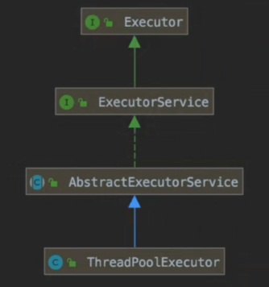
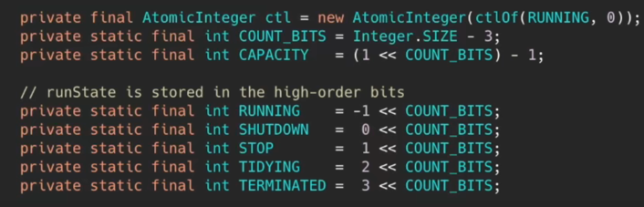
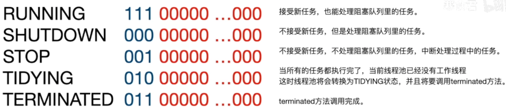
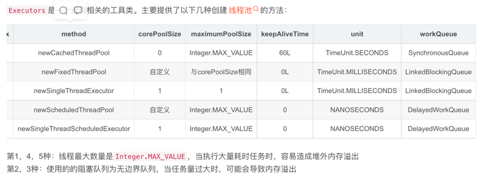

## 线程池
- 降低线程创建回收频率减少开销，提高资源利用率；控制并发数；便于管理
### 线程池的创建方法
- Executors
- ThreadPoolExecutor
### ThreadPoolExecutor 源码：继承关系-> 变量 -> 内部方类 ->方法

### 线程池原理
- 预先创建多个线程对象放到线程池中，来处理任务

#### ThreadPoolExecutor(参数) 核心参数
- corePoolSize： 核心线程数 不会回收
- maximumPoolSize: 最大线程数量
- keepAliveTime： 非核心线程在空闲状态下的存活时间
- unit： keepAliveTime存活时间的单位
- workQueue： 工作队列，当核心线程满了新进的请求会被添加到工作队列中，是阻塞队列
- ThreadFactory：创建线程的工厂对象
- rejectedExecutionHandler：当线程池中的线程达到了最大线程数，再有新的请求进来的时候的拒绝策略

#### 拒绝策略
- CallerRunsPolicy - 当触发拒绝策略，只要线程池没有关闭的话，则使用调用线程直接运行任务。一般并发比较小，性能要求不高，不允许失败。但是，由于调用者自己运行任务，如果任务提交速度过快，可能导致程序阻塞，性能效率上必然的损失较大
- AbortPolicy - 丢弃任务，并抛出拒绝执行 RejectedExecutionException 异常信息。线程池默认的拒绝策略。必须处理好抛出的异常，否则会打断当前的执行流程，影响后续的任务执行。
- DiscardPolicy - 直接丢弃，其他啥都没有
- DiscardOldestPolicy - 当触发拒绝策略，只要线程池没有关闭的话，丢弃阻塞队列 workQueue 中最老的一个任务，并将新任务加入

#### Executors的默认方法

#### 为什么不推荐使用Executors的默认方法