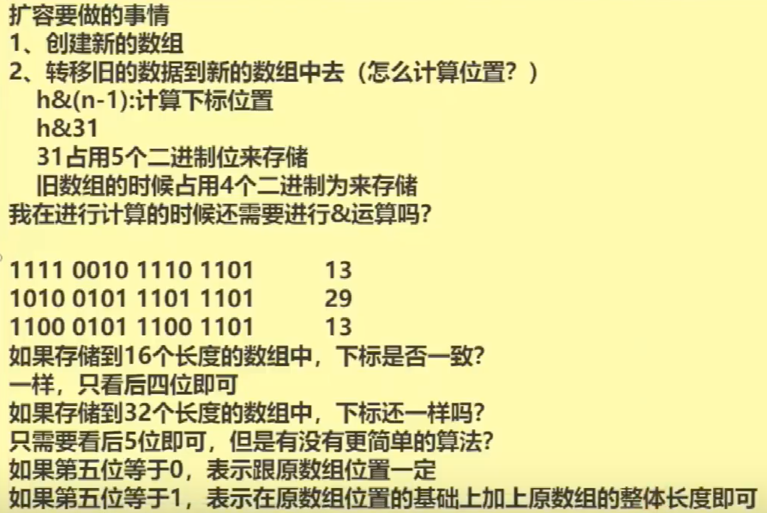
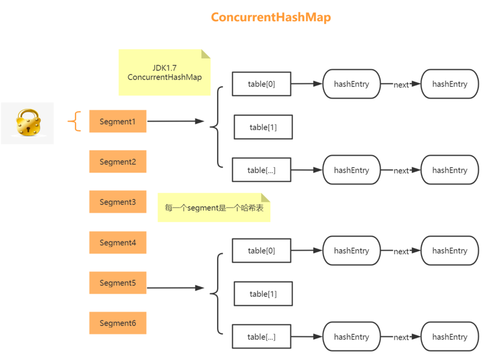

###  ConcurrentHashMap 源码解析
- 数据结构 类似 HashMap，有三个构造函数，内部流程相似。都不是在构造函数中创造 底层数组的固定空间的，而是在put数据时获取到固定空间。
- 参数 跟 HashMap 类似 但有:1. 最大数组容量 MAX_ARRAY_SIZE = Integer.MAX_VALUE -8，留出空间用来存储 原数据信息；2. 默认并发级别 16；3. sizeCtl如果是-1 进行的是初始化操作，如果是-n则进行扩容，如果是正数代表当前数组扩容时的阈值
- 源码
- 扩容流程
- CAS + synchronized
- voletail

```java
final V putVal(K key, V value, boolean onlyIfAbsent) {
        if (key == null || value == null) throw new NullPointerException();
        // int 类型的hashcode值 包括进行扰动函数之后，都是他本身
        int hash = spread(key.hashCode());
        int binCount = 0;
        for (Node<K,V>[] tab = table;;) {
            Node<K,V> f; int n, i, fh; K fk; V fv;
            if (tab == null || (n = tab.length) == 0)
                tab = initTable();
            else if ((f = tabAt(tab, i = (n - 1) & hash)) == null) {
                if (casTabAt(tab, i, null, new Node<K,V>(hash, key, value)))
                    break;                   // no lock when adding to empty bin
            }
            else if ((fh = f.hash) == MOVED)
                tab = helpTransfer(tab, f);
            else if (onlyIfAbsent // check first node without acquiring lock
                     && fh == hash
                     && ((fk = f.key) == key || (fk != null && key.equals(fk)))
                     && (fv = f.val) != null)
                return fv;
            else {
                V oldVal = null;
                synchronized (f) {
                    if (tabAt(tab, i) == f) {
                        if (fh >= 0) {
                            binCount = 1;
                            for (Node<K,V> e = f;; ++binCount) {
                                K ek;
                                if (e.hash == hash &&
                                    ((ek = e.key) == key ||
                                     (ek != null && key.equals(ek)))) {
                                    oldVal = e.val;
                                    if (!onlyIfAbsent)
                                        e.val = value;
                                    break;
                                }
                                Node<K,V> pred = e;
                                if ((e = e.next) == null) {
                                    pred.next = new Node<K,V>(hash, key, value);
                                    break;
                                }
                            }
                        }
                        else if (f instanceof TreeBin) {
                            Node<K,V> p;
                            binCount = 2;
                            if ((p = ((TreeBin<K,V>)f).putTreeVal(hash, key,
                                                           value)) != null) {
                                oldVal = p.val;
                                if (!onlyIfAbsent)
                                    p.val = value;
                            }
                        }
                        else if (f instanceof ReservationNode)
                            throw new IllegalStateException("Recursive update");
                    }
                }
                if (binCount != 0) {
                    if (binCount >= TREEIFY_THRESHOLD)
                        treeifyBin(tab, i);
                    if (oldVal != null)
                        return oldVal;
                    break;
                }
            }
        }
        addCount(1L, binCount);
        return null;
    }
```

```java
    private final Node<K,V>[] initTable() {
        Node<K,V>[] tab; int sc;
        while ((tab = table) == null || tab.length == 0) {
            if ((sc = sizeCtl) < 0)
                Thread.yield(); // lost initialization race; just spin
            else if (U.compareAndSetInt(this, SIZECTL, sc, -1)) {
                try {
                    if ((tab = table) == null || tab.length == 0) {
                        int n = (sc > 0) ? sc : DEFAULT_CAPACITY;
                        @SuppressWarnings("unchecked")
                        Node<K,V>[] nt = (Node<K,V>[])new Node<?,?>[n];
                        table = tab = nt;
                        sc = n - (n >>> 2);
                    }
                } finally {
                    sizeCtl = sc;
                }
                break;
            }
        }
        return tab;
    }
```
```java
    private final void addCount(long x, int check) {
        CounterCell[] cs; long b, s;
        if ((cs = counterCells) != null ||
            !U.compareAndSetLong(this, BASECOUNT, b = baseCount, s = b + x)) {
            CounterCell c; long v; int m;
            boolean uncontended = true;
            if (cs == null || (m = cs.length - 1) < 0 ||
                (c = cs[ThreadLocalRandom.getProbe() & m]) == null ||
                !(uncontended =
                  U.compareAndSetLong(c, CELLVALUE, v = c.value, v + x))) {
                fullAddCount(x, uncontended);
                return;
            }
            if (check <= 1)
                return;
            s = sumCount();
        }
        if (check >= 0) {
            Node<K,V>[] tab, nt; int n, sc;
            while (s >= (long)(sc = sizeCtl) && (tab = table) != null &&
                   (n = tab.length) < MAXIMUM_CAPACITY) {
                // 若元素个数 大于  sizeCtl,则进入扩容流程
                int rs = resizeStamp(n); //当前数组的标识
                if (sc < 0) {
                    if ((sc >>> RESIZE_STAMP_SHIFT) != rs || sc == rs + 1 ||
                        sc == rs + MAX_RESIZERS || (nt = nextTable) == null ||
                        transferIndex <= 0)
                        break;
                    if (U.compareAndSetInt(this, SIZECTL, sc, sc + 1))
                        transfer(tab, nt);
                }
                else if (U.compareAndSetInt(this, SIZECTL, sc,
                                             // rs << RESIZE_STAMP_SHIFT) + 2 改变sc的
                                             (rs << RESIZE_STAMP_SHIFT) + 2))
                    // 正式扩容，transfer 意思是转移；
                    transfer(tab, null);
                s = sumCount();
            }
        }
    }
```
```java
 private final void transfer(Node<K,V>[] tab, Node<K,V>[] nextTab) {
        int n = tab.length, stride;
        // NCPU 为电脑核心线程数
        if ((stride = (NCPU > 1) ? (n >>> 3) / NCPU : n) < MIN_TRANSFER_STRIDE)
            stride = MIN_TRANSFER_STRIDE; // subdivide range  切分成相应的段来完成迁移操作，假设原来容量16，则大于16时要切分成段，每16个一段
        if (nextTab == null) {            // initiating 新创建一个数组 准备扩容
            try {
                @SuppressWarnings("unchecked")
                Node<K,V>[] nt = (Node<K,V>[])new Node<?,?>[n << 1];
                nextTab = nt;
            } catch (Throwable ex) {      // try to cope with OOME
                sizeCtl = Integer.MAX_VALUE;
                return;
            }
            nextTable = nextTab;  // 新数组
            transferIndex = n;    // 原来有16个位置，这16个位置都要移动，要从下标为 transferIndex 开始 由后向前开始遍历操作
        }
        
        int nextn = nextTab.length;
        //相当于一个标识位 1. 如果一个结点为空或者已经转移了 ，要设置为ForwardingNode；2. 如果已经时一个ForwardingNode，则直接跳过
        ForwardingNode<K,V> fwd = new ForwardingNode<K,V>(nextTab);
        boolean advance = true;
        boolean finishing = false; // to ensure sweep before committing nextTab
        for (int i = 0, bound = 0;;) {
            Node<K,V> f; int fh;
            while (advance) {
                int nextIndex, nextBound;
                
                if (--i >= bound || finishing)
                    advance = false;
                else if ((nextIndex = transferIndex) <= 0) {
                    i = -1;
                    advance = false;
                }
                else if (U.compareAndSetInt
                         (this, TRANSFERINDEX, nextIndex,
                          nextBound = (nextIndex > stride ?
                                       nextIndex - stride : 0))) {
                    // 第一次能进来
                    bound = nextBound; //最小下标 0
                    i = nextIndex - 1; // i 最大下标为 15，之后的while循环里每次进行 --i，从后向前操作
                    advance = false;
                }
                
            }
            
            if (i < 0 || i >= n || i + n >= nextn) {
                int sc;
                if (finishing) {
                    nextTable = null;
                    table = nextTab;
                    sizeCtl = (n << 1) - (n >>> 1);
                    return;
                }
                if (U.compareAndSetInt(this, SIZECTL, sc = sizeCtl, sc - 1)) {
                    if ((sc - 2) != resizeStamp(n) << RESIZE_STAMP_SHIFT)
                        return;
                    finishing = advance = true;
                    i = n; // recheck before commit
                }
            }
            else if ((f = tabAt(tab, i)) == null)
                advance = casTabAt(tab, i, null, fwd);
            else if ((fh = f.hash) == MOVED)
                advance = true; // already processed
            else {
                synchronized (f) {
                    // 实际的数据迁移操作
                    if (tabAt(tab, i) == f) {
                        Node<K,V> ln, hn;
                        
                        if (fh >= 0) {
                            int runBit = fh & n;
                            Node<K,V> lastRun = f;
                            for (Node<K,V> p = f.next; p != null; p = p.next) {
                                int b = p.hash & n;
                                if (b != runBit) {
                                    runBit = b;
                                    lastRun = p;  // 最后同色的节点
                                }
                            }
                            if (runBit == 0) {
                                ln = lastRun; // 0 对应的链表
                                hn = null;    // 1 对应的链表
                            }
                            else {
                                hn = lastRun;
                                ln = null;
                            }
                            
                            for (Node<K,V> p = f; p != lastRun; p = p.next) {
                                int ph = p.hash; K pk = p.key; V pv = p.val;
                                if ((ph & n) == 0)
                                    ln = new Node<K,V>(ph, pk, pv, ln);
                                else
                                    hn = new Node<K,V>(ph, pk, pv, hn);
                            }
                            
                            setTabAt(nextTab, i, ln);       
                            setTabAt(nextTab, i + n, hn);    
                            setTabAt(tab, i, fwd); 
                            advance = true;
                        }
                        else if (f instanceof TreeBin) {
                            TreeBin<K,V> t = (TreeBin<K,V>)f;
                            TreeNode<K,V> lo = null, loTail = null;
                            TreeNode<K,V> hi = null, hiTail = null;
                            int lc = 0, hc = 0;
                            for (Node<K,V> e = t.first; e != null; e = e.next) {
                                int h = e.hash;
                                TreeNode<K,V> p = new TreeNode<K,V>
                                    (h, e.key, e.val, null, null);
                                if ((h & n) == 0) {
                                    if ((p.prev = loTail) == null)
                                        lo = p;
                                    else
                                        loTail.next = p;
                                    loTail = p;
                                    ++lc;
                                }
                                else {
                                    if ((p.prev = hiTail) == null)
                                        hi = p;
                                    else
                                        hiTail.next = p;
                                    hiTail = p;
                                    ++hc;
                                }
                            }
                            ln = (lc <= UNTREEIFY_THRESHOLD) ? untreeify(lo) :
                                (hc != 0) ? new TreeBin<K,V>(lo) : t;
                            hn = (hc <= UNTREEIFY_THRESHOLD) ? untreeify(hi) :
                                (lc != 0) ? new TreeBin<K,V>(hi) : t;
                            setTabAt(nextTab, i, ln);
                            setTabAt(nextTab, i + n, hn);
                            setTabAt(tab, i, fwd);
                            advance = true;
                        }
                    }
                }
            }
        }
    }
```

#### 扩容要做的事情
- 1.创建新的数组
- 2.转移旧的数据到新的数组中去（怎么计算位置 ？原先是 h&(n-1) 计算位置。假设原先是16，扩容要左移一位，扩容两倍到32，然后计算位置为 h &(2*n - 1) 即 31，占用5个二进制位，而就数组占用4个二进制位来存储）
####  那下面在进行运算的时候 还要进行与运算吗? 还要看后5位所有数据吗？
- 其实 只第5位就好。如果第5位 = 0 表示跟原数组位置一样；如果第5位为1 ，表示在原数组位置的基础上 + 原数组的整体长度即可。前提：容量为 2的n次幂
####  原数组长度128，扩容后256，扩容时难道用单线程未完成整体全部元素的迁移操作吗？多线程方式怎么做？
- 将原来的数组分段，规定每个线程最少负责16个桶的迁移工作，8个线程可以并行执行，若小于16个桶，则单线程操作
#### HashTable 比 ConcurrentHashMap 性能低的原因：
- HashTable锁的是 put方法

- ConcurrentHashMap JDK1.7版本： 容器中有多把锁，每一把锁锁一段数据,即数组+Segment+分段锁Segment的方式实现，ConcurrentHashMap定位一个元素的过程需要进行两次Hash操作。
  第一次Hash定位到Segment，第二次Hash定位到元素所在的链表的头部
- ConcurrentHashMap JDK1.8版本 CAS+Synchronized保证线程安全。JDK8中彻底放弃了Segment转而采用的是 对每个数组元素加锁（Node），Node：保存key，value及key的hash值的数据结构。其中value和next都用volatile修饰，保证并发的可见性。
#### 乐观锁，悲观锁
- 悲观锁：悲观锁是将资源锁住，等一个之前获得锁的线程释放锁之后，下一个线程才可以访问。
- 乐观锁：采取了一种宽泛的态度，通过某种方式不加锁来处理资源，比如通过给记录加version来获取数据，性能较悲观锁有很大的提高。
#### CAS操作
- CAS是compare and swap的缩写，即我们所说的比较交换。cas是一种基于锁的操作，而且是乐观锁。CAS 操作包含三个操作数 —— 内存位置（V）、预期原值（A）和新值（B）。如果内存地址里面的值和A的值是一样的，那么就将内存里面的值更新成B。CAS是通过无限循环来获取数据的，如果在第一轮循环中，a线程获取地址里面的值被b线程修改了，那么a线程需要自旋，到下次循环才有可能机会执行。
