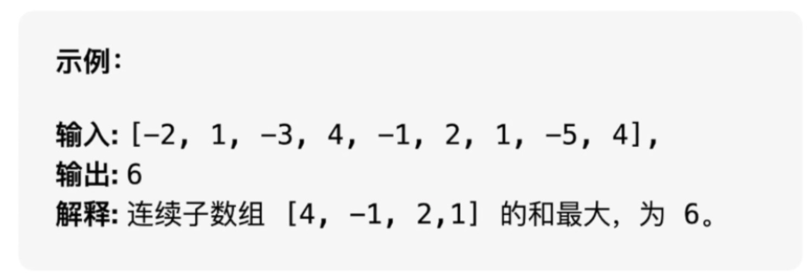

### 1.求最大子数组

* 动态规划算法
  * [代码戳这里](https://github.com/chsring/MergeSort/blob/master/src/MaxArray.java)
  * 状态定义：dp[i]表示以nums[i]结尾的 连续子数组的最大和
  * 如果 dp[i-1] > 0 , dp[i] = dp[i-1] + nums[i]
  * 如果 dp[i-1] <= 0 , dp[i] = nums[i]
  * 初始化 dp[0] = nums[0]
  * 最后输出max(dp)
  * 时间复杂度 O(N)，空间复杂度 O(N)
```java
public int maxSubArray(int[]nums){
    int len = nums.length;
    if(len == 0){
        return 0;
    }
    // dp[i]：以nums[i]结尾的 和最大的 连续子数组的和
    int []dp = new int[len];
    dp[0]=nums[0];
    int res = nums[0];
    for(int i=0;i<len;i++){
        dp[i] = Math.max(dp[i-1] + num[i] , nums[i]);
        res = Math.max(res,dp[i]);
    }
    return res;
}
```
### 数组中的逆序对
- https://www.bilibili.com/video/BV1Qk4y1r7u5?spm_id_from=333.999.0.0


### 2.链表逆置
- 利用头插法
```java
// 头结点为L，则头插法如下
p->next = L->next;
L->next = p;
```
```java
//链表逆置

```
### 3.顺序表逆置
```java

```
### 4.判断链表是否有环


### 5.求链表倒数第n个元素


### 合并k个排序链表


- https://space.bilibili.com/390775036/channel/seriesdetail?sid=1868869
### 验证二叉搜索树
### 二叉树中最大路径
### 最小二叉搜索树
### 二叉树最近的公共祖先


### 最长回文串
### String to interger


### 参考致谢
- https://blog.csdn.net/kongmin_123/article/details/82430985