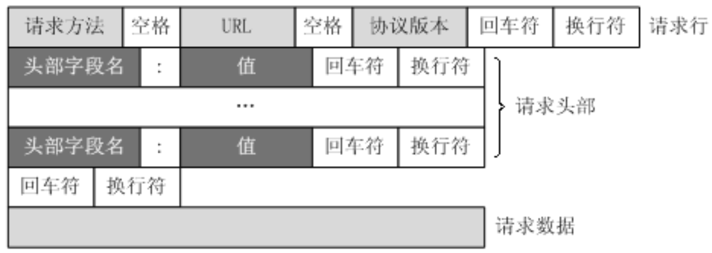
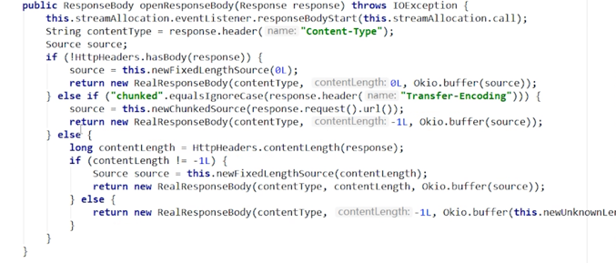
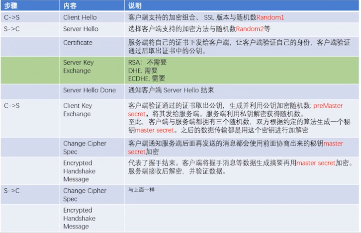

### HTTP发展
- 0.9 他只允许发送GET请求
- 1.0 增加了HEAD，POST等新方法，引入了HTTP Header(头部的概念)，让HTTP请求和响应更加灵活，发一次请求后就断开
- 1.1 增加了PUT，DELETE等新方法，明确了连接管理，允许持久连接，允许响应数据分块，利于传输大文件
- 2.0 OKHttp（底部封装了socket）支持2.0协议。二进制协议，不再是纯文本，可发起多个请求，废弃了1.1里面的管道，使用专有算，法压缩头部，减少数据传输量，允许服务器主动向客户端推送数据，增强了安全性，"事实上"要求加密通信

### HTTP报文格式

- 请求头实际上是 key-value 的格式；请求头有多个（Host，Content-Length，Content-Type 等）
- POST请求还有请求体，参数都在请求体里面。

#### 响应体中如果没有Content-Length，那么怎么知道这个响应体有多长，怎么知道这个响应体解析完了
- 在请求头中，有个 Transfer-Encoding：chunked，表示该响应体采取的分块编码，当数据量比较大的时候就会采取分块编码。每一行数据读取完后都会加/r/n
- 最后一个数据解析完会0/r/n，表示后面有没有数据要解析。
- OKHttp中解析方式分两种，如果响应头中包含了 Transfer-Encoding，就按照数据块的方式去解析。如果包含了 Content-Length，就可以直接获取数据长度。

### HTTPS与SSL
- HTTP在传输数据的时候全都是明文，无法保证数据的安全性。
- HTTPS 运行在TLS协议上的安全的HTTP协议，TLS是SSL的升级版。当客户端发送http请求时，先对http请求内容在SSL层进行加密，然后通过TCP/IP传输，Client收到http请求后，先通过SSL层解密，就变成了HTTP抱文数据
- 1.客户端要向服务器发送信息，客户端和服务器都要产生一对用于加密和解密的公钥和私钥。
- 2.客户端的私钥保密，客户端的公钥告诉服务器；服务器的私钥保密，服务器的公钥告诉客户端。
- 3.客户端 用对称加密报文，并产生一个密钥A，用服务器发送的公钥 使用非对称加密 A 后，与报文一起发送给服务器。
- 4.服务器收到这个消息后，服务器用自己的私钥解密客户端的消息。

### 非对称加密
- 如果用公钥对数据进行加密，只有用对应的私钥才能解密。
- 优点：安全性较高，比对称密钥安全性高很多。 
- 缺点：由于其算法复杂，而使得加密解密速度没有对称加密解密的速度快。
- 常见非对称加密算法RSA，DSA

### 对称加密
- 加密和解密使用相同密钥的加密算法。
- 优点：算法公开、计算量小、加密速度快、加密效率高。 
- 缺点：密钥管理的安全性很低，因为加密和解密都使用同一个密钥，在密钥的发送过程中，密钥可能被第三方截取
- 常见对称加密算法DES，AES

### HTTP加密过程：SSL握手
- SSL握手的过程是明文的，握手之后才是加密的，因此SSL握手的重点在于-在不安全的网络中进行密钥的交换
- 在握手阶段使用非对称加密确定握手的密钥，

### RSA交换密钥，一般情况下会使用 ECDH+RSA 算法交换密钥，保证在不安全的网络中交换密钥
- 1.客户端给出协议版本号、一个随机数R1、以及客户端支持的加密方法
- 2.服务端确认使用的加密方法，给出数字证书，以及随机数R2
- 3.客户端确认数字证书有效，生成一个新的随机数 ps，并使用数字证书的 公钥，利用RSA加密这个随机数，发给服务端。
- 4.客户端和服务端根据约定的加密方法，使用前面的三个随机数，生成对话密钥AES密钥，用来对称加密对话整个过程。

### 数字证书
- 证书相当于身份证，由CA机构颁发
- 验证某个网站，还可以用来验证某个文件是否被篡改。
- 有了证书之后，当你的浏览器在访问某个 HTTPS 网站时，会验证该站点上的 CA 证书。如果浏览器发现该证书没有问题，那么页面就直接打开；否则的话，浏览器会给出一个警告，告诉你该网站的证书存在某某问

### cookie
- cookie的执行原理：就是当客户端访问服务器的时候（服务器运用了cookie），服务器会生成一份cookie传输给客户端，客户端会自动把cookie保存起来，以后客户端每次访问服务器，都会自动的携带着这份cookie。

### session
- 当客户端第一次请求服务器的时候，服务器生成一份session保存在服务端，将该数据(session)的id以cookie的形式传递给客户端；以后的每次请求，浏览器都会自动的携带cookie来访问服务器(session数据id)。

### cookie和session共同点
- cookie和session都是用来跟踪浏览器用户身份的会话方式。

### cookie和session区别
- cookie是保存在客户端的，cookie有大小限制，
- session是保存在服务器端，session更加安全，session会比较占用服务器性能，当访问增多时应用cookie

### 参考致谢
- https://www.bilibili.com/video/BV1WV411t7pY?p=3