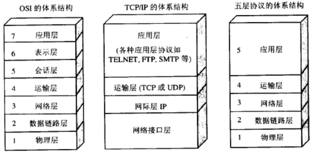
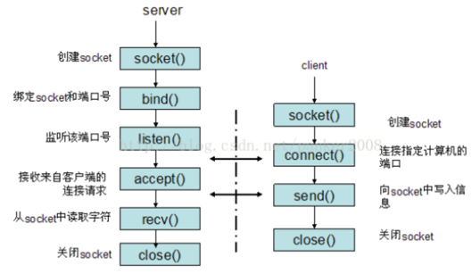
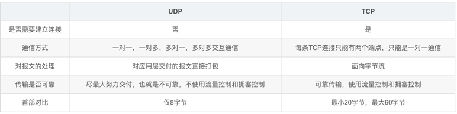
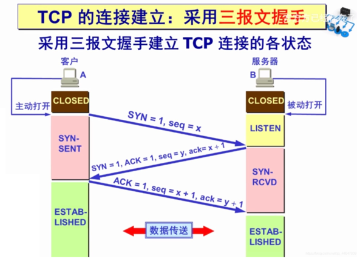
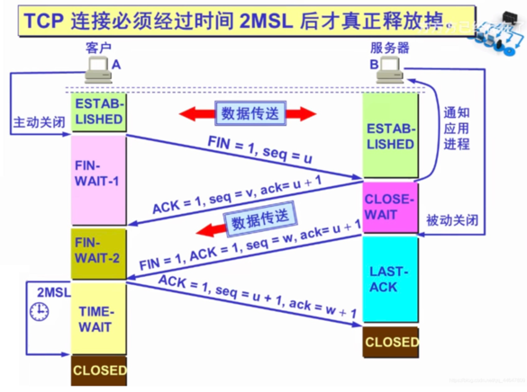

### OSI七层模型

- 物理层：用于建立、维护和拆除物理链路连接。数据的单位是比特，主要设备有中继器、集线器、适配器。
- 链路层：在物理层基础上，建立相邻结点之间的数据链路，提供数据帧在信道上无差错的传输，本层在不可靠的物理介质上提供可靠的传输，其作用有物理地址寻址、数据的成帧、流量控制、数据的检验、重发等，本层的单位为帧，主要设备是二层交换机、网桥。
- 网络层：其就是选择合适的网间路由和交换结点，确保数据及时传达。网络层将数据链路层提供的帧组成数据包，其中含有逻辑地址信息（源站点和目的站点地址的网络地址）。IP是第三层的一部分，此外还有一些路由协议和地址解析协议。地址解析和路由是第三层的重要目的。本层的单位是数据包，典型的协议包括IP,IPX,RIP,ARP,RARP,OSPF等。主要设备是路由器。
- 传输层：为上层提供端到端（最终用户到最终用户） 的透明的、可靠的数据传输服务。具体的协议包括有TCP,UDP.单位是数据段。
- 会话层：在会话层及以上的层次，数据传送单元统称为报文。它提供包括访问验证和会话管理在内的建立和维护应用之间的通信机制。如服务器验证用户登录便是在会话层完成的。
- 表示层：解决用户信息的语法表示问题。提供格式化的表示和转换数据服务。数据的压缩和解压缩，加密和解密等工作都是由表示层负责的。
- 应用层：为操作系统或网络应用程序提供访问网络服务的接口。这层的协议包括有IPSP,FTP,HTTP,SNMP等。

### socket
- Socket是对TCP/IP协议的封装，是⼀个调⽤接⼝API。在TCP/IP协议中主要有Socket类型的流套接字StreamSocket和数据报套接
  字DatagramSocket。
- 流套接字将TCP作为其端到端的协议，提供⼀个可信赖的字节流服务。
- 数据报套接字使⽤UDP协议，提供数据打包发送服务。

### TCP
- TCP 是一种面向有连接的传输层协议，能够对自己提供的连接实施控制。适用于要求可靠传输的应用，例如文件传输。面向字节流，传输慢

### UDP
- UDP 是一种面向无连接的传输层协议，不会对自己提供的连接实施控制。适用于实时应用，例如：IP电话、视频会议、直播等，以报文的方式传输，效率高

### TCP和UDP区别

#### TCP 三次握手

- 第一次：Client将同步标志位 SYN （同步包）置为1，设置请求序号 seq 假设为 x，将该数据包发送给Server，Client进入 SYN_SENT 状态，等待Server确认。
- 第二次：Server收到数据包，同步标志位 SYN=1 ，确认标志位 ACK 置为1，确认序号 ack=x+1，seq=y（自己的序号）发送给Client以确认连接请求，Server进入SYN_RCVD状态。
- 第三次：Client 收到后，ACK=1，确认号 ack=y+1 ，自己的序号 seq=x+1 发送给Server，Client和Server进入ESTABLISHED状态，完成三次握手，随后Client与Server之间可以开始传输数据了。

#### TCP 四次挥手

- 第一次：Client发送一个 FIN=1 （finish包），以及选择号 seq=u，用来关闭Client到Server的数据传送。Client进入FIN_WAIT_1状态。
- 第二次：Server收到FIN后，发送一个 ACK=1，一个请求号 seq=v 和确认序号 ack=u+1 给Client。Server进入CLOSE_WAIT状态，Client收到后，进入FIN_WAIT_2状态。
- 注：第二次之后，服务器可能还有数据要往客户端发送，所以第二次只是一发一个ACK确认包。
- 第三次：Server发送一个FIN，请求号为最新的 seq=w 和确认序号 ack=u+1，用来关闭Server到Client的数据传送。Server进入LAST_ACK状态。
- 第四次：Client收到FIN后，Client进入TIME_WAIT状态，接着发送一个 ACK=1 给Server，序号为 seq=u+1，确认序号为 ack=w+1。Server进入CLOSED状态，完成四次挥手。

#### 为什么建立链接要三次握手？
- 第一次保证Server发送能力没问题，第二次保证Server接受能力没问题，发送能力没问题；第三次保证Client接受能没问题

### 参考致谢
- https://blog.csdn.net/qq_44647809/article/details/115143100
- https://blog.csdn.net/MHSMIE/article/details/50992971
- https://www.bilibili.com/video/BV1WV411t7pY?spm_id_from=333.999.0.0